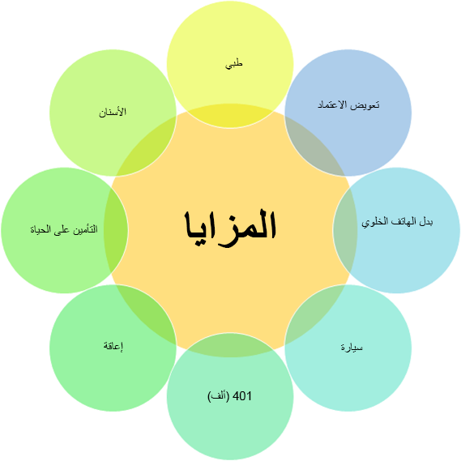

تتيح لك إدارة المزايا في Dynamics 365 Human Resources تقديم أنواع مختلفة من خطط المزايا للمساعدة في جذب قوة عاملة قوية والاحتفاظ بها.

> [!div class="mx-imgBorder"]
> 

من خلال المرونة التي توفرها إدارة المزايا، يمكنك تقديم وإدارة أي نوع تقريباً من المزايا التي يمكنك التفكير بها لموظفيك.

## الاعتبارات

عند إعداد خطة المزايا، تحتاج إلى تقييم اعتبارات متعددة. بعض هذه العوامل يفرضها القانون، والبعض الآخر تفرضه سياسات مؤسستك.

> [!div class="mx-imgBorder"]
> 

اسأل نفسك الأسئلة التالية عند تقييم معايير إعداد خطة المزايا:

- **الأهلية** - هل ستشمل موظفين بدوام كامل أو جزئي أو موظفين في مستويات وظيفية معينة؟ على سبيل المثال، الخطط الطبية متاحة بشكل عام فقط للموظفين بدوام كامل.

- **التكلفة** - ما تكلفة المزايا لكل من الموظف وصاحب العمل؟ على سبيل المثال، يدفع الموظفون وأصحاب العمل عادةً جزءاً من أقساط التأمين الطبي.

- **التغطية** - هل ستغطي الميزة الموظف فقط أم ستغطي الموظف زائد واحد أو الموظف بالإضافة إلى الأسرة؟ على سبيل المثال، يمكن أن تغطي الخطط الطبية الموظف بالإضافة إلى الأسرة.

- **فترة الانتظار** - هل تُفرض فترة انتظار تبلغ 30 أو 60 يوماً أو عدداً آخر من الأيام؟ على سبيل المثال، يمكن لمعظم الموظفين التسجيل في خطة طبية عند بدء العمل.

بالإضافة إلى ذلك، ستحتاج إلى التفكير فيما إذا كان بإمكان الموظفين التسجيل في أكثر من خطة واحدة من نفس النوع. على سبيل المثال، ربما لن يتمكن الموظفون لديك من التسجيل في أكثر من نوع واحد من التأمين الطبي، ولكن من المحتمل أن يسجلوا في خطط تأمين متعددة على الحياة.

## من يحصل على المزايا

يمكن لجميع الموظفين تقريباً، وبعض من يعولونهم، الحصول على مزايا. يتم تقسيم المستلمين إلى فئتين:

- **المعال** - مشمول بالخطة (على سبيل المثال، تأمين الأسنان أو الرؤية أو التأمين الطبي).

- **المستفيد** - يتلقى عائداً من الخطة، على الرغم من عدم تغطيتها بشكل مباشر (على سبيل المثال، التأمين على الحياة).

أمثلة لمن قد يكون قادراً على تلقي المزايا بموجب خططك:

- الموظفون النشطون بدوام كامل

- معالو الموظفين

- الموظفون المتقاعدون

- معالو الموظفين المتقاعدين

- الموظفون بدوام جزئي

- معالو الموظفين بدوام جزئي

- الموظفون المعاقون

- معالو الموظفين المعاقين

- المتبقون من الموظفين المتوفين

- الموظفون الذين أنهوا عملهم

- معالو الموظفين الذين أنهوا عملهم

- الموظفون الذين تم فصلهم مؤقتاً عن العمل (على سبيل المثال، في إجازة عائلية)

- معالو الموظفين الذين تم فصلهم مؤقتاً عن العمل

تعتمد أهلية المزايا وتواريخ البدء على نوع العامل، كما هو موضح في الجدول التالي.

| نوع العامل | الوصف  | التواريخ المستخدمة للأهلية |
|---|---|---|
| العامل الحالي | موظف قبل فترة خطة المزايا. على سبيل المثال، إذا كانت فترة خطة المزايا هي 1/1 /2021 - 12/31/2021، فإن تاريخ بدء الموظف سيكون قبل 1/1/2021. | تتم قراءة تعويضات العمال وتفاصيل التوظيف ومعلومات الوظيفة اعتباراً من بداية فترة الخطة. |
| التوظيف الجديد | تم التعاقد معه خلال فترة خطة المزايا. في هذه الحالة، سيتم تعيين الموظف بين 1/1/2021 واليوم. | تتم قراءة تفاصيل الوظيفة ومعلومات المنصب اعتباراً من اليوم. |
| التوظيف المستقبلي | سيتم التوظيف في المستقبل. في هذه الحالة، سيتم تعيين الموظف بين اليوم و12/31/2021. | تتم قراءة تعويضات العمال وتفاصيل التوظيف ومعلومات الوظيفة اعتباراً من تاريخ البدء في المستقبل. |

## ميزتان لمساحات العمل في Human Resources

بشكل افتراضي، يتضمن Dynamics 365 Human Resources مساحة عمل **مزايا** قديمة. غالباً ما تتطلب الشركات نظاماً أكثر مرونة مع عملية تسجيل مفتوحة سلسة ودعماً للأحداث المؤهلة والمعدلات المعقدة.

توفر مساحة عمل **إدارة المزايا** الخيارات التالية:

- تسجيل مفتوح

- مستويات الأسعار (على سبيل المثال، أسعار مختلفة حسب العمر أو الراتب)

- أحداث الحياة المؤهلة (على سبيل المثال، تبني طفل أو الزواج)

## عملية إعداد خطة المزايا

توضح لقطة الشاشة التالية خطوات إعداد وإنشاء خطط المزايا.

> [!div class="mx-imgBorder"]
> 
