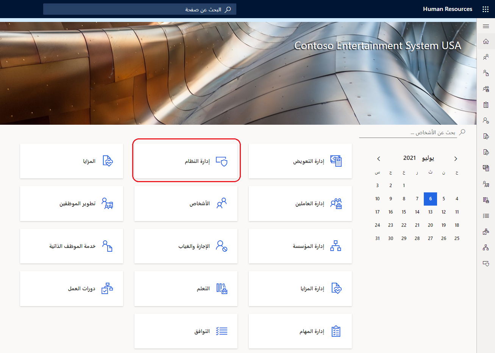
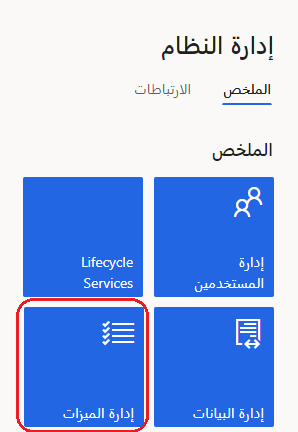
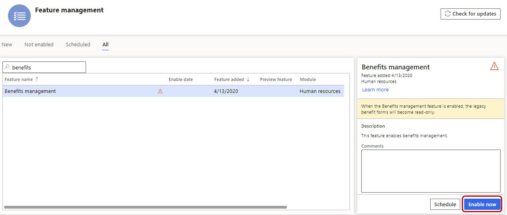
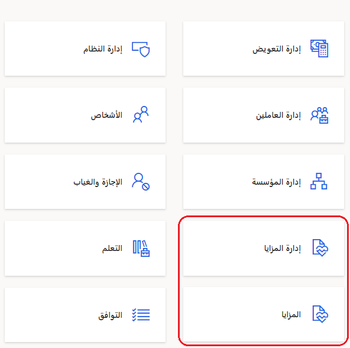
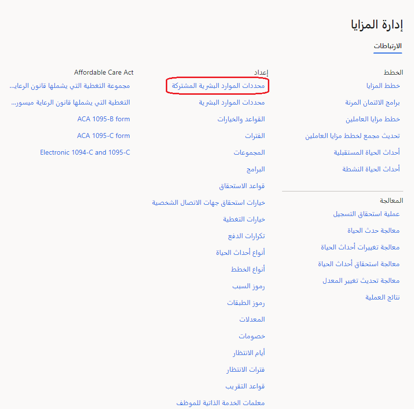
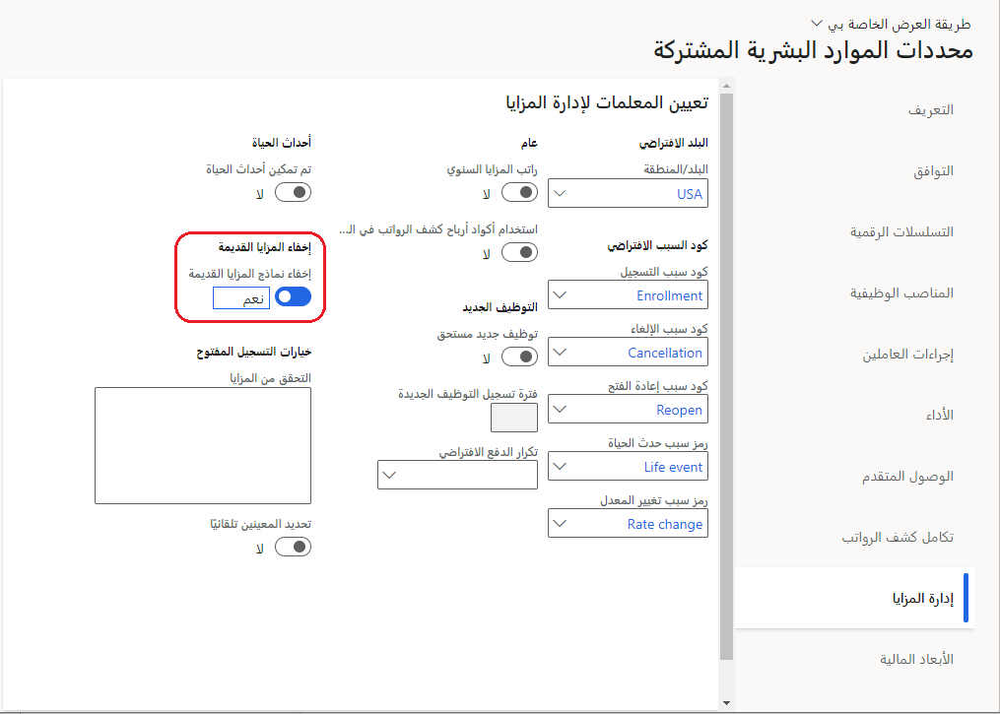

قبل أن تتمكن من استخدام إدارة المزايا، يجب عليك تمكينها في مساحة عمل **إدارة الميزات**، التي توفر قائمة بالميزات التي يتم تقديمها في كل إصدار. بشكل افتراضي، يتم إيقاف تشغيل الميزات الجديدة.

> [!IMPORTANT]
> تأكد من التدرب على إدارة المزايا في بيئة وضع حماية قبل تمكينها في بيئة الإنتاج الخاصة بك. يمكنك تمكين وتعطيل إدارة المزايا بقدر ما تريد في بيئة وضع الحماية. ومع ذلك، بعد تشغيل إدارة المزايا في بيئة إنتاج، لا يمكنك إيقاف تشغيل الميزة. لمزيد من المعلومات، راجع [إدارة الميزات](/dynamics365/human-resources/hr-admin-manage-features/?azure-portal=true).

## تمكين إدارة المزايا

لتمكين إدارة المزايا، اتبع الخطوات التالية:

1. في Human Resources، حدد إطار متجانب **إدارة النظام**.
   > [!div class="mx-imgBorder"]
   > 

1. في صفحة **إدارة النظام**، حدد إطار متجانب **إدارة الميزات**.
   > [!div class="mx-imgBorder"]
   > 

1. في صفحة **إدارة الميزات**، حدد **إدارة المزايا**، ثم حدد **تمكين الآن**.
   > [!div class="mx-imgBorder"]
   > 

1. في جزء **تمكين إدارة المزايا**، حدد **تمكين**.

تحل إدارة المزايا محل الوظائف في مساحة عمل **المزايا** القديمة. بعد قيامك بتمكين إدارة المزايا، لن تتمكن من الوصول إلى النماذج التالية في مساحة عمل **المزايا**:

- **المزايا‬**

- **عناصر المزايا**

- **نسب حساب المساهمة**

- **نتائج تسجيل الميزات**

- **نتائج التمديد أو انتهاء صلاحية الميزات**

- **أنواع قواعد سياسات استحقاق المزايا**

- **سياسات استحقاق المزايا**

- **أحداث الاستحقاق**

يمكنك عرض المعلومات في هذه النماذج في وضع القراءة فقط. إذا كنت ترغب في تحرير المعلومات، يجب عليك أولاً تعطيل إدارة المزايا (في بيئات وضع الحماية فقط).

بعد تمكين إدارة المزايا، سيتوفر الإطاران المتجانبان **إدارة الميزات** و **المزايا** في Human Resources.

> [!div class="mx-imgBorder"]
> 

## إخفاء نماذج المزايا القديمة

يمكنك إيقاف تشغيل نماذج المزايا القديمة إذا لم تعد بحاجة إلى رؤيتها في بيئتك.

1. في Human Resources، حدد إطار متجانب **إدارة المزايا**.

1. في مساحة عمل **إدارة المزايا**، حدد **المعلمات المشتركة لـ Human Resources‬**.
   > [!div class="mx-imgBorder"]
   > 

1. في صفحة **المعلمات المشتركة لـ Human Resources**، حدد علامة التبويب **إدارة المزايا**.

1. قم بتعيين تبديل **إخفاء نماذج المزايا القديمة** إلى **نعم**.
   > [!div class="mx-imgBorder"]
   > 

## تعطيل إدارة المزايا

تتشابه خطوات تعطيل إدارة المزايا تقريباً مع خطوات تمكينها. تذكر، لا يمكنك تعطيل إدارة المزايا في بيئة إنتاج.

1. في Human Resources، حدد إطار متجانب **إدارة النظام**.

1. في صفحة **إدارة النظام**، حدد إطار متجانب **إدارة الميزات**.

1. في صفحة **إدارة الميزات**، حدد **إدارة المزايا**، ثم حدد **تعطيل**.
