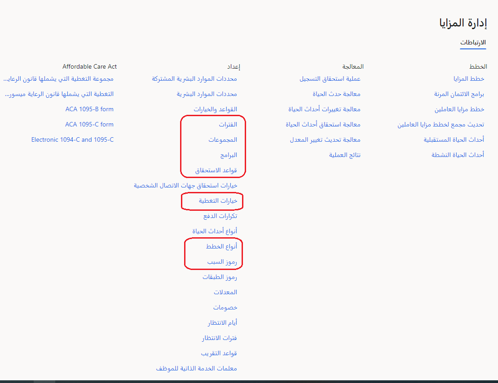
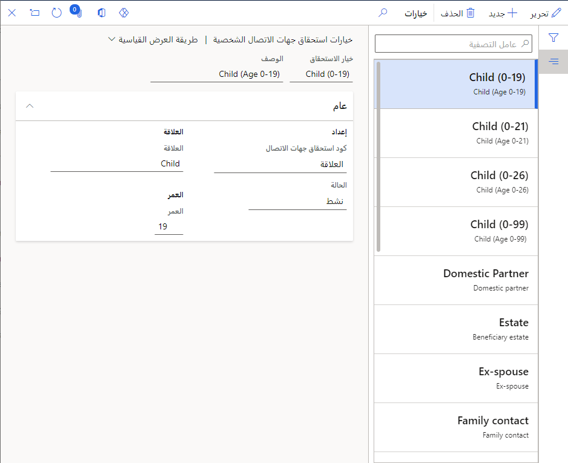
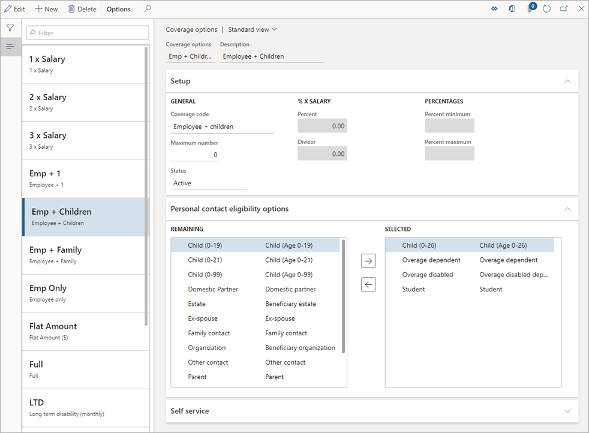
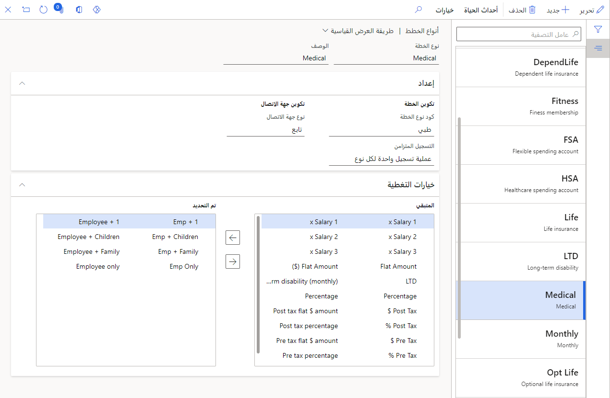
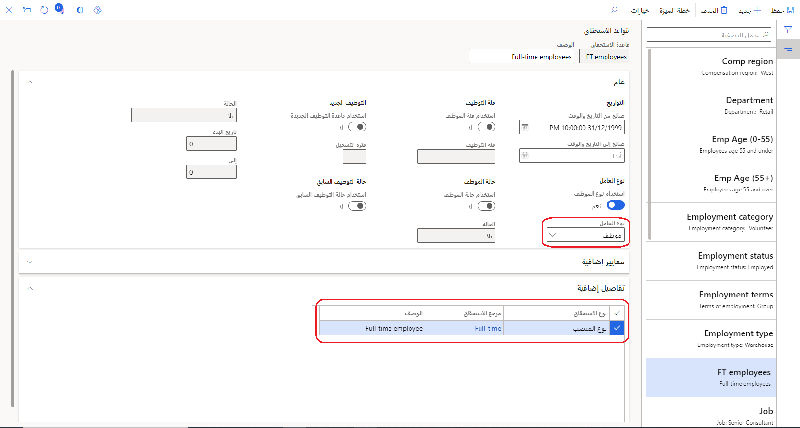
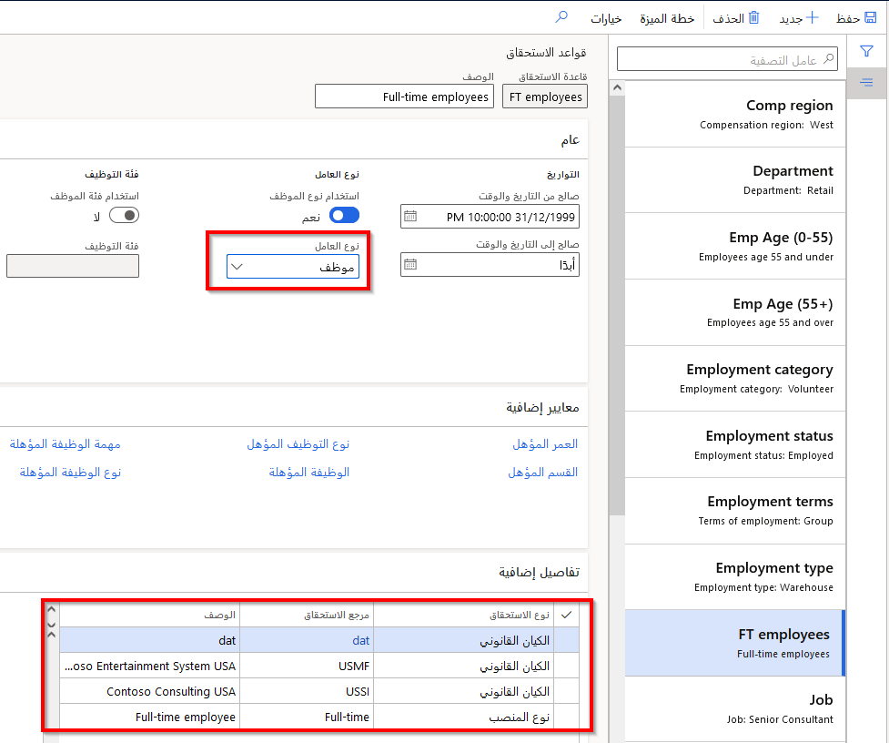
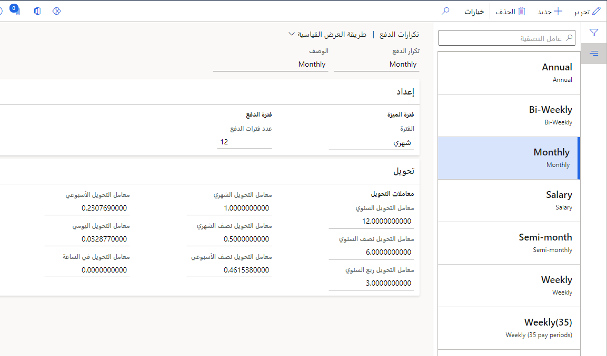
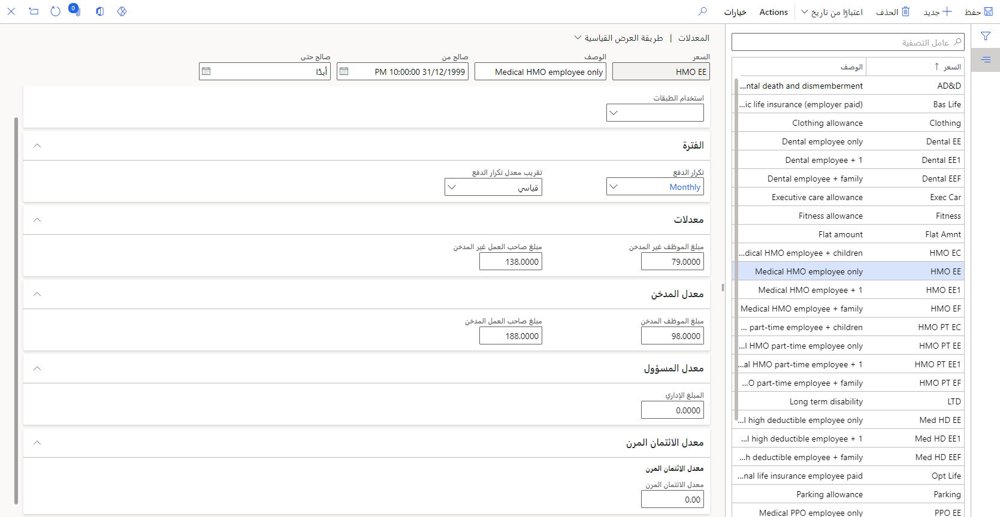
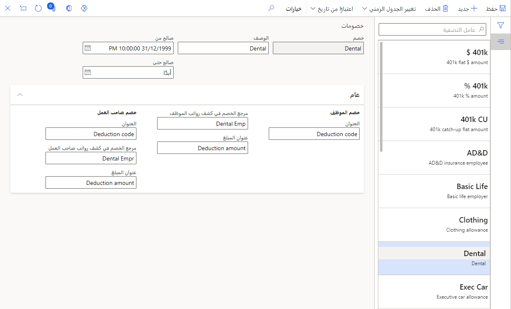

قبل أن تتمكن من إنشاء خطط الميزة في Dynamics 365 Human Resources وتسجيل الموظفين بها، يجب عليك تكوين المعلمات التالية:Before you can create benefit plans in Dynamics 365 Human Resources and enroll employees in them, you must configure the following parameters:

- خيارات أهلية جهة الاتصال الشخصيةPersonal contact eligibility options

- خيارات التغطية للخططCoverage options for the plans

- أنواع الخططPlan types

- قواعد الأهليةEligibility rules

- الأسعار (بما في ذلك أسعار الطبقة، إذا لزم الأمر)Rates (including tier rates, if needed)

- الخصوماتDeductions

- تكرارات المدفوعاتPayment frequencies

> [!div class="mx-imgBorder"]
> 

> [!NOTE]
> حالياً، لا يمكنك الترحيل من المزايا القديمة إلى إدارة المزايا الجديدة في Dynamics 365 Human Resources.Currently, you can't migrate from legacy Benefits to the new Benefits management in Dynamics 365 Human Resources. ستحتاج إلى إعادة إنشاء خطط المزايا الخاصة بك ثم إعادة تسجيل موظفيك في الخطط الجديدة.You'll need to recreate your benefit plans and then re-enroll your employees in the new plans.

## أنشئ خيارات أهلية جهة الاتصال الشخصيةCreate personal contact eligibility options

في مساحة عمل **إدارة المزايا**، ضمن **إعداد**، حدد **خيارات أهلية جهة الاتصال الشخصية**.In the **Benefits management** workspace, under **Setup**, select **Personal contact eligibility options**. تنقسم جهات الاتصال الشخصية إلى فئتين:Personal contacts are divided into two categories:

- **المعالون** - الأفراد الذين تمت تغطيتهم في خططك.**Dependents** - Individuals who are covered under your plans.

- **المستفيدون** - الأفراد أو المؤسسات المستفيدة الذين يستفيدون من خططك.**Beneficiaries** - Individuals or beneficiary organizations who benefit from your plans. يشمل مصطلح المستفيدين في العادة الطلبة أو الأزواج أو الأطفال أو الصناديق.Beneficiaries usually include students, spouses, children, or trusts.

> [!div class="mx-imgBorder"]
> 

لمزيد من المعلومات، اطلع على [تكوين خيارات أهلية جهة الاتصال الشخصية](https://docs.microsoft.com/dynamics365/human-resources/hr-benefits-setup-contact-eligibility-options/?azure-portal=true).For more information, see [Configure personal contact eligibility options](https://docs.microsoft.com/dynamics365/human-resources/hr-benefits-setup-contact-eligibility-options/?azure-portal=true).

## أنشئ خيارات التغطية للخططCreate coverage options for the plans

في مساحة عمل **إدارة المزايا**، ضمن **إعداد**، حدد **خيارات التغطية**.In the **Benefits management** workspace, under **Setup**, select **Coverage options**. تشير خيارات التغطية إلى من يجب تغطيتهم أو مقدار التغطية المتاحة.Coverage options indicate who should be covered or how much coverage is available. على سبيل المثال، فيما يتعلق بخطة طبية، قد تتوفر لديك الخيارات التالية:For example, for a medical plan, you might have the following options:

- الموظف فقطEmployee only

- الموظف + 1Employee + 1

- العائلةFamily

فيما يتعلق بخطة تأمين، قد توفر تغطية تأمين على الحياة الخيارات التالية:For an insurance plan, you might offer life insurance coverage with the following options:

- 1 x الراتب1 x Salary

- 2 x الراتب2 x Salary

- 3 x الراتب3 x Salary

> [!div class="mx-imgBorder"]
> 

لمزيد من المعلومات، راجع [إنشاء خيارات التغطية](https://docs.microsoft.com/dynamics365/human-resources/hr-benefits-setup-coverage-options/?azure-portal=true).For more information, see [Create coverage options](https://docs.microsoft.com/dynamics365/human-resources/hr-benefits-setup-coverage-options/?azure-portal=true).

## إنشاء أنواع الخطةCreate plan types

في مساحة عمل **إدارة المزايا**، ضمن **إعداد**، حدد **أنواع الخطط**.In the **Benefits management** workspace, under **Setup**, select **Plan types**. تعرض هذه الصفحة أنواع الخطط التي تدعمها الموارد البشرية.This page displays the types of plans that Human Resources supports. تؤثر المعلومات التالية الموجودة في هذه الصفحة على الخيارات المتاحة عند إنشاء خطة مزايا جديدة:The following information on this page impacts the options that are available when you create a new benefit plan:

- **كود نوع الخطة** - التأثيرات التي يتم عرضها في علامة تبويب **التكوين** عند إعداد خطة المزايا.**Plan type code** - Impacts what displays on the **Configuration** tab when you set up the benefit plan.

- **التسجيل المتزامن** - يحدد ما إذا كان مسموحاً بالتسجيلات المتعددة.**Concurrent enrollment** - Determines whether multiple enrollments are allowed. بالنسبة **لخطة طبية**، ستقوم عادةً بتعيين **التسجيل المتزامن** إلى **تسجيل واحد لكل نوع**.For **Medical**, you'd usually set **Concurrent enrollment** to **One enrollment per type**.

- **نوع جهة الاتصال** - يسمح بإضافة المعالين أو المستفيدين للخطة.**Contact type** - Allows dependents or beneficiaries to be added to a plan. إذا قمت بتعيين **نوع جهة الاتصال** إلى **لا شيء**، فلن يتمكن الموظفون الذين يقومون بالتسجيل في المزايا من تحديد مستفيد أو مُعال.If you set **Contact type** to **None**, then employees who are enrolling in benefits can't select either a beneficiary or a dependent.

- **خيارات التغطية** - في هذا الجزء، ستربط خيارات التغطية بأنواع الخطط.**Coverage options** - In this area, you will join the coverage options with the plan types. تحدد **خيارات التغطية** الأفراد الذين تم تغطيتهم بواسطة نوع الخطة هذا أو مبالغ التغطية المتوفرة لنوع الخطة هذا.‬**Coverage options** define either the individuals who are covered by this plan type or the coverage amounts that are available for this plan type. على سبيل المثال، يمكنك تعيين نوع خطة طبية للحصول على تغطية متاحة **للموظف فقط**، **أو الموظف + 1**، أو **الموظف + العائلة**.For example, you might set a medical plan type to have coverage that is available to **Employee only**, **Employee + 1**, or **Employee + Family**.

> [!div class="mx-imgBorder"]
> 

لمزيد من المعلومات، راجع [إنشاء أنواع الخطط](https://docs.microsoft.com/dynamics365/human-resources/hr-benefits-setup-plan-types/?azure-portal=true).For more information, see [Create plan types](https://docs.microsoft.com/dynamics365/human-resources/hr-benefits-setup-plan-types/?azure-portal=true).

## أنشئ قواعد الأهليةCreate eligibility rules

في مساحة عمل **إدارة المزايا**، ضمن **إعداد**، حدد **قواعد الأهلية**.In the **Benefits management** workspace, under **Setup**, select **Eligibility rules**. تحدد قواعد الأهلية ما إذا كان الموظف مؤهلاً لإحدى الخطط.Eligibility rules determine whether an employee is eligible for a plan. يجب أن تتضمن خطة المزايا قاعدة أهلية واحدة على الأقل مرتبطة بها.A benefit plan must have at least one eligibility rule associated to it.

يمكنك إقران قواعد متعددة بميزة.You can associate multiple rules to a benefit. يحتاج الموظف إلى استيفاء قاعدة واحدة على الأقل ليكون مؤهلاً للمزايا.The employee needs to meet at least one rule to be eligible for the benefit.

على سبيل المثال، عندما تُنشئ خطة مزايا لاحقاً، يمكنك تطبيق قاعدتين من قواعد الأهلية:For example, when you create a benefit plan later, you could apply two eligibility rules:

- تنص قاعدة الأهلية الأولى على أن يكون **نوع العامل** **موظفاً**.The first eligibility rule states that the **Worker type** must be **Employee**.

- تنص قاعدة الأهلية الثانية على أن يكون **نوع الوظيفة** **دواماً كاملاً**.The second eligibility rule states that the **Position type** must be **Full-time**.

في هذه الحالة، يعد الموظفون بدوام جزئي الذين يستوفون القاعدة الأولى مؤهلين، حتى إذا لم يستوفوا معايير القاعدة الثانية.In this case, part-time employees who meet the first rule are eligible, even if they don't meet the criteria for the second rule.

إذا كنت تريد أن يستوفي الأفراد كلا المعيارين، فيجب عليك إعداد قاعدة أهلية واحدة تتطلب أن يكون الفرد موظفاً وعاملاً بدوام كامل، كما هو موضح في المثال التالي.If you want individuals to meet both criteria, you must set up a single eligibility rule that requires the individual to be both an employee and full-time, as illustrated in the following example.

> [!div class="mx-imgBorder"]
> 

يوضح المثال التالي أنه تمت إضافة طبقة أخرى، لذلك تنطبق قاعدة الأهلية على الموظفين بدوام كامل في الشركات الكائنة في الولايات المتحدة الأمريكية.The following example shows that one more layer was added, so the eligibility rule applies to full-time employees in US-based companies. تشتمل قاعدة الأهلية هذه على الإعدادات التالية:This eligibility rule includes the following settings:

- **نوع العامل** **موظف****Worker type** is **Employee**

- **نوع الوظيفة** **دوام كامل****Position type** is **Full-time**

- **الكيان القانوني** هو **USMF‎** و **USSI‎****Legal entity** is **USMF** and **USSI**

> [!div class="mx-imgBorder"]
> 

> [!NOTE]
> في قاعدة الأهلية هذه، يمكن توظيف الموظف في USMF أو USSI واستيفاء قاعدة الأهلية.In this eligibility rule, the employee can be employed in USMF or USSI and meet the eligibility rule.
>
> يعد ترتيب قواعد الأهلية مهماً.The order of eligibility rules is important. ضع القواعد الأكثر تقييداً، مثل تلك القواعد المتعلقة بالموظفين الجدد أو المعاد توظيفهم أولاً.Place your most restrictive rules, such as those for new hires or rehires, first.

لمزيد من المعلومات، اطلع على [تكوين قواعد الأهلية وخياراتها](https://docs.microsoft.com/dynamics365/human-resources/hr-benefits-setup-eligibility-rules/?azure-portal=true).For more information, see [Configure eligibility rules and options](https://docs.microsoft.com/dynamics365/human-resources/hr-benefits-setup-eligibility-rules/?azure-portal=true).

## إنشاء تكرارات المدفوعاتCreate payment frequencies

في مساحة عمل **إدارة المزايا**، ضمن **إعداد**، حدد **تكرارات المدفوعات**.In the **Benefits management** workspace, under **Setup**, select **Payment frequencies**. سيتعين عليك تكوين تكرارات المدفوعات حتى يمكنك تحديد أسعار المزايا.You'll need to configure payment frequencies so that you can set rates for benefits. تساعد تكرارات المدفوعات في تحديد المبالغ مستحقة الدفع من جانب الموظف وصاحب العمل بمعدل أسبوعي أو شهري أو سنوي أو أي معدل آخر تحدده.Payment frequencies help determine amounts that are owed by the employee and employer on a weekly, monthly, annual, or other rate that you set.

> [!div class="mx-imgBorder"]
> 

لمزيد من المعلومات، راجع [إعداد تكرارات المدفوعات](https://docs.microsoft.com/dynamics365/human-resources/hr-benefits-setup-payment-frequencies/?azure-portal=true).For more information, see [Set up payment frequencies](https://docs.microsoft.com/dynamics365/human-resources/hr-benefits-setup-payment-frequencies/?azure-portal=true).

## إنشاء أسعارCreate rates

في مساحة عمل **إدارة المزايا**، ضمن **إعداد**، حدد **الأسعار**.In the **Benefits management** workspace, under **Setup**, select **Rates**. تشير الأسعار إلى مقدار تكاليف المزايا سواء للموظف أو لصاحب العمل.Rates indicate how much a benefit costs either the employee or the employer.

> [!div class="mx-imgBorder"]
> 

إكمال الحقول التالية:Complete the following fields:

- **صالح من** - يجب أن يكون هذا التاريخ في فترة المزايا أو قبلها.**Valid from** - This date should be on or before your benefit period. من الممارسات الجيدة تعيين هذا الحقل في تاريخ خطة المزايا المقابلة الخاصة بك.A good practice is to set this field to the date of your corresponding benefit plan.

- **استخدام الطبقات** - قم بتعيين هذا الخيار إذا كنت بحاجة لتضمين منطق لتحديد سعر.**Use tiers** - Set this option if you need to include logic for determining a rate. على سبيل المثال، استخدم الطبقات لسعر يزيد بناءً على العمر.For example, use tiers for a rate that increases based on age. إذا كان لديك سعراً ثابتاً لا يتغير، فاترك هذا الحقل فارغاً.If you have a flat rate that doesn't change, leave this field blank.

  **إعداد الطبقات****Set up tiers**
  
  إذا قمت بتعيين **استخدام الطبقات** إما **لطبقة واحدة** أو **طبقة مزدوجة**، حدد **الإجراءات** الموجودة في الأعلى ثم حدد **أسعار الطبقات**.If you set **Use tiers** to either **Single tier** or **Double tier**, select **Actions** at the top and then select **Tier rates**. عيّن الحقول التالية في صفحة **أسعار الطبقات**:Set the following fields on the **Tier rates** page:
  
  - **كود الطبقة** - حقل معرف من قبل المستخدم، يتم تعيينه غالباً على **الطبقة 01** **والطبقة 02** وهكذا.**Tier code** - A user-defined field, often set as **Tier 01**, **Tier 02**, and so on. يضمن وضع صفر قبل الرقم الفردي أن يتم الاحتفاظ بأكواد الطبقة بترتيب عند فرزها أبجدياً.‬Putting a zero before a single-digit number ensures that tier codes remain in order when they're sorted alphabetically. لمزيد من المعلومات، راجع [إعداد أكواد الطبقات](https://docs.microsoft.com/dynamics365/human-resources/hr-benefits-setup-tier-codes/?azure-portal=true).For more information, see [Set up tier codes](https://docs.microsoft.com/dynamics365/human-resources/hr-benefits-setup-tier-codes/?azure-portal=true).
  
  - **نوع الطبقة** - حدد ما تريد أن تقوم عليه طبقتك.**Tier type** - Select what you want to base your tier on.
  
  - **المستوى** - أدخل مبلغاً استناداً إلى نوع الطبقة.**Level** - Enter an amount based on tier type. على سبيل المثال، بالنسبة للسعر الذي يتغير في الأعمار 30 و60 و90، قم بتعيين **نوع الطبقة** إلى **العمر**.For example, for a rate that changes at ages 30, 60, and 90, set **Tier type** to **Age**. أدخل **30** للمستوي الأول من طبقتك الأولى.Enter **30** for the first level of your first tier. ثم قم بعد ذلك بإنشاء طبقة جديدة وحدد **العمر** وحدد **المستوى** إلى **60** لتضمين أي شخص من عمر 30.01 إلى 60.Then, create a new tier, select **Age**, and set **Level** to **60** to include anyone from age 30.01-60. كرر تلك الخطوات للطبقة الأخيرة.Repeat those steps for the last tier.
  
  - **نوع الحساب** حدد من الخيارات التالية:**Calculation type** - Select from the following options:
  
    - **المبلغ الأساسي** - لا يتغير.**Flat amount** - Doesn't change.
  
    - **لكل مبلغ $ من الراتب** - سيسدد الفرد حسب الدخل.**Per $ amount of salary** - The individual will pay based on income. على سبيل المثال، مقابل كل 10،000.00 دولار أمريكي من الراتب، قد يدفع الفرد 0.50 دولار أمريكي.For example, for every $10,000.00 USD of salary, an individual might pay $0.50.
  
    - **لكل $ من مبلغ التغطية** - سيسدد الفرد بناءً على مبلغ التغطية.**Per $ amount of coverage** - The individual will pay based on the amount of coverage. على سبيل المثال، لكل 10،000.00 دولار أمريكي من تغطية التأمين، قد يدفع الفرد 0.50 دولار أمريكي.For example, for every $10,000.00 USD of insurance coverage, an individual might pay $0.50.
  
  - **الأسعار** - المبلغ الذي سيدفعه الموظف وصاحب العمل للحصول على هذه الميزة.**Rates** - The amount that the employee and employer will pay for the benefit. إذا كان سجل الموظف يشير إلى أن الموظف مدخن، فسيتم تطبيق **السعر المخصص للمدخنين**.If the employee record indicates that the employee is a smoker, then the **Smoker rate** will apply.

     > [!NOTE]
     > لا يتم إظهار إشارة المدخن للموظف مطلقاً.The smoker indication is never shown to the employee.

    لمزيد من المعلومات، راجع [إعداد أسعار الطبقات](https://docs.microsoft.com/dynamics365/human-resources/hr-benefits-setup-rates?azure-portal=true#set-up-tier-rates).For more information, see [Set up tier rates](https://docs.microsoft.com/dynamics365/human-resources/hr-benefits-setup-rates?azure-portal=true#set-up-tier-rates).

- **تكرارات المدفوعات** - تكرار المدفوعات الخاصة بموفر الميزة.**Payment frequency** - The payment frequency for the benefit provider. تعتمد الأسعار التي تدخلها في الأقسام الأخرى في هذه الصفحة على تكرارات المدفوعات التي تحددها.The rates that you enter in other sections on this page are based on the payment frequency that you set. على سبيل المثال، إذا قمت بتحديد **شهرياً** ثم قمت بتعيين سعراً بقيمة 100.00 دولار أمريكي، فسوف تكون التكلفة 100.00 دولار أمريكي كل شهر.For example, if you select **Monthly** and then set a rate of $100.00 USD, then the cost will be $100.00 USD each month. ومع ذلك، بالنسبة للموظفين الذين دفعوا مرتين شهرياً، سيُظهر حقل **الخدمة الذاتية للموظفين** أنهم سيدفعون 50 دولاراً أمريكياً لفترة الدفع هذه.However, for employees who paid twice a month, the **Employee self-service** field will show that they'll pay $50.00 USD for that pay period.

- **الأسعار** - المبلغ الذي سيدفعه الموظف وصاحب العمل للحصول على هذه الميزة.**Rates** - The amount that the employee and employer will pay for the benefit. إذا كان سجل الموظف يشير إلى أن الموظف مدخن، فسيتم تطبيق **السعر المخصص للمدخنين**.If the employee record indicates that the employee is a smoker, then the **Smoker rate** will apply.

- **سعر الإدارة** - عَيِّن هذا الخيار إذا كان المبلغ مرتبطاً بإدارة الميزة.**Admin rate** - Set this option if an amount is associated for managing the benefit.

- **سعر الرصيد المرن** - إذا كنت تستخدم أرصدة مرنة، يمثل هذا الحقل تكلفة الرصيد المرن الخاص بالميزة.**Flex credit rate** - If you're using flex credits, this field represents the flex credit cost of the benefit.

لمزيد من المعلومات، راجع [تكوين الأسعار](https://docs.microsoft.com/dynamics365/human-resources/hr-benefits-setup-rates/?azure-portal=true).For more information, see [Configure rates](https://docs.microsoft.com/dynamics365/human-resources/hr-benefits-setup-rates/?azure-portal=true).

## إنشاء خصوماتCreate deductions

في مساحة عمل **إدارة المزايا**، ضمن **إعداد**، حدد **الخصومات**.In the **Benefits management** workspace, under **Setup**, select **Deductions**. تعد الخصومات معلومات الرأس أو الأكواد التي يتم تمريرها إلى نظام الرواتب للإشارة إلى خصم الراتب للميزة.Deductions are the header information or codes that are passed into the payroll system to indicate the payroll deduction for the benefit. إعداد الخصومات قبل إنشاء خطط المزايا التي ستستخدمها.Set up deductions before creating benefit plans that will use them. من الممارسات الجيدة تعيين حقل **صالح من** ليكون نفس تاريخ خطة المزايا.It's a good practice to set the **Valid from** field to be the same as your benefit plan date.

> [!div class="mx-imgBorder"]
> 

لمزيد من المعلومات، راجع [تكوين الخصومات](https://docs.microsoft.com/dynamics365/human-resources/hr-benefits-setup-deductions/?azure-portal=true).For more information, see [Configure deductions](https://docs.microsoft.com/dynamics365/human-resources/hr-benefits-setup-deductions/?azure-portal=true).
