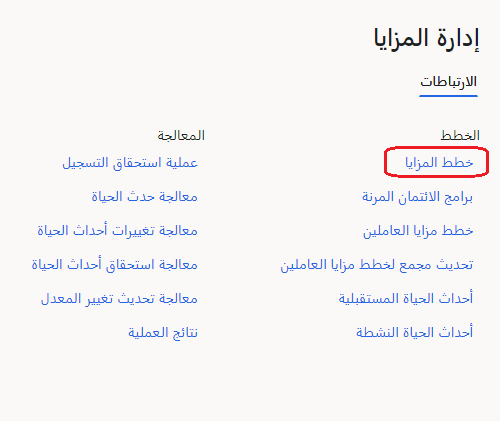
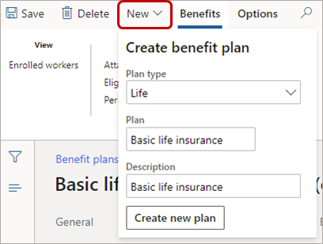
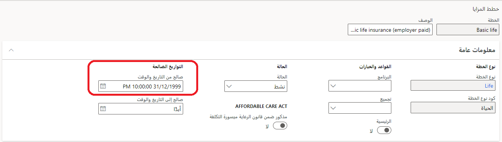
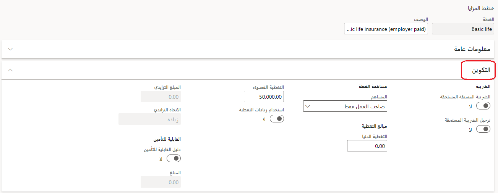
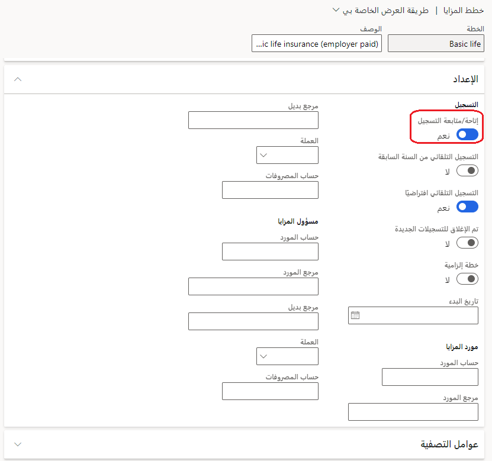
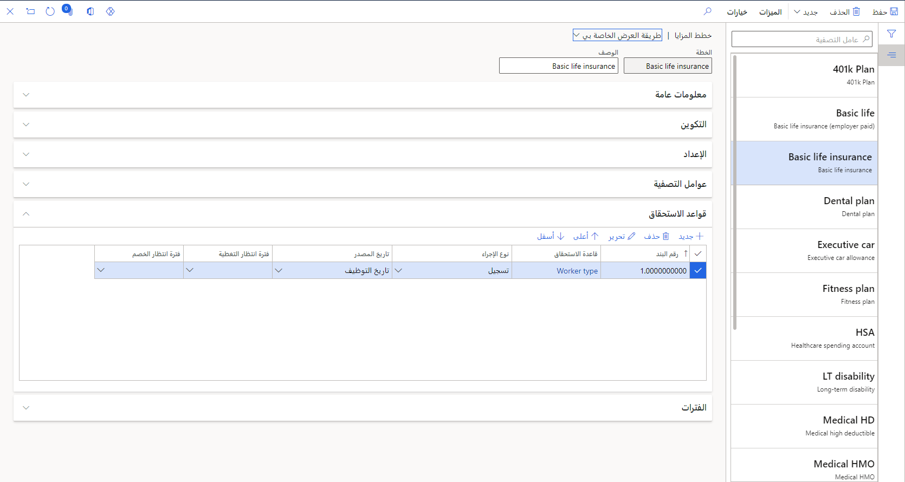
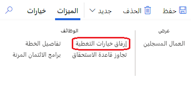
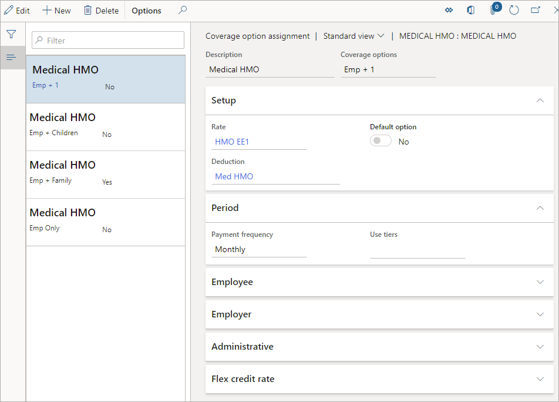
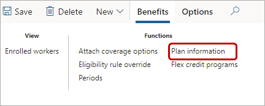

بعد تكوين جميع الخيارات الضرورية لإدارة الميزات، يمكنك إنشاء خطة ميزة.

1. انتقل إلى **إدارة الميزات > خطط الميزة**.

   > [!div class="mx-imgBorder"]
   > 

1. حدد **جديد** لإنشاء خطة جديدة، وحدد **نوع الخطة**، وأدخل **اسم الخطة** و **الوصف** الخاص بها، ثم حدد **إنشاء خطة جديدة**.

   > [!div class="mx-imgBorder"]
   > 

1. غالباً ما تكون علامة التبويب **عام** معلوماتية. تأكد من تعيين الحقل **صالح بدءاً من تاريخ ووقت** قبل بداية فترة الخطة. على سبيل المثال، إذا كانت فترة الخطة 1/1/2021 - 12/31/2021، فقم بتعيين **صالح بدءاً من تاريخ ووقت** إلى قبل 1/1/2021.

   > [!div class="mx-imgBorder"]
   > 

1. تعرض علامة التبويب **تكوين** الحقول المتعلقة **بنوع الخطة** الذي اخترته للخطة. على سبيل المثال، إذا كان **نوع الخطة** خطة تأمين، تعرض علامة التبويب **تكوين** خيارات لمبلغي **الحد الأدنى للتغطية** و **الحد الأقصى للتغطية**.

   > [!div class="mx-imgBorder"]
   > 

1. في علامة التبويب **الإعداد**، قم بتعيين خيار **السماح بـ/متابعة التسجيل** إلى **نعم** حتى يستطيع الموظفون التسجيل في الخطة.

   > [!div class="mx-imgBorder"]
   > 

   نادراً ما تُستخدم علامة التبويب **عوامل التصفية**.

1. في علامة التبويب **قواعد الأهلية**، يجب تضمين قاعدة أهلية واحدة على الأقل للموظفين كي يكونوا مؤهلين للخطة. لكل قاعدة أهلية، قم بتضمين المعلومات التالية:

   - **رقم السطر** - أمر قواعد الأهلية مهم. على سبيل المثال، قد تكون لديك قاعدة تفيد بأن عمليات توظيف جديدة لديها فترة انتظار تغطية تبلغ 30 يوماً. ولا يتوفر لكل شخص آخر فترة انتظار. قم بتضمين قاعدة التوظيف الجديدة أولاً لأن هذه هي أكثر القواعد تقييداً. بعد أن يستوفي موظف قاعدة أهلية في هذا القسم، يتم اعتباره مؤهلاً.

   - **قاعدة الأهلية**: يمكنك تحديد شروط متعددة داخل قاعدة واحدة. يجب أن يفي الموظف بجميع الشروط التي تشملها قاعدة ما حتى يُعتبَر مؤهلاً.

     إذا قمت بالتنقل الإضافي إلى شرط معين داخل إحدى القواعد، فلاحظ أن الموظف يجب أن يفي بشرط واحد على الأقل. على سبيل المثال، إذا قمت بإعداد قاعدة لمنطقة التعويض. في قاعدة التعويض، قم بتعيين الشرط **منطقة التعويض = شرق** ثم أضف شرطاً آخر تكون فيه **منطقة التعويض = غرب**. ونتيجة لذلك، سيكون الموظف مؤهلاً إذا كان موجوداً في منطقة الشرق أو منطقة الغرب.

   - **نوع الإجراء** - يحدد ما إذا كانت ستتم قراءة القاعدة عندما يسجِّل الموظف في الميزات (**تسجيل**) أو عند إنهائها (**انتهاء الصلاحية**).

   - **فترة انتظار التغطية** - تحديد فترة الانتظار التي كانت لدى الموظفين قبل تسجيلهم في الميزة. يمكن ربط فترات انتظار بقاعدة أهلية تسجيل. على سبيل المثال، يمكنك تحديد قاعدة توظيف جديدة ثم ربط هذه القاعدة بفترة انتظار. في هذا المثال، يجب أن تنتظر عمليات التوظيف الجديدة 60 يوماً قبل التسجيل في خطة 401(k). يمكنك القيام بنفس الاجراء مع عمليات الإنهاء. على سبيل المثال، ربما يُسمح لأعضاء مجلس الإدارة بشركتك بالحفاظ على ميزة صالة ألعاب رياضية لمدة ستة أشهر بعد مغادرتهم الشركة. في هذه الحالة، يمكنك تغيير **نوع الاجراء** إلى **انتهاء الصلاحية**، ثم يمكنك تحديد قاعدة انتهاء صلاحية لمجلس الإدارة. سيتم تشغيل قاعدة انتهاء الصلاحية عند الإنهاء، وتوسيع تاريخ التغطية بعد تاريخ الإنهاء بستة أشهر.

   > [!div class="mx-imgBorder"]
   > 

1. حدد **خيارات تغطية الإرفاق** بأعلى الصفحة.

   > [!div class="mx-imgBorder"]
   > 

   - في حقل **خيارات التغطية**، ستقوم بربط أي شخص بتكلفة التغطية لنوع خطة طبي، أو ستقوم بربط مبلغ التغطية بتكلفة التغطية. على سبيل المثال، إذا كنت تقوم بإعداد خطة ميزة طبية، فإن خيارات التغطية الخاصة بك قد تتضمن على الأرجح:

     - الموظف فقط

     - الموظف + 1

     - الموظف + العائلة

     > [!div class="mx-imgBorder"]
     > 

   - تحت **الإعداد**، حدد السعر المرتبط بخيارات التغطية.

     > [!NOTE]
     > نصيحة لاستكشاف الأخطاء وإصلاحها: إذا لم تقم بإعداد خيارات التغطية، فستبدو وكأن الموظف اجتاز الأهلية؛ ولكن، عند الانتقال إلى نموذج الموظف، سيتم تعطيل عنصر القائمة **خطة ميزات العامل**.

   - ضمن **الفترة**، تأكد من أن تاريخ **صالح من** بعد تاريخ **صالح من** لخطة الميزة.

1. حدد **معلومات الخطة** بأعلى الصفحة. أدخل نص الوصف الذي ترغب في عرضه في **تسجيل الخدمة الذاتية للموظف** عندما يمرر المستخدم مؤشر الماوس فوق اسم الخطة.

   > [!div class="mx-imgBorder"]
   > 

لمزيد من المعلومات، راجع [إنشاء خطة ميزة](/dynamics365/human-resources/hr-benefits-plans-setup/?azure-portal=true).
