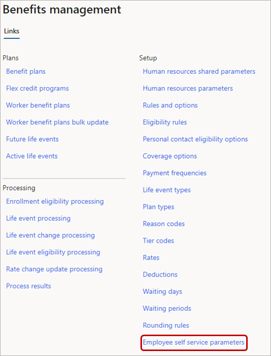
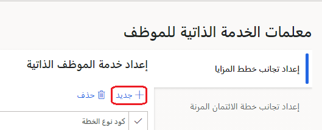
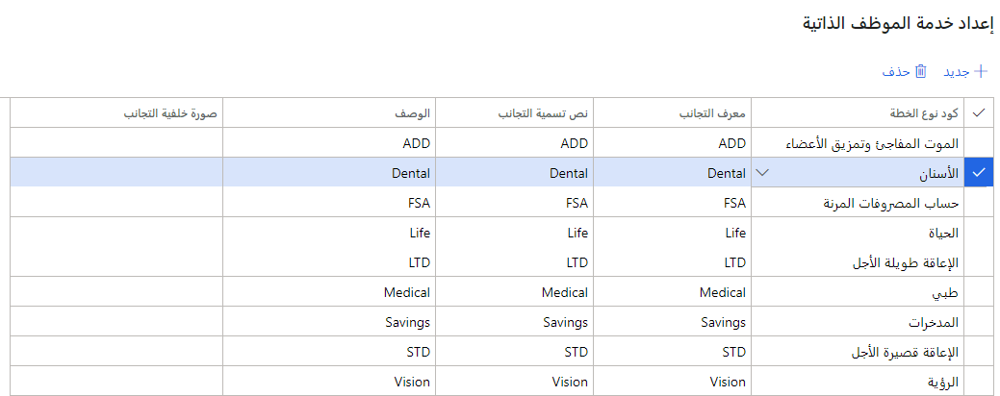

لجعل الفوائد الخاصة بك قابله للوصول للموظفين في **معلمات الخدمة الذاتية للموظفين**، يمكنك تكوين إطارين لإدارة الفوائد:

- خطط الفوائد

- خطة الائتمان المرنة

في Dynamics 365 Human Resources، يمكنك تكوين الإطارات المتجانبة للتنقل عالي المستوى في **معلمات الخدمة الذاتية للموظفين**. توجه الإطارات المتجانبة بخطة الفوائد المستخدمين إلى خطط الفوائد التي يستحقونها.

## إعداد إطار متجانب لخطط الفوائد

لإعداد إطار متجانب لخطط الفوائد، اتبع الخطوات التالية:

1. في مساحة عمل **إدارة الفوائد** أسفل **إعداد**، حدد **معلمات الخدمة الذاتية للموظف**.

   > [!div class="mx-imgBorder"]
   > 

1. في علامة التبويب **إعداد إطار متجانب لخطط الفوائد**، حدد **جديد**.

   > [!div class="mx-imgBorder"]
   > 

1. حدد **كود نوع الخطة** ثم أدخل القيم الخاصة بـ **معرف الإطار المتجانب** و **نص تسمية الإطار المتجانب** و **الوصف**. يمكنك أيضاً إضافة **صورة خلفية للإطار المتجانب**، إذا كنت ترغب في ذلك.

   > [!div class="mx-imgBorder"]
   > 

1. حدد **حفظ**.

## إعداد إطار متجانب لخطة الائتمان المرن

لإعداد إطار متجانب لخطة الائتمان المرنة، اتبع الخطوات التالية:

1. في علامة التبويب **إعداد إطار متجانب لخطة الائتمان المرنة**، حدد **جديد**.

1. حدد **معرف ائتمان الفوائد** ثم أدخل القيم الخاصة بـ **معرف الإطار المتجانب** و **نص تسمية الإطار المتجانب** و **الوصف**. يمكنك أيضاً إضافة **صورة خلفية للإطار المتجانب**، إذا كنت ترغب في ذلك.

1. حدد **حفظ**.
