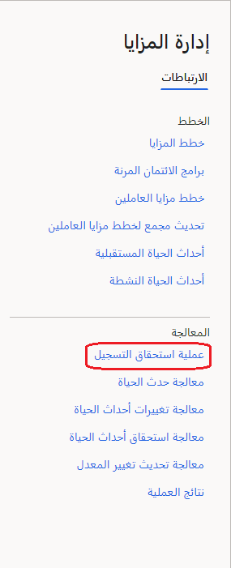
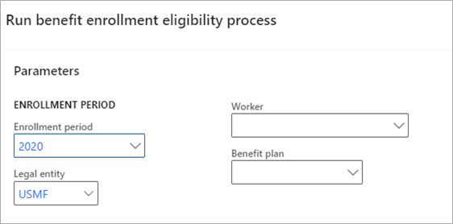

بعد قيامك بإنشاء خطة، يمكنك البدء في تسجيل الموظفين فيها، فهي عبارة عن عملية متعددة الخطوات.

1. تحديد ما إذا كان الموظفون مؤهلين للخطة أم لا. في مساحة العمل **إدارة الميزات**، ضمن **معالجة**، حدد **معالجة أهلية التسجيل**.

   > [!div class="mx-imgBorder"]
   > 

   في جزء **تشغيل عملية أهلية تسجيل الميزات**، حدد **فترة التسجيل** و **خطة الميزات**. اترك حقل **العامل** فارغاً لمعالجه كافة العاملين أو حدد عاملاً واحداً لمعالجة ذلك الشخص فقط.

   > [!div class="mx-imgBorder"]
   > 

   لمزيد من المعلومات، راجع [معالجة أهلية التسجيل](/dynamics365/human-resources/hr-benefits-process-enrollment-eligibility/?azure-portal=true).

1. يجب على الموظفين المؤهلين بعد ذلك تحديد خيار التغطية الذي يكونون مؤهلين له في **الخدمة الذاتية للموظف > الخدمة الذاتية للميزات**.

1. يجب أن يؤكد مدير التعويضات والميزات على تحديدات الموظف في **الخدمة الذاتية للموظفين > أصناف العمل المعينة لي**. بعد اكتمال التأكيد، يعتبر الموظف مسجلاً في الميزة.
