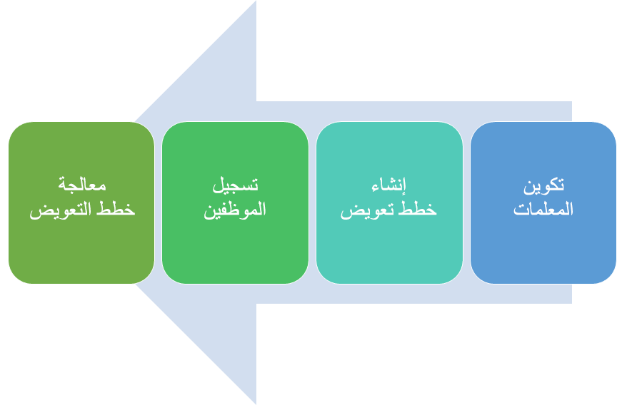

تساعدك Microsoft Dynamics 365 Human Resources على إنشاء برامج موارد بشرية (HR) فعالة من حيث التكلفة وأتمتة العمليات لتعقب برامج المكافآت. وتتكامل مع أنظمة الرواتب الشعبية للمساعدة على مركزية برامج الموارد البشرية الخاصة بك.

تساعدك Dynamics 365 Human Resources على جعل بياناتك مركزية وتوفير تحليلات حول موظفيك باستخدام Microsoft Power BI بحيث يمكنك اتخاذ قرارات أكثر ذكاء بشأن موظفيك.

يساعدك التعويض في Dynamics 365 Human Resources على إدارة التعويض الثابت والمتغير للموظفين في مؤسستك.
يمكنك إدارة الزيادات الثابتة في الأجر الأساسي والجدارة للموظف من خلال خطط التعويض الثابتة، ويمكنك إدارة دفع الحوافز من خلال خطط التعويض المتغيرة. قد يشمل الأجر التحفيزي ما يلي:

- مدفوعات المكافآت

- جوائز الأداء

- خيارات الأسهم والمنح

- جوائز المرة الواحدة

يمكنك تسجيل الموظفين في خطة واحدة أو أكثر من كلا النوعين. لكي يكون الموظف مؤهلاً للالتحاق في خطة التعويض، يجب أن يستوفي المتطلبات التالية:

- يتم تعيينه إلى منصب نشط.

- استيفاء المعايير المحددة في قواعد الأهلية لخطة التعويض.

> [!div class="mx-imgBorder"]
> 
