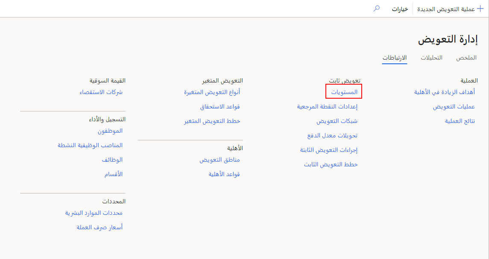
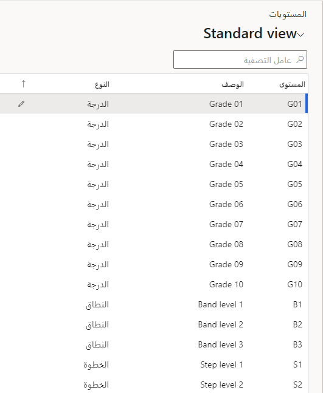
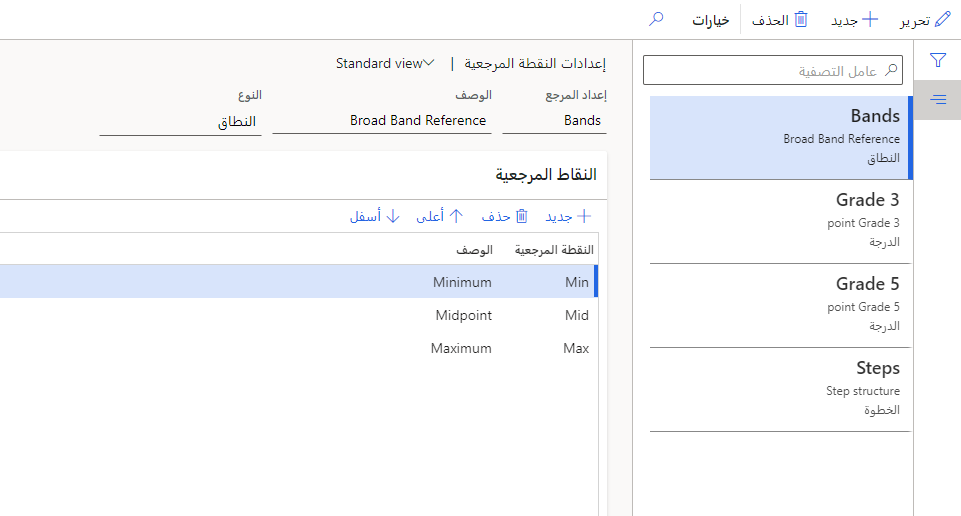
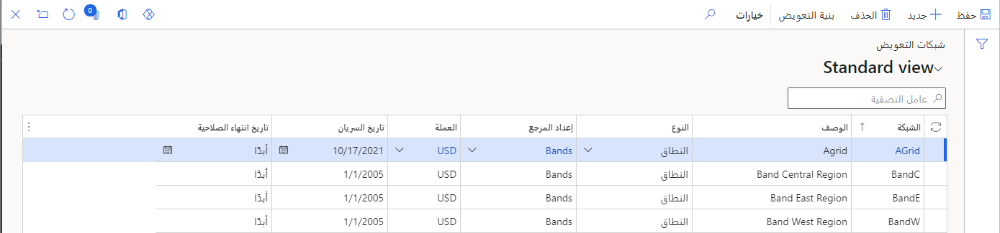
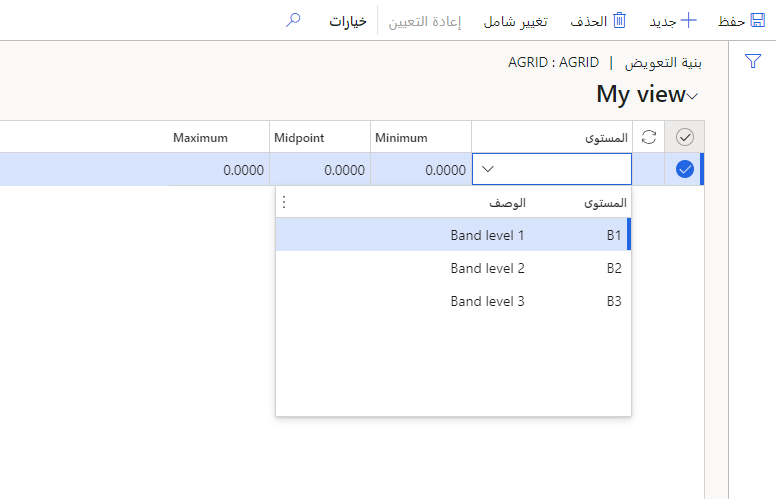
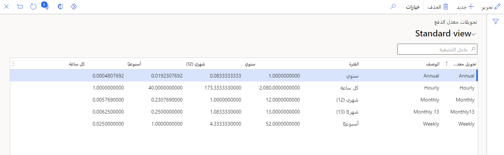
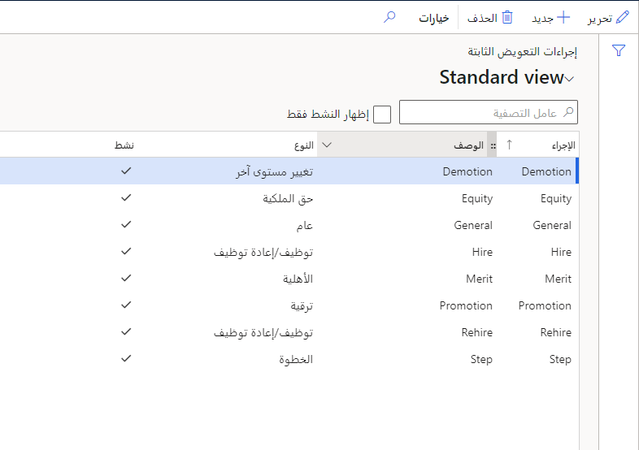

قبل أن تتمكن من إنشاء خطط تعويض ثابتة لموظفيك في Dynamics 365 Human Resources، ستحتاج إلى إعداد عدة مكونات:

- مستويات التعويض

- النقاط المرجعية

- شبكات التعويض

- تكرارات الدفع

## إعداد مستويات التعويض

يمكنك استخدام مستويات التعويض لتعيين تعويضات للوظائف المختلفة للمساعدة في ضمان حصول الموظفين الذين يشغلون هذه الوظائف على رواتب عادلة.

1. في Dynamics 365 Human Resources، حدد **إدارة التعويض**.

    > [!div class="mx-imgBorder"]
    > 

1. حدد **الارتباطات‏‎ > المستويات**.

    > [!div class="mx-imgBorder"]
    > 

1. حدد **جديد** ثم أدخل قيم **المستوى**، **الوصف**، وكذلك **النوع**.

1. في عمود **النوع**، استخدم الزرين **لأعلى** وكذلك **لأسفل** لوضع المستويات بالترتيب الصحيح وفقاً لنوعها. من خلال تحديد مستويات التعويض على وظيفة، ستساعد في ضمان حصول جميع الموظفين الذين يشغلون منصباً على هذه الوظيفة على نفس المستوى.

   > [!div class="mx-imgBorder"]
   > 

1. حدد **حفظ**.

## تكوين نقاط مرجعية

النقاط المرجعية هي الأعمدة الموجودة في الشبكة التي تحدد نطاقات التعويض لكل مستوى. مستوى التعويض هو الصف في الشبكة.
النقاط المرجعية النموذجية لخطة من نوع التقدير هي الحد الأدنى ونقطة المنتصف والحد الأقصى.

1. في مساحة عمل **إدارة التعويض**، حدد **ارتباطات > إعدادات نقطة مرجعية**.

1. حدد **جديد**.

1. أدخل قيم **إعداد المرجع**، **النوع** وكذلك **الوصف**.

1. ضمن **النقاط المرجعية**، حدد النقاط المرجعية التي تريد استخدامها.

   > [!div class="mx-imgBorder"]
   > 

1. حدد **حفظ**.

## إنشاء شبكات التعويض

بعد إعداد مستويات التعويض والنقاط المرجعية، يمكنك دمجها لإنشاء شبكة تعويض.

1. في مساحة العمل **إدارة التعويض**، حدد **الارتباطات > شبكات التعويض**.

1. حدد **جديد**.

1. أدخل قيم **الشبكة** وكذلك **النوع**.

1. حدد **النوع**، **إعداد المرجع** وكذلك **العملة** لشبكة التعويض.

1. أدخل **تاريخ السريان** وكذلك **تاريخ انتهاء الصلاحية**. إذا لم يكن لديك تاريخ انتهاء صلاحية، أدخل **أبداً**.

   > [!div class="mx-imgBorder"]
   > 

1. حدد **حفظ**.

1. حدد **بنية التعويض** لإضافة مستويات ومبالغ إلى شبكة التعويض.

1. حدد **مستوى** ثم أدخل مبالغ **الحد الأدنى**، **نقطة الوسط** وكذلك **الحد الأقصى**.

   > [!div class="mx-imgBorder"]
   > 

   > [!NOTE]
   > إذا كنت ترغب في تحديث مستويات متعددة في شبكة التعويض الخاصة بك بنفس النسبة المئوية أو مبلغ ثابت، حدد **تغييرات الكتلة**.

1. حدد **حفظ**.

## إعداد تكرارات الدفع

تحدد تكرارات الدفع كيفية تحديد أجر الموظف أو راتبه (على سبيل المثال 10.00 دولار أمريكي في الساعة مقابل 50,000.00 دولار أمريكي في السنة) والتحويل بين الأسعار بالساعة والأسبوعية والشهرية (12 شهراً) والسنوية. على سبيل المثال، تقوم الشركة التي تستخدم أسبوع عمل مدته 38 ساعة للموظفين بالساعة بإعداد تكرار دفع بمعدل ساعة واحدة ومعدل أسبوعي قدره 38 ومعدل شهري 164.6666666667 ومعدل سنوي قدره 1976. تستخدم هذه التحويلات لحساب معدلات الدفع المختلفة التي تظهر في سجل التعويض الثابت للموظف.

1. في مساحة العمل **إدارة التعويض**، حدد **الارتباطات > تحويلات معدل الدفع**.

1. حدد **جديد**.

1. أدخل قيم **تحويل معدل الدفع** وكذلك **وصفه**.

1. حدد قيمة **للفترة**.

1. أدخل قيم التحويل **السنوية**، **والشهرية (12)**، **والأسبوعية**، **وبالساعة**.

   > [!div class="mx-imgBorder"]
   > 

1. حدد **حفظ**.

## تحديد إجراءات التعويض الثابت

يمكنك استخدام إجراءات التعويض الثابتة عند تعيين التغييرات أو تطبيقها على التعويض الثابت للموظف. تتيح لك إجراءات التعويض الثابتة توفير أسماء وصفية لأنواع الإجراءات التي يمكن لمدير التعويضات والمزايا تنفيذها. أنواع مختلفة من الإجراءات لها منطق خاص وراءها بحيث يمكن استخدامها في أوقات محددة.

على سبيل المثال، عند إعداد التعويض الثابت للموظف، يمكن استخدام الإجراءات التي تحتوي على نوع من **توظيف/إعادة توظيف** فقط. في هذه الحالة، قد تحتاج إلى إنشاء ثلاثة إجراءات مختلفة من نوع **توظيف/إعادة توظيف** ثم تسميتهم **توظيف**، **إعادة توظيف**، **انتقال**. بعد ذلك، سيكون لديك شرح أكثر وصفاً لسبب منح التعويض الثابت للموظف أو سبب تغييره.

1. في مساحة العمل **إدارة التعويض**، حدد **الارتباطات > إجراءات التعويض الثابتة**.

1. حدد **جديد**.

1. أدخل قيم **الإجراء** وكذلك **الوصف**.

1. حدد قيمة **للنوع**.

   > [!div class="mx-imgBorder"]
   > 

1. حدد **حفظ**.

لمزيد من المعلومات، راجع [إنشاء خطة تعويض ثابت](/dynamics365/human-resources/hr-compensation-fixed-plans/?azure-portal=true).
