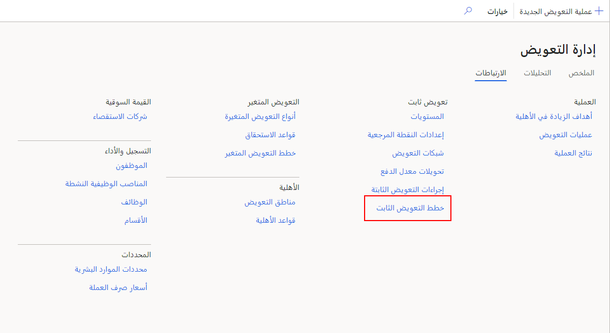
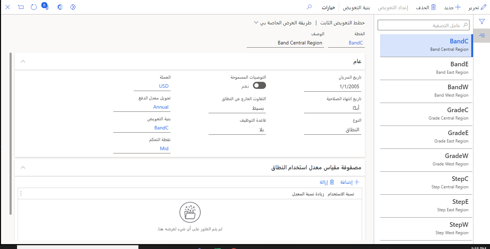
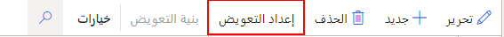
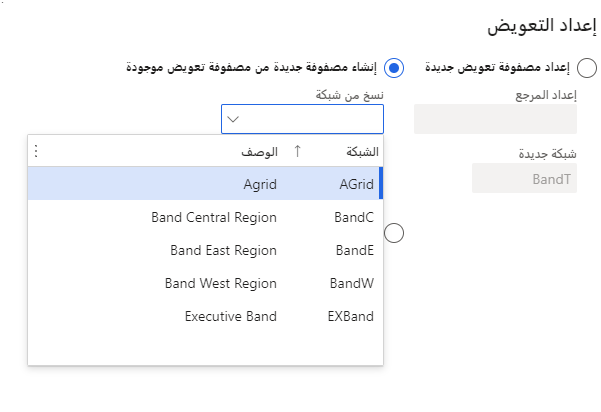
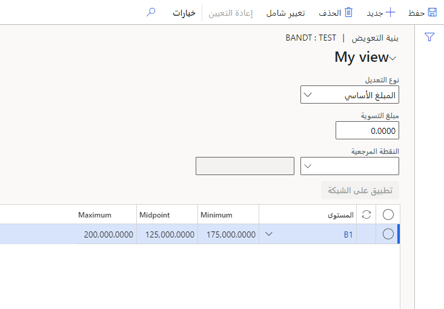
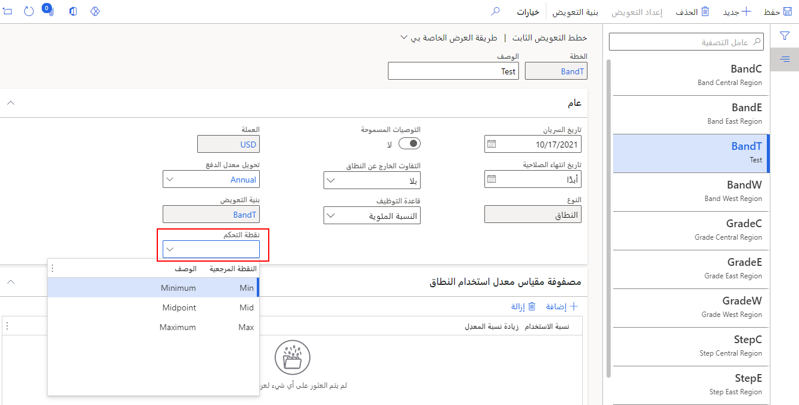

يشير التعويض الثابت إلى إجمالي الراتب أو الأجور العادية للموظف. يمكنك حساب مبالغ التعويض الثابتة لموظفيك استناداً إلى عوامل مثل الأداء والمنطقة وزيادة الميزانية.
يدعم Dynamics 365 Human Resources أنواع تعويض الخطوة والدرجة والنطاق.

في هذه الوحدة، ستتعلم كيفية إعداد درجات الأجور للوظائف ومعايير الأهلية التي يجب على الموظفين استيفائها من خلال إكمال الإجراءات التالية:

- امنح خطتك اسماً ووصفاً.

- حدد نوع الخطة (الخطوة أو الدرجة أو النطاق).

- حدد تكرار الدفع الذي ستستخدمه لمعدل أجر الموظف (مثل المبلغ بالساعة أو المبلغ في السنة).

- تعيين الخيارات التي تتحكم في كيفية معالجة التعويض.

## ضع خطة تعويض ثابتة

لإعداد خطة تعويض ثابتة، اتبع الخطوات التالية:

1. في Dynamics 365 Human Resources، حدد **إدارة التعويض**.

   > [!div class="mx-imgBorder"]
   > 

1. حدد **ارتباطات > خطط التعويض الثابت**.

   > [!div class="mx-imgBorder"]
   > 

1. حدد **جديد**.

   > [!div class="mx-imgBorder"]
   > 

1. في الحقل **خطة**، أدخل اسماً للخطة. في الحقل **الوصف**، أدخل وصفاً ذا مغزى.

1. في حقل **تاريخ السريان‬**، أدخل التاريخ الذي تصبح فيه الخطة سارية المفعول.

1. في حقل **النوع**، حدد ما إذا كانت خطة التعويض الثابت هي خطة **نطاق**، أو **درجة**، أو **خطوة**.

1. تعمل خانة الاختيار **السماح بالتوصية** كقيمة افتراضية للإجراءات التي تمت إضافتها إلى هذه الخطة في حدث العملية. حدد **نعم** للسماح بالتوصيات وتمكينك من تجاوز مبلغ الإرشاد المحسوب عند معالجة التعويض.

1. حدد قيمة في حقل **التفاوت الخارج عن النطاق**، والذي يسمح لك بتحديد كيفية معالجة مبالغ التعويض التي تقع خارج نطاق بنية التعويض المحدد للمستوى المحدد:

   - **بلا‬‏‫** - يسمح لك باستخدام أي مبلغ تعويض.
    
   - **مبدئي** - يحذر المستخدمين إذا كان مبلغ التعويض أقل من الحد الأدنى أو أكبر من الحد الأقصى لمبالغ النقطة المرجعية لهذا المستوى. يمكن للمستخدمين تجاهل التحذير والمتابعة.
    
   - **ثابت** - ينشئ خطأ إذا كان تعويض الموظف خارج الحد الأدنى والحد الأقصى للنقاط المرجعية للمستوى، وسوف يضبط تعويض الموظف تلقائياً ليقع ضمن النطاق.

1. حدد قيمة في حقل **قاعدة التوظيف** الذي يحسب تعويض الموظف أثناء حدث العملية. تحسب **قاعدة التوظيف** **بالنسبة المئوية** الزيادة التي يتم توزيعها بالتناسب على طول الفترة الزمنية التي قضاها العامل في العمل في الدورة.

1. في حقل **العملة**، حدد رمز العملة.

1. في حقل **تحويل معدل الدفع**، حدد قيمة.

1. حدد **حفظ**.

   > [!div class="mx-imgBorder"]
   > 

## إعداد التعويض

يتيح حفظ خطة التعويض زر **إعداد التعويض** بحيث يمكنك الاستمرار في تحديد بنية التعويض الخاص بك للخطة.

يمكنك إنشاء بنية تعويض باستخدام إحدى الطرق الثلاثة التالية:

- إنشاء بنية جديدة تماماً عن طريق تحديد مجموعة من النقاط المرجعية ثم إضافة المستويات لإنشاء البنية الخاصة بك.

- نسخ بنية تعويض من خطة موجودة كنقطة بداية وتعديلها للخطة الجديدة.

- تحديد شبكة تعويض موجودة. إذا كانت هناك خطة أخرى تستخدم شبكة التعويض بالفعل، فإن الخطة الأخرى تعكس أيضاً التغييرات التي تجريها على الشبكة.

على سبيل المثال، ستقوم بنسخ بنية تعويض من خطة موجودة.

1. حدد **إعداد التعويض**.

   > [!div class="mx-imgBorder"]
   > 

1. حدد **إنشاء مصفوفة تعويض جديدة من القائمة**.

1. في الحقل **نسخ من الشبكة**، أدخل قيمة أو حددها.

   > [!div class="mx-imgBorder"]
   > 

1. حدد **موافق**.

1. حدد **تغيير الكتلة** والذي يسمح لك بالحفاظ على مبالغ مصفوفة التعويض عن طريق تطبيق نسبة مئوية أو مبلغ ثابت على مستوى واحد أو أكثر أو نقاط مرجعية.

1. في حقل **مبلغ التسوية**، أدخل رقماً.

1. في القائمة، حدد كافة الصفوف أو قم بمسحها.

1. حدد **تطبيق على الشبكة**.

   > [!div class="mx-imgBorder"]
   > 

1. حدد **حفظ** ثم عد إلى صفحة **خطط التعويضات الثابتة**.

1. في الحقل **نقطة التحكم**، أدخل نقطة مرجعية أو حددها لاستخدامها كنقطة تحكم لخطة التعويض الثابت. يتم استخدام نقطة التحكم لحساب **نسبة التعويض** للموظف.

   > [!div class="mx-imgBorder"]
   > 

1. حدد **حفظ**.

لمزيد من المعلومات، راجع [إنشاء خطة تعويض ثابت](/dynamics365/human-resources/hr-compensation-fixed-plans/?azure-portal=true).
