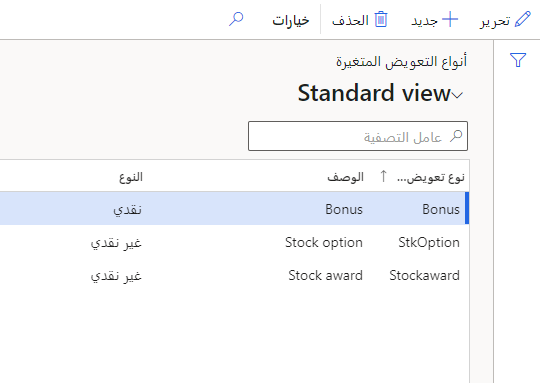
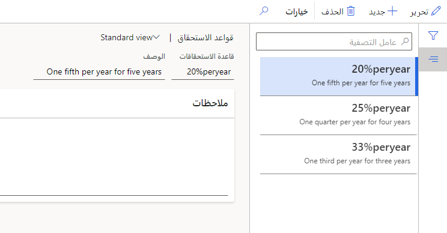
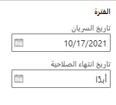

في Dynamics 365 Human Resources، يشكل التعويض المتغير الأجر غير المنتظم للموظف، مثل المكافآت أو مكافآت الأسهم. تحتاج إلى إعداد بعض المكونات قبل أن تتمكن من استخدام التعويض المتغير وتسجيل موظف في خطة تعويض متغيرة.

يمكن أن يستند حساب مبالغ التعويض المتغيرة لموظفيك إلى عدة عوامل، منها:

- أداء الموظف

- مستوى تعويض الموظف

- أداء القسم

## إنشاء أنواع التعويض

أنواع التعويض المتغير هي مكونات مطلوبة لخطة تعويض متغيرة. تتيح لك أنواع التعويض المتغير وصف أنواع التعويض المتغير الذي تمنحه مؤسستك. كما أنها تتيح لك تحديد ما إذا كان التعويض سيكون نقداً أو في صورة غير نقدية، مثل الأسهم.

1. في مساحة العمل **إدارة التعويض**، حدد **الارتباطات > أنواع التعويض المتغير**.

1. حدد **جديد**.

1. أدخِل قيم **نوع التعويض المتغير** و **الوصف**.

1. حدد ما إذا كان **النوع** **نقداً** أم **غير نقدي**.

   > [!div class="mx-imgBorder"]
   > 

1. حدد **حفظ**.

## إعداد قواعد الاستحقاق

اختيارياً، يمكنك إعداد قواعد الاستحقاق، التي تصف كيفية تخصيص المكافأة المتغيرة بمرور الوقت. على سبيل المثال، قد تنص قاعدة الاستحقاق على أن الموظف سيحصل على 25 في المائة من إجمالي الجائزة كل عام للسنوات الأربع المقبلة. قواعد الاستحقاق إعلامية فقط.

1. في مساحة العمل **إدارة التعويض**، حدد **الارتباطات > قواعد الاستحقاق**.

1. حدد **جديد**.

1. أدخِل قيم **قاعدة الاستحقاق** وكذلك **الوصف**.

   > [!div class="mx-imgBorder"]
   > 

1. حدد **حفظ**.

## إعداد خطة التعويض المتغير

تحتوي خطة التعويض المتغير على القواعد وأساليب الحساب والقيم الافتراضية لحساب التعويض المتغير للموظفين المسجلين.

1. في مساحة العمل **إدارة التعويض**، حدد **الارتباطات > خطط التعويض المتغير**.

1. حدد **جديد**.

1. أدخِل قيم **الخطة** وكذلك **الوصف**.

   > [!div class="mx-imgBorder"]
   > 

1. ضمن **عام**، أدخِل **تاريخ السريان** وكذلك **تاريخ انتهاء الصلاحية**.
إذا لم يكن لديك تاريخ انتهاء صلاحية، أدخل **أبداً**.

   > [!div class="mx-imgBorder"]
   > 

1. حدد **نوع تعويض متغير**، والذي يحدد ما إذا كان النظام سيحسب مبلغ عملة أو عدد معين من الوحدات كجائزة.

1. حدد طريقة حساب في **الحساب**:

    - **نقطة زمنية معينة**: يستند حساب المكافأة المتغيرة إلى التعويض الثابت الذي حصل عليه الموظف في تاريخ محدد. يتم تحديد هذا التاريخ في حدث العملية عند معالجة مبالغ تعويض جديدة.
    
    - **مركب**: يتم حساب مبلغ المكافأة لكل معدل دفع تعويض ثابت فريد كان لدى الموظف بين تاريخ بدء الدورة وتاريخ انتهاء الدورة في حدث العملية. ثم تضاف المعدلات معاً لتحديد المكافأة النهائية. على سبيل المثال، أثناء الدورة، يتم نقل موظف إلى منصب مختلف له معدل دفع مختلف. في هذه الحالة، يتم تعديل المكافأة المتغيرة لطول المدة الزمنية التي كان للموظف فيها كل معدل دفع.

    > [!div class="mx-imgBorder"]
    > 

1. حدد **النسبة المئوية من الأساس** أو **عدد الوحدات**. يمكن أن يستند مبلغ المكافأة المتغيرة إلى نسبة مئوية من الأرباح الأساسية العادية للموظف أو عدد محدد من الوحدات، على النحو التالي:

   - **النسبة المئوية للأساس**: حدد هذا الخيار لإدخال نسبة مئوية افتراضية، ثم حدد ما إذا كان يجب أن يكون الأساس هو معدل الدفع الثابت للموظف أو نقطة التحكم لمستوى تعويض الموظف. يتم تعيين مستوى التعويض استناداً إلى وظيفة الموظف. يمكن تعيين نقطة مرجعية واحدة من بنية التعويض كنقطة تحكم في خطة التعويض الثابتة.
   سيستخدم النظام مستوى التعويض من وظيفة الموظف ويراجعه مع نقطة التحكم المسردة في خطة التعويض الثابتة للموظف للعثور على مبلغ نقطة التحكم لمستوى تعويض الموظف. ثم يتم استخدام مبلغ نقطة التحكم بدلاً من معدل الدفع الثابت للموظف كأساس للمكافأة.
    
   - **عدد الوحدات**: حدد هذا الخيار لإدخال عدد افتراضي من الوحدات وقيمة كل وحدة والعملة الخاصة بقيمة الوحدة إذا كانت خطة التعويض لمكافأة غير نقدية (على سبيل المثال، 200 وحدة مخزون بقيمة 40 دولاراً أمريكياً)، أو فقط عدد الوحدات إذا كانت خطة التعويض لمكافأة نقدية. بالنسبة إلى مكافأة نقدية، سيحصل الموظف على العدد المحدد من وحدات العملة المستخدمة لخطة التعويض الثابت (على سبيل المثال، 500 وحدة من دولار أمريكي واحد). يمكن استخدام عنصر التحكم علاقة واحد إلى واحد للإشارة إلى ما إذا كان يوجد تعيين مباشر واحد إلى واحد بين عدد الوحدات وقيمة الوحدة. عند إنشاء خطة تعويض متغيرة لخطة مستندة إلى النقد باستخدام عدد الوحدات، يتم تأمين هذا الخيار تلقائياً إلى **نعم**، وقيمة الوحدة هي **1.0000**.

    > [!div class="mx-imgBorder"]
    > 

1. تحديد قيمة **قاعدة التوظيف**:

    - **بدون**: يجب أن يحصل جميع الموظفين على نفس الزيادة، بغض النظر عن تاريخ تعيينهم.
    
    - **النسبة المئوية**: يجب أن يحصل الموظفون على نسبة مئوية من المكافأة على أساس طول مدة عملهم خلال الدورة.

لمزيد من المعلومات، راجع [إنشاء خطط تعويض متغيرة](/dynamics365/human-resources/hr-compensation-variable-plans/?azure-portal=true).
