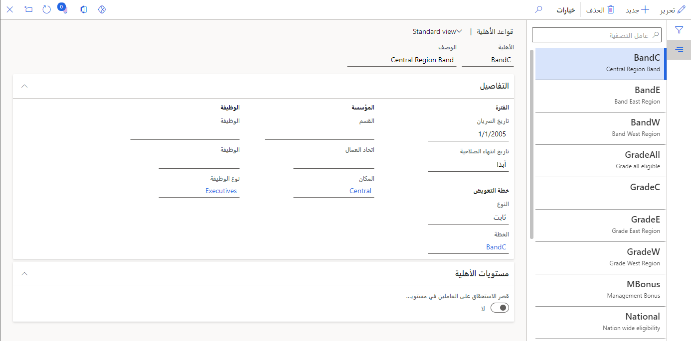

قبل أن تتمكن من تسجيل الموظفين في خطة تعويض في Dynamics 365 Human Resources، تحتاج أولاً إلى تحديد المؤهلين للحصول على التعويض المحدد ضمن الخطة. وحتى تقوم بتحديد الأهلية، لن تتمكن من تعيين الخطة للموظفين.

يجب أن يستوفي الموظف جميع المعايير المحددة ليكون مؤهلاً للحصول على خطة التعويض. إذا لم تحدد المعايير، يكون جميع الموظفين مؤهلين للحصول على خطة التعويض. إذا لم يستوف أحد الموظفين المعايير المحددة في قاعدة الأهلية، أو لم يتم تحديد قاعدة أهلية لخطة تعويض، فلن تظهر خطة التعويض في البحث عند إنشاء سجل تعويض ثابت للموظف.

1. في مساحة العمل **إدارة التعويض**، حدد **الارتباطات > قواعد الأهلية**.

   > [!div class="mx-imgBorder"]
   > 

1. حدد **جديد**.

1. في حقل **الأهلية**، أدخِل اسماً لقاعدة الأهلية.

1. في الحقل **الوصف**، أدخل وصفاً ذا مغزى.

1. في الحقل **تاريخ السريان**، أدخِل تاريخاً.

1. في الحقل **النوع**، حدد نوع الخطة (ثابت أو متغير).

1. في الحقل **الخطة**، حدد قيمة.

1. حدد المعايير التي يجب أن يستوفيها الموظف ليكون مؤهلاً للحصول على خطة التعويض، مثل:

   - **القسم**
    
   - **اتحاد العمال**
    
   - **الموقع**
    
   - **الوظيفة**
    
   - **الوظيفة**
    
   - **نوع الوظيفة**

   > [!div class="mx-imgBorder"]
   > 

1. حدد **حفظ**.
