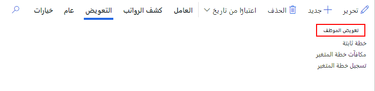
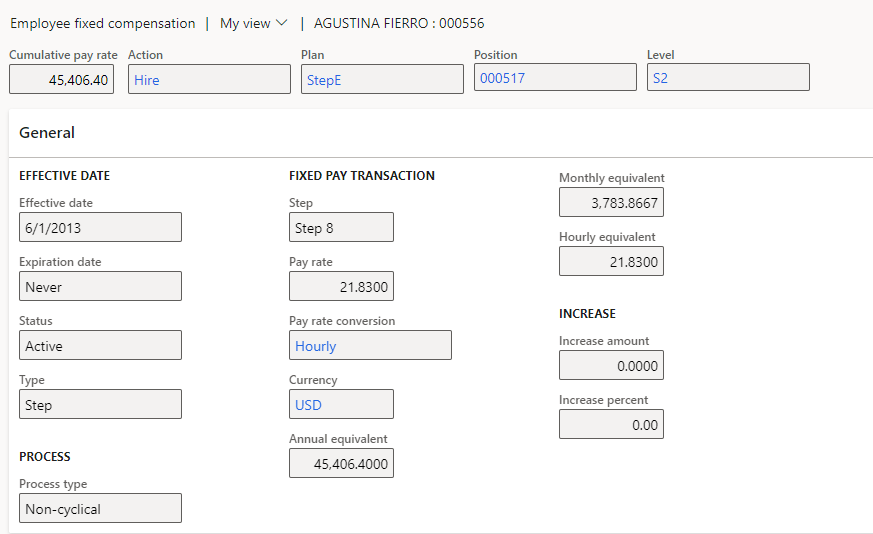
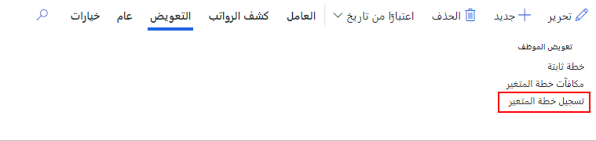
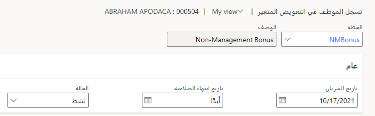

يمكنك الآن تعيين موظف إلى خطة تعويض واحدة أو أكثر في Dynamics 365 Human Resources. يعرض حقل **خطط التعويض** لسجل الموظف الخطط التي يكون الموظف مؤهلاً لها بموجب قواعد الأهلية التي تم إعدادها لكل خطة. إذا لم يتم إعداد قواعد الأهلية لخطة، فلن يكون أي موظف مؤهلاً لتلك الخطة.

يتحقق النظام من أن مبلغ التعويض المحدد لخطة تعويض من نوع **الصف** أو **النطاق** يقع ضمن الحد الأدنى والحد الأقصى من النقاط المرجعية لمستوى التعويض المحدد في وظيفة الموظف. إذا كان مبلغ التعويض خارج النطاق المسموح به، سيتم عرض رسالة تحذير أو خطأ، استناداً إلى مستوى التفاوت الذي تم تعيينه على خطة التعويض.

## تسجيل موظف في خطة تعويض ثابتة

يمكن لمديري التعويضات والمزايا تعيين الموظفين لخطط التعويض الثابتة لإدارة رواتبهم الأساسية.

1. في مساحة العمل **إدارة التعويض**، حدد **الارتباطات > الموظفين**.

1. حدد **التعويض** في شريط التنقل ثم حدد **خطة ثابتة**.

   > [!div class="mx-imgBorder"]
   > 

1. حدد **جديد**.

1. في الحقل **إجراء**، حدد إجراء تعويض ثابت من النوع **توظيف** أو **إعادة توظيف** لوصف التغيير في تعويض الموظف.

1. في الحقل **الخطة**، حدد خطة تعويض ثابتة للموظف. تتم تصفية بحث **الخطة** لإظهار الخطط التي يكون الموظف فيها مؤهلاً للحصول عليها فقط استناداً إلى قواعد الأهلية.

1. حدد قيمة الموضع في الحقل **الموضع**، ثم حدد المستوى في الحقل **المستوى**.

1. اضبط **تاريخ السريان** و **تاريخ انتهاء الصلاحية** حسب الحاجة، ثم قم بضبط القيم في الحقول الأخرى حسب الضرورة.

   > [!div class="mx-imgBorder"]
   > 

1. حدد **حفظ**.

## تسجيل موظف في خطة التعويض المتغيرة

يمكن لمديري التعويضات والمزايا تسجيل الموظفين في خطط التعويض المتغير لحساب المكافآت النقدية وغير النقدية للموظفين.

1. في مساحة العمل **إدارة التعويض**، حدد **الارتباطات > الموظفين**.

1. حدد **التعويض** في شريط التنقل ثم حدد **تسجيل خطة متغيرة**.

   > [!div class="mx-imgBorder"]
   > 

1. حدد **جديد**.

1. في الحقل **الخطة**، حدد خطة تعويض متغيرة للموظف. تتم تصفية بحث **الخطة** لإظهار الخطط التي يكون الموظف فيها مؤهلاً للحصول عليها فقط استناداً إلى قواعد الأهلية.

1. أدخِل قيم **تاريخ السريان** و **تاريخ انتهاء الصلاحية** و **الحالة**.

   > [!div class="mx-imgBorder"]
   > 

1. حدد **حفظ**.
