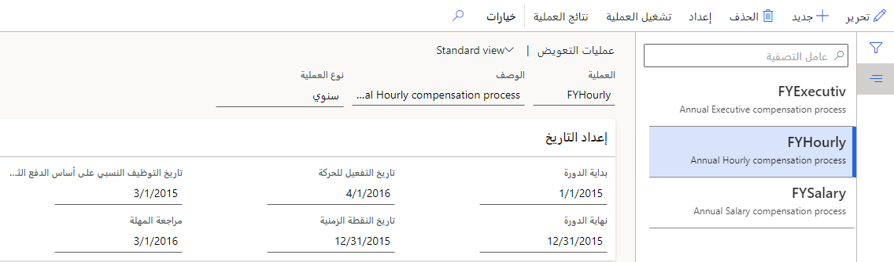
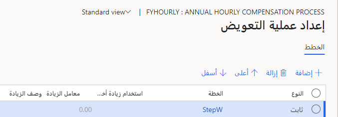
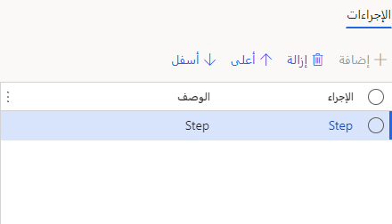
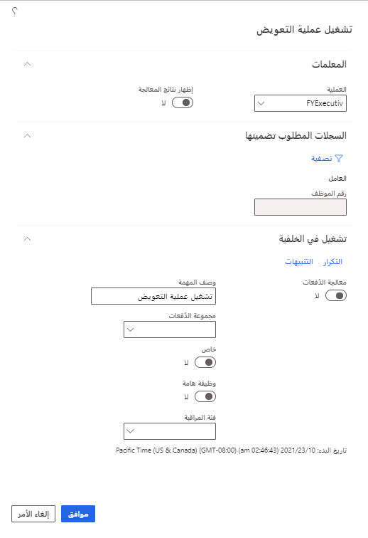
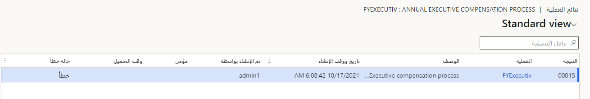

في Dynamics 365 Human Resources، تسمح لك معالجة التعويض احتساب مبالغ التعويض الأساسية الجديدة لموظفيك استناداً إلى تعديلات الأسهم وأهداف زيادة الجدارة والأداء. في هذا الوحدة، ستقوم بما يلي:

- إنشاء عملية تعويض.

- تشغيل العملية.

- عرض النتائج.

## إعداد عملية التعويض

يتيح لك حدث العملية تحديد معلمات معالجة التعويض، بما في ذلك فترة التاريخ لتقييم تحديد مبالغ التعويض والتاريخ الذي يجب أن تدخل فيه مبالغ التعويض الجديدة حيز التنفيذ.

1. في مساحة العمل **إدارة التعويض**، حدد **الارتباطات > عمليات التعويض**.

1. حدد **جديد**.

1. أدخِل قيم **العملية** و **الوصف**، ثم حدد **نوع العملية**.

1. أدخِل تواريخ الحقول ضمن **إعداد التاريخ**.

   > [!div class="mx-imgBorder"]
   > 

1. حدد **حفظ**.

1. حدد **الإعداد** في شريط التنقل.

1. ضمن **الخطط**، حدد **إضافة** لإضافة خطة تعويض إلى حدث العملية.

   > [!div class="mx-imgBorder"]
   > 

1. ضمن **الإجراءات**، حدد **إضافة** لإضافة إجراءات تعويض ثابتة للخطة المحددة.

   > [!div class="mx-imgBorder"]
   > 

1. حدد **حفظ**.

## تشغيل عملية التعويض

لتشغيل عملية التعويض، اتبع الخطوات التالية:

1. في الصفحة **عمليات التعويض**، حدد **تشغيل العملية**.

1. قم بتغيير القيم في جزء **تشغيل عملية التعويض** حسب الضرورة.

   > [!div class="mx-imgBorder"]
   > 

1. حدد **موافق**.

## عرض نتائج العملية

في الصفحة **عمليات التعويض**، حدد **نتائج العملية**.

> [!div class="mx-imgBorder"]
> 

تحتوي صفحة **نتائج العملية** على معلومات حول تشغيل العملية، بما في ذلك وقت التشغيل، والمستخدم الذي قام بتشغيل العملية، وما إذا كانت الأخطاء قد حدثت عند تشغيل العملية. يمكنك أيضاً تحديد الخيار **تأمين** لتعطيل الزر **تحميل التعويض** ومنع أي شخص من تحميل أحداث التعويض إلى سجلات الموظف.
يؤدي تحديد الزر **نتائج الموظف** إلى عرض قائمة الموظفين المضمنين في التشغيل.

للحصول على مزيد من المعلومات، راجع [عملية التعويض](/dynamics365/human-resources/hr-compensation-process/?azure-portal=true).
