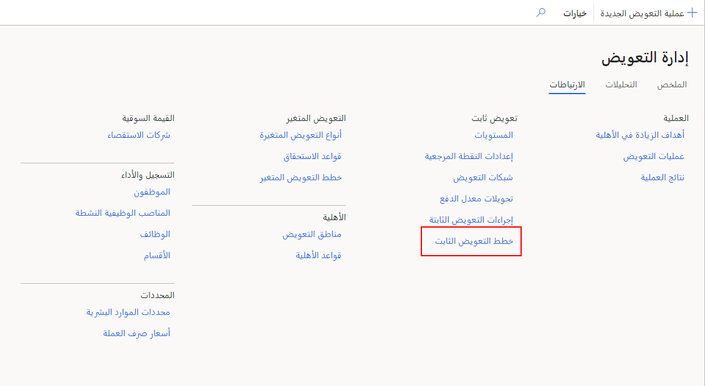
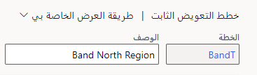

في هذا التدريب، ستقوم بإنشاء خطة تعويض ثابتة.

1.  في Dynamics 365 Human Resources، حدد **إدارة التعويض**.

    > [!div class="mx-imgBorder"]
    > 

1.  حدد **الارتباطات > شبكات التعويض**.

1.  أدخِل القيم التالية لشبكة التعويض الجديدة:

    - **الشبكة** - BandN
    
    - **الوصف** - نطاق المنطقة الشمالية
    
    - **النوع** - النطاق
    
    - **الإعداد المرجعي** - النطاقات
    
    - **العملة** - الدولار الأمريكي
    
    - **تاريخ السريان** - 4/1/2021
    
    - **تاريخ انتهاء الصلاحية** - أبداً

    > [!div class="mx-imgBorder"]
    > 

1.  حدد **حفظ**.

1.  ارجع إلى **إدارة التعويض** ثم حدد **خطط التعويض الثابتة**.

    > [!div class="mx-imgBorder"]
    > 

1.  حدد **جديد**.

    > [!div class="mx-imgBorder"]
    > 

1.  في حقل **الخطة**، أدخِل **BandN**. في الحقل **الوصف**، أدخل **نطاق المنطقة الشمالية‬**.

    > [!div class="mx-imgBorder"]
    > 

1.  في **تاريخ السريان**، حدد **4/1/2021** ثم اترك قيمة **تاريخ انتهاء الصلاحية** **أبداً**.

1.  في **النوع**، حدد **شريط** وفي **قاعدة التوظيف**، حدد **لا يوجد**.

1.  في **العملة**، حدد **الدولار الأمريكي** وفي **تحويل سعر الدفع**، حدد **سنوي**.

1.  حدد **حفظ**.

1.  حدد **إعداد التعويض** في شريط التنقل.

1.  حدد **استخدام مصفوفة التعويض الموجودة**.

1.  في **الشبكة**، حدد **BandN**.

1.  حدد **موافق**.

1.  في صفحة **بنية التعويض**، قم بإعداد الشبكة مع القيم الموضحة في لقطة الشاشة التالية.

    > [!div class="mx-imgBorder"]
    > 

1.  حدد **حفظ**.

1.  العودة إلى صفحة **خطط التعويض الثابتة**.

1.  في **نقطة التحكم**، حدد **المنتصف**.

1.  حدد **حفظ**.

    > [!div class="mx-imgBorder"]
    > 
