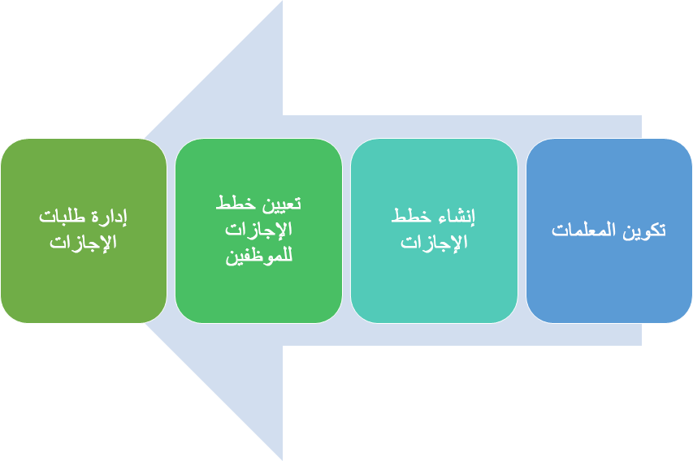

Microsoft Dynamics 365 Human Resources يساعدك على توفير مزايا إجازة تنافسية ومرنة لموظفيك. توفر مساحة العمل **الإجازة والغياب** مهام سير عمل لإدارة الطلبات وصفحة خدمة ذاتية بديهية للموظفين لطلب إجازة. تساعد التحليلات مؤسستك على قياس ومراقبة أرصدة الإجازات والاستخدام لخطط الإجازات الخاصة بك.

يتيح تطبيق Microsoft Dynamics 365 Human Resources في Microsoft Teams للموظفين طلب إجازة سريعة وعرض معلومات رصيد الإجازات في Microsoft Teams. يمكن للموظفين التفاعل مع روبوت لطلب المعلومات وبدء طلب إجازة. بالإضافة إلى ذلك، يمكنهم استخدام تطبيقات أخرى لإرسال معلومات للآخرين حول الإجازة القادمة.

Dynamics 365 Human Resources يوفر لك ميزات إجازة وغياب محسّنة من شأنها:

- مساعدتك في توفير مزايا إجازة حديثة لعمالك.

- قم بتمكين العاملين لديك من خلال تجربة خدمة ذاتية مبسطة وشخصية.

- ساعد في خفض تكاليف العملية الخاصة بك.

- قدم رؤى للقوى العاملة ومساعدتك على تلبية لوائح الامتثال.

Dynamics 365 Human Resources يساعدك على توفير خطط إجازة تساعد في جذب قوة عاملة قوية والاحتفاظ بها. مع مساحة العمل **المغادرة والغياب**، يمكنك عرض وإدارة أي نوع تقريباً من خطط الإجازة التي يمكنك التفكير فيها لموظفيك.
تتيح لك ميزة **الإجازة والغياب** إنشاء برامج متوافقة وتنافسية تلتزم باللوائح العالمية المتغيرة، مثل قانون الإجازة العائلية والإجازة الطبية (FMLA) وقانون الأمريكيين ذوي الإعاقة (ADA).

> [!div class="mx-imgBorder"]
> 
