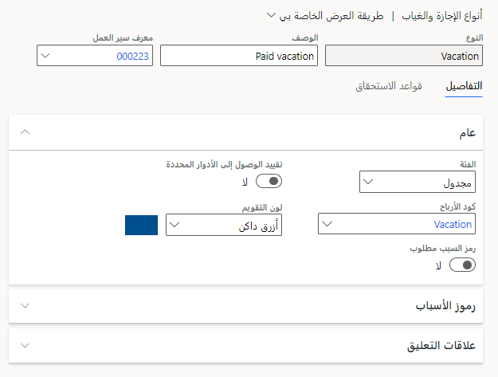

قبل إنشاء خطط الإجازة في Dynamics 365 Human Resources، تحتاج إلى تكوين الخيارات التالية:

- معايير الموارد البشرية

- معايير الإجازة والغياب

## تكوين معايير الموارد البشرية

في هذه الخطوة، ستقوم بتهيئة:

- التسلسل الرقمي الذي تستخدمه الموارد البشرية لطلبات الإجازة.

- متطلبات الأهلية لقانون الإجازة العائلية والطبية (FMLA).

- المعلومات التي يمكن للمديرين إدخالها للموظفين في علامة التبويب **الخدمة الذاتية للموظف**.

1. في الموارد البشرية، حدد المربع **المغادرة والغياب**.

   > [!div class="mx-imgBorder"]
   > 

1. في صفحة **المغادرة والغياب** حدد علامة التبويب **الروابط**.

1. ضمن **الإعداد**، حدد **معايير الموارد البشرية**.

1. في علامة التبويب **التسلسلات الرقمية**، قم بتغيير **رمز التسلسل الرقمي** من أجل **معرّف طلب الإجازة**، إذا لزم الأمر. يحدد هذا الإعداد التسلسل المستخدم لتعيين المعرفات تلقائياً لمغادرة الطلبات.

   > [!div class="mx-imgBorder"]
   > 

1. إذا كانت شركتك في الولايات المتحدة، في علامة التبويب **FMLA**، أدخل متطلبات أهلية FMLA لشركتك.

   > [!div class="mx-imgBorder"]
   > 

1. في علامة التبويب **الخدمة الذاتية للموظف**، حدد العناصر التي يمكن للمديرين إدخالها نيابة عن موظفيهم. في هذه الحالة، حدد الخيارات التالية:

   - **طلبات المغادرة والغياب**

   - **إجازة طلب الشراء**

   - **طلب إجازة البيع**

   > [!div class="mx-imgBorder"]
   > 

1. حدد **حفظ** في الزاوية العلوية اليسرى.

## تكوين معايير الإجازة والغياب

لتكوين معايير الإجازة والغياب، اتبع الخطوات التالية:

1. في صفحة **المغادرة والغياب** حدد علامة التبويب **الروابط**.

1. ضمن **الإعداد**، حدد **معايير الإجازة والغياب**.

1. في علامة التبويب **عام**، قم بتعيين المعايير التالية:

    - عيّن **وحدة الإجازة والغياب** إما **ساعات** أو **أيام**. إذا تم تعيين الخيار على أنه **أيام**، يمكنك تعيين **تمكين تعريف نصف يوم** للتبديل إلى **نعم** للسماح للموظفين باختيار النصف الأول أو النصف الثاني من اليوم في طلبات إجازاتهم.

    - حدد **تاريخ سريان أشهر الخدمة** لتعيين وقت سريان معدلات الاستحقاق لخطط الإجازة باستخدام أشهر الخدمة.

    - حدد **حساب الرصيد** لعرض الأرصدة اعتباراً من اليوم أو اعتباراً من فترة الاستحقاق. إذا حددت **الرصيد اعتباراً من اليوم**، فسيعرض الرصيد إجمالي جميع المستحقات والتسويات اعتباراً من اليوم. إذا حددت **الرصيد اعتباراً من فترة الاستحقاق** فسيعرض الرصيد إجمالي جميع المستحقات والتعديلات والطلبات اعتباراً من فترة الاستحقاق المحددة بواسطة التكرار في خطة الإجازة.

    - قم بتعيين وقت البدء لوظيفة مجموعة انتهاء الصلاحية المُرحّلة.

    - حدد **نعم** لـ **السماح للموظفين بشراء إجازة** و **السماح للموظفين ببيع الإجازة**. إذا حددت **نعم** لكلا الخيارين، يمكنك إنشاء سياسات إجازة البيع والشراء وتمكين الموظفين من إرسال طلبات إجازة الشراء والبيع.

    > [!div class="mx-imgBorder"]
    > 

1. في علامة التبويب **التقويم**، قم بتغيير إعدادات التقويم حسب الضرورة.

    > [!div class="mx-imgBorder"]
    > 

1. حدد **حفظ**.

## إنشاء تقويم وقت العمل

يعرض تقويم وقت العمل في Dynamics 365 Human Resources الأيام والساعات التي يعمل فيها الموظفون في مؤسستك. عندما يقدم موظف طلب إجازة، فلا داعي للقلق بشأن العطلات والإغلاق.

لتبسيط طلبات الإجازة، قم بتكوين هذه العناصر لمؤسستك:

- تقويم وقت العمل

- العطل والإغلاق

- وقت غير العمل

يمكنك إضافة آخر عنصرين أثناء إعداد تقويم وقت العمل. يمكنك أيضاً تكوينها أو تحديثها بشكل منفصل.

قم بإعداد تقويم وقت عمل واحد على الأقل يعرض أيامك وساعات عملك. إذا كان لديك مواقع في بلدان ومناطق متعددة، فقد ترغب في إعداد تقويم وقت العمل لكل منطقة.

1. في الموارد البشرية، حدد **إدارة المؤسسة**.

1. حدد **تقويمات**.

1. حدد **جديد**، أدخل تقويماً واسماً للتقويم الخاص بك، ثم حدد **إنشاء تقويم جديد**.

   > [!div class="mx-imgBorder"]
   > 

1. ضمن **خيارات الإنشاء**،حدد أيام العمل لمؤسستك ثم أدخل أوقات العمل.

   > [!div class="mx-imgBorder"]
   > 

   - لإضافة عطلة أو إغلاق، حدد الزر **إضافة** بجوار **الأعياد والإغلاق**.

   - لإضافة وقت غير العمل، مثل وجبات الغداء أو فترات الراحة، حدد **إضافة** ضمن **وقت عدم العمل** ثم أدخل الاسم والنطاق الزمني.

1. ضمن **أيام**، حدد **إنشاء** لإنشاء الأيام في التقويم الخاص بك. أدخل النطاق الزمني للتقويم الخاص بك ثم حدد **إنشاء أيام**.

1. لإضافة جداول عمل، ضمن **جدول العمل**، حدد **إضافة** ثم أدخل الأوقات لكل جدول عمل.

1. حدد **حفظ**.

### أضف أيام العطل وأوقات غير العمل

يمكنك إضافة أو تغيير أيام العطل والإغلاق بشكل منفصل عن تقويم وقت العمل.

1. في صفحة **إدارة المؤسسة**، حدد **الأعياد والإغلاق**.

1. حدد **جديد**، أدخل اسماً ووصفاً للعطلة أو الإغلاق، ثم حدد **حفظ**.

1. ضمن **التواريخ**، حدد **جديد** وأضف كل يوم إجازة أو يوم عطلة لمجموعة العطلات والإغلاق.

   > [!div class="mx-imgBorder"]
   > 

1. حدد **حفظ**.

يمكنك إضافة أو تغيير أوقات غير العمل بشكل منفصل عن تقويم وقت العمل.

1. في صفحة **إدارة المؤسسة**، حدد **وقت خارج العمل**.

1. حدد **جديد**، وأدخل اسماً ونطاقاً زمنياً لوقت غير العمل، ثم حدد **حفظ**.

   > [!div class="mx-imgBorder"]
   > 

## إنشاء سير عمل طلب الإجازة

يمكنك إنشاء سير عمل في Dynamics 365 Human Resources لإدارة طلبات الإجازات والغياب باستمرار. يتيح لك سير العمل **المغادرة والغياب**:

- تحديد المهام.

- حدد من يجب أن يكمل المهام.

- حدد من يمكنه الموافقة على الطلبات أو رفضها.

1. في صفحة **المغادرة والغياب** حدد علامة التبويب **الروابط**.

1. ضمن **الإعداد**، حدد **مهام سير عمل الموارد البشرية**.

1. حدد **جديد** ثم حدد **طلب المغادرة والغياب**.

   > [!div class="mx-imgBorder"]
   > 

1. عندما يظهر مربع الرسالة **فتح هذا الملف؟**، حدد **فتح** ثم تسجيل الدخول باستخدام بيانات اعتماد شركتك.

1. استخدم محرر سير العمل لإنشاء سير عمل لطلبات الإجازة الخاصة بك.
لمزيد من المعلومات، راجع [نظرة عامة على إنشاء سير العمل](/dynamics365/fin-ops-core/fin-ops/organization-administration/create-workflow/?azure-portal=true).

## تكوين أنواع الإجازات والغياب

تحدد أنواع الإجازات في Dynamics 365 Human Resources أنواع حالات الغياب التي يمكن للموظفين الإبلاغ عنها. يمكنك تخصيص أنواع الإجازات وفقاً لاحتياجات مؤسستك. تتضمن أمثلة أنواع الإجازات ما يلي:

- إجازة مدفوعة الأجر (PTO)

- إجازة غير مدفوعة الأجر

- اجازه مدفوعة

- إجازة مرضية

- إجازة طبية

- إجازة بخصوص الشئون العائلية

- العجز على المدى القصير

- إجازة عزاء

1. في صفحة **المغادرة والغياب** حدد علامة التبويب **الروابط**.

1. ضمن **الإعداد**، حدد **أنواع الإجازة والغياب**.

1. حدد **جديد**.

1. أدخل اسماً لنوع الإجازة ضمن **النوع**، وحدد سير عمل من **معرف سير العمل**، ثم أدخل وصفاً ضمن **الوصف**.

1. في **عام**، حدد **بلا**، **مجدول**، أو **غير مجدول** من القائمة المنسدلة **الفئة**.

1. حدد رمز الربح من القائمة المنسدلة **رمز الكسب**.

1. ضمن **كود السبب مطلوب**،اختر ما إذا كنت تريد طلب رمز سبب. إذا كنت تريد طلب أكواد الأسباب، فقد تحتاج إلى إضافتها. ضمن **أكواد السبب**، حدد **إضافة**، حدد كود السبب، ثم حدد **ممكّن** الخيار بجانبه.

1. ضمن **تقييد الوصول إلى الأدوار المحددة**،اختر ما إذا كنت تريد تقييد الوصول ثم حدد أدوار الأمان ضمن **أدوار الأمان لنوع الإجازة هذا**. يتم تحديد أدوار الأمان في سير العمل الذي حددته ضمن **معرف سير العمل** سابقاً في هذا الإجراء.

1. ضمن **لون التقويم**،اختر اللون الذي تريد عرضه في تقويمات الإجازات والغياب لنوع الإجازة هذا.

   > [!div class="mx-imgBorder"]
   > 

1. ضمن **علاقات التعليق**، اختر ما إذا كنت تريد أن يعلق نوع الإجازة هذا نوع إجازة آخر أو يتم تعليقه بنوع إجازة آخر. عند تقديم طلب إجازة لنوع الإجازة المعلقة، يتم إنشاء تعليق إجازة تلقائياً لنوع الإجازة المعلقة.

1. حدد **حفظ**.

### تكوين قواعد نوع الإجازة

لتكوين قواعد نوع الإجازة، اتبع الخطوات التالية:

1. في علامة التبويب **قواعد الاستحقاق** لنوع الإجازة والغياب، قم بتعيين خيارات التقريب لنوع الإجازة. تتضمن الخيارات **بلا**، **أعلى**، **أسفل**، و **الأقرب**. يمكنك أيضاً ضبط دقة التقريب لنوع الإجازة.

   > [!div class="mx-imgBorder"]
   > 

1. قم بتعيين **تصحيح الإجازة** لنوع الإجازة. عند تحديد هذا الخيار، تستخدم الموارد البشرية عدد الإجازات التي تقع في يوم عمل لتحديد كيفية استحقاق الإجازة لنوع الإجازة.
على سبيل المثال، إذا صادفت يوم عطلة مثل يوم الكريسماس يوم الإثنين، فستقوم الموارد البشرية بطرح يوم واحد من نوع الإجازة عند معالجة الاستحقاقات.

1. قم بتعيين **نوع إجازة الترحيل** لنوع الإجازة. عند تحديد هذا الخيار، سيتم تحويل أي أرصدة مُرحّلة إلى نوع الإجازة المحدد. تحتاج أيضاً إلى تضمين نوع الإجازة المُرحّلة في خطة الإجازة والغياب.

1. حدد **قواعد انتهاء الصلاحية** لنوع الإجازة. عند تكوين هذا الخيار، يمكنك اختيار الوحدة الزمنية للأيام أو الأشهر وتعيين مدة انتهاء الصلاحية. يمكنك أيضاً تعيين تاريخ سريان قاعدة انتهاء الصلاحية. يتم استخدام التاريخ الفعلي لتحديد وقت بدء تشغيل وظيفة المجموعة التي تعالج انتهاء صلاحية الإجازة أو التاريخ الذي تسري فيه القاعدة. سيحدث انتهاء الصلاحية دائماً في تاريخ بدء خطة الإجازة بعد تعيين وظيفة المجموعة للمعالجة.
على سبيل المثال، قد يكون تاريخ بدء الخطة 1/1/2021، ولكن لم يتم إنشاء القاعدة حتى 6/1/2021. من خلال تعيين التاريخ الفعلي على 6/1/2021، ستتم معالجة القاعدة في حدود العام المقبل، أو 1/1/2022. سيتم طرح أي أرصدة إجازات موجودة في وقت انتهاء الصلاحية من نوع الإجازة وستنعكس في رصيد الإجازة.
