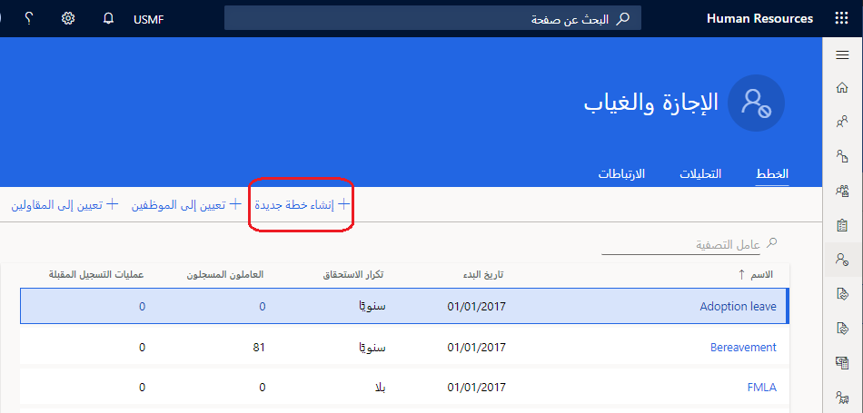
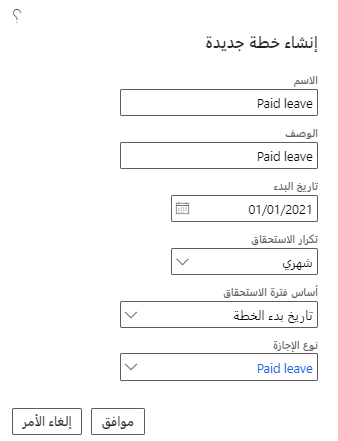
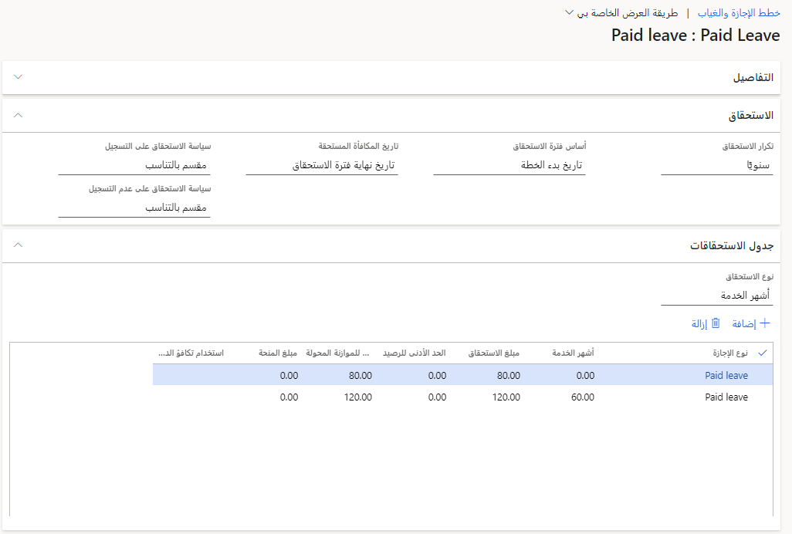
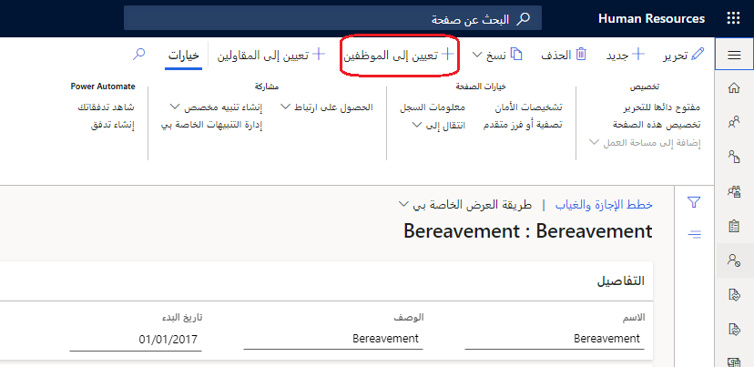
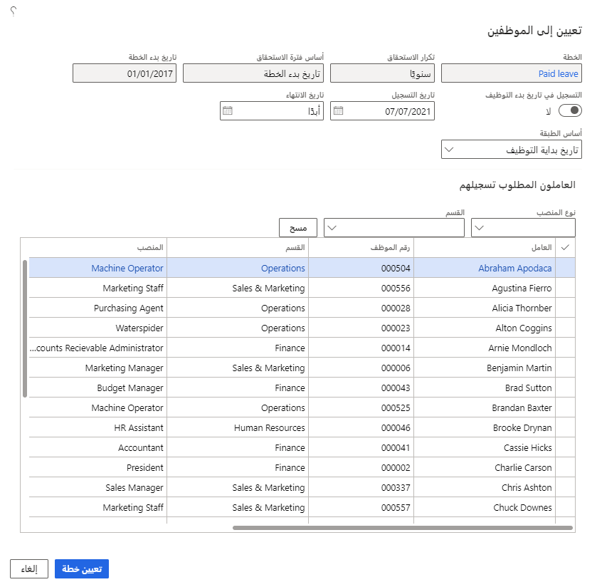

يمكنك تحديد خطط الإجازة والغياب في Dynamics 365 Human Resources لكل نوع إجازة تقدمه. يمكن أن تتراكم خطط الإجازات والغياب بترددات مختلفة، مثل سنوياً أو شهرياً أو نصف شهرياً. يمكنك أيضاً تعريف الخطة على أنها منحة، حيث يحدث استحقاق واحد في تاريخ محدد. على سبيل المثال، يمكنك إنشاء خطة تمنح إجازات عائمة سنوياً.

تسمح خطط الإجازات المتدرجة للموظفين بالحصول على مزايا بناءً على مقدار الوقت الذي يقضونه مع المؤسسة. تتيح الخطط المتدرجة التسجيل التلقائي في ساعات المزايا الإضافية.

يمكنك تحديد الحد الأقصى للمبالغ المرحلة أو الحد الأدنى من الأرصدة للتأكد من أن الموظفين يستخدمون فقط ساعات المزايا التي جمعوها.

على سبيل المثال، مع الخطة المتدرجة، يمكنك منح ميزة 80 ساعة إجازة مدفوعة الأجر (PTO) للموظفين الجدد. بعد ذلك، يمكنك منح 120 ساعة مقابل 60 شهراً من الخدمة.

يمكنك أيضاً إنشاء مزايا إجازة قائمة على المنصب، مثل ساعات المزايا الخاصة بالتنفيذيين فقط.

## ضع خطة إجازة
لإنشاء خطة إجازة، اتبع الخطوات التالية:

1.  في صفحة **الإجازة والغياب**، حدد **إنشاء خطة جديدة**.

    > [!div class="mx-imgBorder"]
    > 

1.  ضمن **إنشاء خطة جديدة**، أدخل **الاسم**، **الوصف**، **تاريخ البدء**، **معدل الاستحقاق**، **أساس فترة الاستحقاق**، و **نوع الإجازة**، لخطتك، ثم حدد **موافق**.

    > [!div class="mx-imgBorder"]
    > 

لمزيد من المعلومات، راجع [إنشاء خطة إجازة وغياب](/dynamics365/human-resources/hr-leave-and-absence-plans/?azure-portal=true) في وثائق المنتج.

## تحديد الاستحقاقات لخطة الإجازة

تحدد الاستحقاقات متى وكيف يتم منح الموظف إجازة.
في هذه الخطوة، ستحدد السياسات المتعلقة بوقت منح المستحقات والسياسات المتعلقة بتوزيع مزايا الإجازة بالتناسب.

1.  في صفحة **المغادرة والغياب** حدد خطة المغادرة الخاصة بك.

1.  في **معدل الاستحقاق** ضمن **الاستحقاق** حدد تكرار الاستحقاق.

1.  في **أساس فترة الاستحقاق**،حدد خياراً لتحديد تاريخ البدء المستخدم لحساب فترات الاستحقاق.

1.  حدد خياراً من المربع المنسدل **تاريخ استحقاق الاستحقاق**.

1.  حدد خياراً من المربع المنسدل **سياسة الاستحقاق على التسجيل**. تحدد هذه القيمة كيفية حساب الاستحقاق عندما يسجل الموظف في منتصف فترة الاستحقاق.

1.  حدد خياراً من المربع المنسدل **سياسة الاستحقاق عند إلغاء التسجيل**. تحدد هذه القيمة كيفية حساب الاستحقاق عندما يقوم الموظف بإلغاء التسجيل في منتصف فترة الاستحقاق.

    > [!div class="mx-imgBorder"]
    > 

بعد ذلك، ستحدد جدول الاستحقاق ضمن علامة التبويب **جدول الاستحقاق** يحدد جدول الاستحقاق:

- كيف يحصل الموظف على إجازة.

- ما هي المبالغ التي سوف يتراكم الموظف.

- ما هي المبالغ التي سيتم ترحيلها.

يمكنك إنشاء طبقات لمنح إجازة بناءً على مستويات مختلفة. إذا كان لديك موظفون كل ساعة، فيمكنك منح إجازة بناءً على ساعات العمل بدلاً من فترة العمل في مؤسستك. عادةً ما يتم تخزين بيانات ساعات العمل في نظام الوقت والحضور. يمكنك استيراد ساعات العمل العادية والإضافية من نظام الوقت والحضور واستخدامها كأساس لجائزة الموظف.

1. حدد خياراً من المربع المنسدل **نوع الاستحقاق**.

1. أدخل القيم في جدول الاستحقاق.

1. حدد **حفظ**.

لمزيد من المعلومات، راجع [إنشاء خطة إجازة وغياب](/dynamics365/human-resources/hr-leave-and-absence-plans/?azure-portal=true) في وثائق المنتج.

## كلف العمال بخطة إجازة

بعد إنشاء خطة الإجازة والغياب في Dynamics 365 Human Resources، يمكنك حينئذٍ تخصيصها للعاملين.

### عيّن خطة لمجموعة من الموظفين
لتعيين خطة لمجموعة من الموظفين، اتبع الخطوات التالية:

1.  في صفحة **المغادرة والغياب** حدد الخطة التي تريد تعيينها.

1.  حدد **تعيين للموظفين**.

    > [!div class="mx-imgBorder"]
    > 

1.  حدد الموظفين لتعيين الخطة لهم، ثم حدد **تعيين الخطة**.

    > [!div class="mx-imgBorder"]
    > 

### قم بتعيين خطة لموظف

يمكنك تعيين خطة لموظف واحد أيضاً:

1. في سجل الموظف، حدد **إجازة**.

1. حدد **المغادرة والغياب**.

1. حدد **جديد**.

1. أدخل تاريخ التسجيل ثم حدد خطة إجازة.
