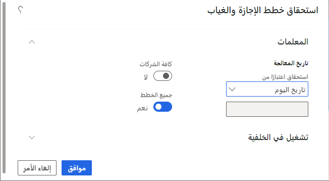

في Dynamics 365 Human Resources،يمكنك الحصول على إجازة وغياب لعدة موظفين أو لفرد.

## استحقاق الإجازة والغياب لعدة موظفين
لتراكم الإجازات والغياب لعدة موظفين، اتبع الخطوات التالية:

1.  في صفحة **المغادرة والغياب** حدد علامة التبويب **الروابط**.

1.  ضمن **إدارة الإجازة**، حدد **تجميع خطط الإجازات والغياب**.

1.  يظهر مربع الحوار **استحقاق خطط الإجازة والغياب**. في **استحقاق اعتباراً من**، حدد **تاريخ اليوم** أو حدد **تاريخ مخصص** ثم أدخل تاريخاً مخصصاً تاريخ.

    إذا كنت تريد تشغيل الاستحقاقات لجميع الشركات، فحدد **جميع الشركات**.
    إذا كنت تريد معالجة المستحقات لخطة إجازة واحدة، فحدد **لا** لـ **جميع الخطط** ثم حدد **مغادرة الخطة**. إذا حددت جميع الشركات، فلا يمكنك تحديد خطة إجازة فردية.

1.  حدد **موافق**.

    > [!div class="mx-imgBorder"]
    > 

## استحقاق الإجازة والغياب للموظف
لتراكم الإجازة والغياب للموظف، اتبع الخطوات التالية:

1.  في سجل الموظف، حدد **إجازة**.

1.  حدد **استحقاق الإجازة والغياب**.

1.  يظهر مربع الحوار **استحقاق خطط الإجازة والغياب**. في **استحقاق اعتباراً من**، حدد **تاريخ اليوم** أو حدد **تاريخ مخصص** ثم أدخل تاريخاً مخصصاً تاريخ.

    إذا كنت تريد تشغيل الاستحقاقات لجميع الشركات، فحدد **جميع الشركات**. إذا كنت تريد معالجة المستحقات لخطة إجازة واحدة، فحدد **لا** لـ **جميع الخطط** ثم حدد **مغادرة الخطة**. إذا حددت جميع الشركات، فلا يمكنك تحديد خطة إجازة فردية.

1.  حدد **موافق**.
