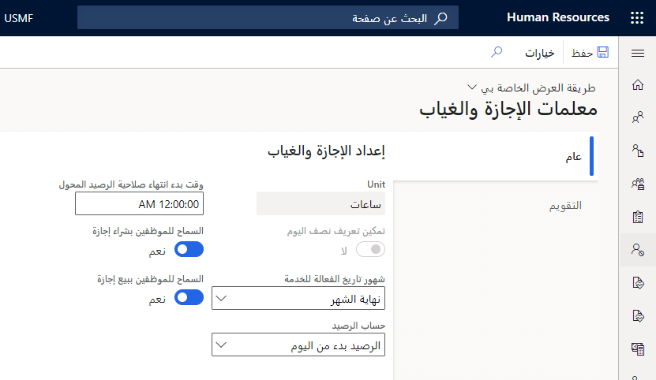
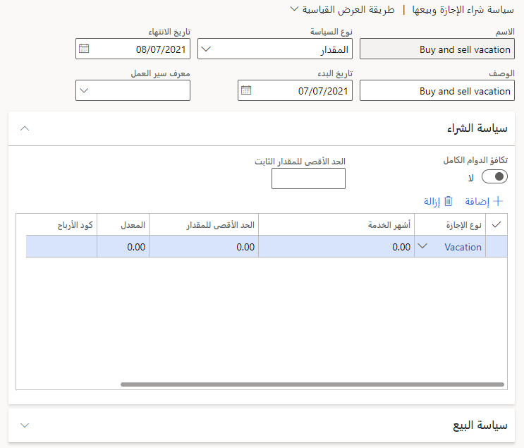
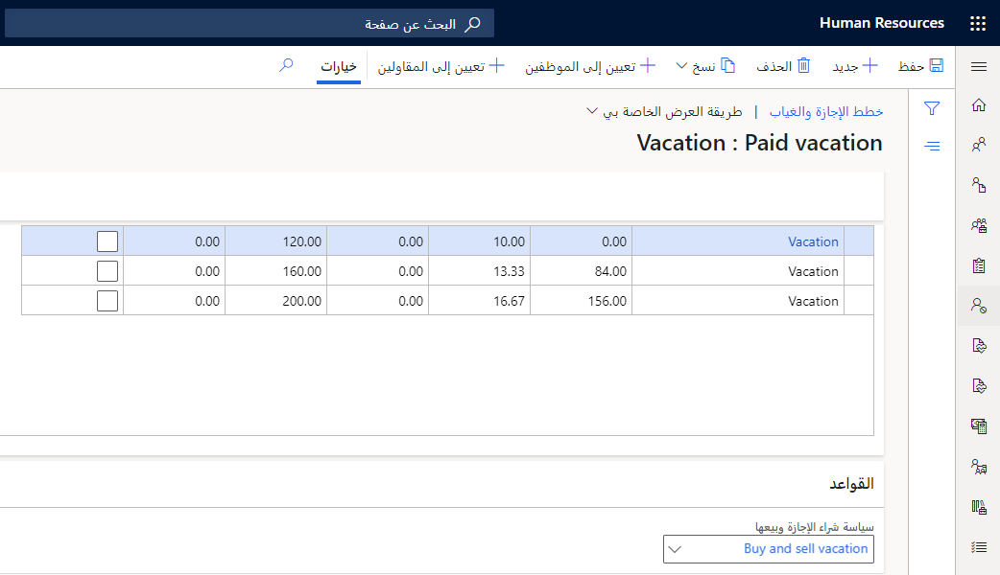

يمكنك تمكين الموظفين من شراء وبيع الإجازة من خلال إنشاء سياسة إجازة البيع والشراء. يمكنك تكوين هذه السياسات لاستخدام سير العمل للموافقات، وتعيين الحد الأقصى للمبالغ والأسعار، وتعيين معدلات الشراء والبيع.

## تمكين الموظفين من شراء وبيع الإجازة
لتمكين الموظفين من شراء وبيع الإجازة، اتبع الخطوات التالية:

1.  في صفحة **المغادرة والغياب** حدد علامة التبويب **الروابط**.

1.  حدد **معلمات الإجازة والغياب**.

1.  في صفحة **معلمات الإجازة والغياب**، حدد **نعم** لخيارات **السماح للموظفين بشراء الإجازة** و **السماح للموظفين ببيع الإجازة**.

1.  حدد **حفظ**.

    > [!div class="mx-imgBorder"]
    > 

### إنشاء سياسة شراء الإجازة وبيعها

لإنشاء سياسة شراء الإجازة وبيعها، اتبع الخطوات التالية:

1.  في صفحة **المغادرة والغياب** حدد علامة التبويب **الروابط**.

1.  ضمن **الإعداد**، حدد **سياسة شراء الإجازة وبيعها**.

1.  حدد **جديد**.

1.  قم بإدخال **اسم** و **وصف** للسياسة ضمن **سياسة شراء الإجازة وبيعها**.

1.  حدد **نوع السياسة**.

1.  حدد **تاريخ البدء** و **تاريخ الانتهاء** للسياسة. طلبات شراء الإجازة أو بيعها ستكون متاحة فقط لتقديمها خلال هذا الإطار الزمني.

1.  حدد **معرف سير العمل** للسياسة. ستستخدم طلبات البيع والشراء سير العمل هذا للمراجعة والموافقة.

1. اتبع هذه الخطوات الواردة ضمن قسمي **سياسة الشراء** و **سياسة البيع**:

    1.  حدد **معادلة الدوام الكامل** ‏(FTE) لتقسيم الحد الأقصى للمبلغ بناءً على FTE المحدد في منصب الموظف. إذا كان نوع السياسة هو **المبلغ**، فأدخل **الحد الأقصى للمبلغ الثابت**.

    1.  حدد **إضافة** لإضافة أنواع الإجازات للموظفين لشراء الإجازة.
        يمكنك إضافة أنواع إجازات متعددة إلى السياسة.

    1.  أدخل **أشهر الخدمة** لنوع الإجازة لتمكين أشهر مختلفة من الخدمة لتحديد الحد الأقصى للمبلغ الذي يمكن للموظف شراؤه.

    1.  أدخل **الحد الأقصى للمبلغ** لنوع الإجازة.

    1.  أدخل **السعر** الذي سيشتري الموظف الإجازة به.

    1.  (اختياري) أدخل **رمز الكسب** الذي سيتم استخدامه لشراء إجازة.

    1.  (اختياري) قم بتعيين ما إذا كان يتم استخدام FTE لتحديد الحد الأقصى للمبلغ لنوع الإجازة أو لا.

        > [!div class="mx-imgBorder"]
        > 

    1.  حدد **حفظ**.

### إضافة سياسة شراء الإجازة وبيعها إلى خطة الإجازة والغياب

لإضافة سياسة شراء الإجازة وبيعها إلى خطة الإجازة والغياب، اتبع الخطوات التالية:

1.  في صفحة **الإجازة والغياب**، حدد خطة الإجازة والغياب.

1.  ضمن **القواعد**، اختر سياسة شراء إجازة وبيعها في القائمة المنسدلة **سياسة شراء الإجازة وبيعها**.

    > [!div class="mx-imgBorder"]
    > 

### إنشاء عمليات سير عمل شراء الإجازات وبيعها

يمكنك إنشاء سير عمل في Dynamics 365 Human Resources لإدارة طلبات شراء الإجازات الشراء وبيعها لديك باستمرار. يتيح لك سير عمل **شراء الإجازة وبيعها** ما يلي:

- تحديد المهام.

- حدد من يجب أن يكمل المهام.

- حدد من يمكنه الموافقة على الطلبات أو رفضها.

لإنشاء سير العمل، أكمل الخطوات التالية:

1.  في صفحة **المغادرة والغياب** حدد علامة التبويب **الروابط**.

1.  ضمن **الإعداد**، حدد **مهام سير عمل الموارد البشرية**.

1.  حدد **جديد**، ثم حدد **طلب شراء الإجازة وبيعها**.

1.  عندما يظهر مربع الرسالة **فتح هذا الملف؟**، حدد **فتح** ثم تسجيل الدخول باستخدام بيانات اعتماد شركتك.

1.  استخدم محرر سير العمل لإنشاء سير عمل لطلبات الإجازة الخاصة بك. لمزيد من المعلومات، راجع [نظرة عامة على إنشاء سير العمل](/dynamics365/fin-ops-core/fin-ops/organization-administration/create-workflow/?azure-portal=true).

## شراء الإجازة وبيعها

في Dynamics 365 Human Resources، يمكنك إرسال طلبات شراء الإجازات وبيعها بناءً على سياسات شراء الإجازات وبيعها التي قامت شركتك بإعدادها.

### طلب شراء إجازة
لطلب شراء إجازة، اتبع الخطوات التالية:

1.  حدد **الخدمة الذاتية للموظف**، ثم حدد **طلب شراء الإجازة** في الإطار المتجانب **أرصدة الإجازات**.

1.  أضف **نوع إجازة**، ثم قم بإدخال **مبلغ** الإجازة التي ترغب في شرائها.

1.  حدد **إرسال** عندما تكون مستعداً لإرسال طلبك.

### طلب بيع إجازة
لطلب بيع إجازة، اتبع الخطوات التالية:

1.  حدد **الخدمة الذاتية للموظف**، ثم حدد **طلب بيع الإجازة** في الإطار المتجانب **أرصدة الإجازات**.

1.  أضف **نوع إجازة**، ثم قم بإدخال **مبلغ** الإجازة التي ترغب في بيعها.

1.  حدد **إرسال** عندما تكون مستعداً لإرسال طلبك.
