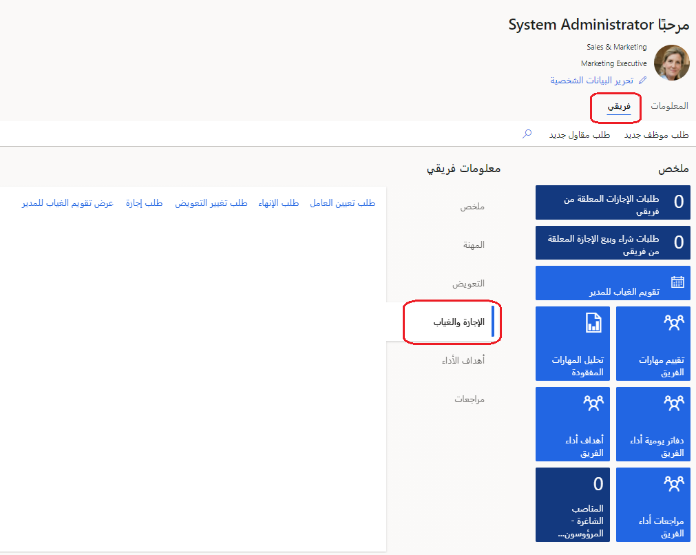
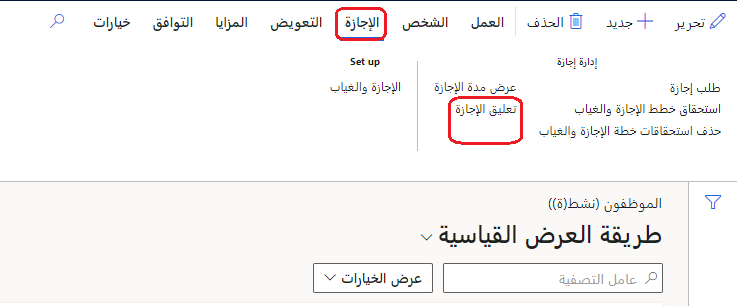
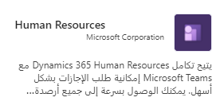
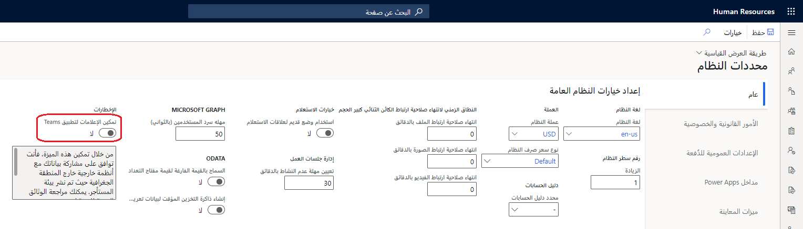
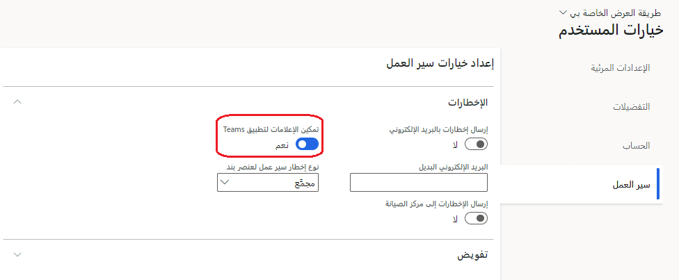
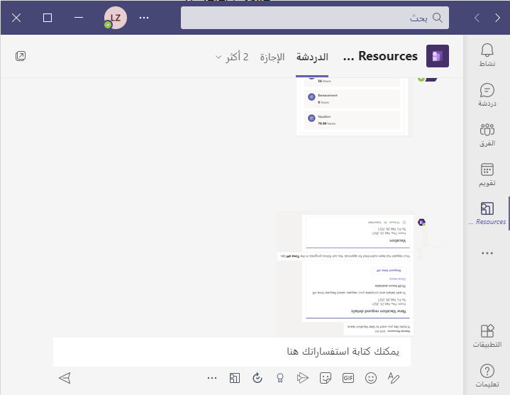
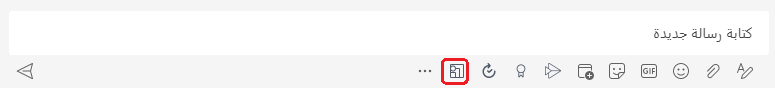

يمكنك إدارة طلبات الإجازات من مساحة عمل **الخدمة الذاتية للموظف** في Dynamics 365 Human Resources. قد تكون الطلبات عبارة عن طلبات بسيطة ليوم واحد أو طلبات متعددة الأيام تتضمن أنواعاً متعددة من الإجازات والغياب. إذا لم يتم تمكين سير العمل، تتم الموافقة على الطلبات تلقائياً. عند تمكين سير العمل، يمكن أن تكون الموافقة تلقائية أو تتطلب تسجيل الخروج، استناداً إلى تكوين سير العمل.

1.  حدد **الخدمة الذاتية للموظف**، ثم حدد **فريقي**.

1.  ضمن **معلومات فريقي**، حدد علامة التبويب **الإجازة والغياب**.

1.  اعرض طلبات الإجازات لأعضاء فريقك والموافقة عليها عند اللزوم.

    > [!div class="mx-imgBorder"]
    > 

## إدارة إجازة الموظف

يمكنك إدارة إجازة الموظف حسب نوع إجازته، بما في ذلك انتهاء صلاحية التسجيل في الإجازة وتسوية أرصدة أنواع الإجازات.

### تسوية أرصدة الإجازات
لتسوية أرصدة الإجازات، اتبع الخطوات التالية:

1. في سجل الموظف، حدد **إجازة**.

1. حدد **إعداد الإجازة والغياب**.

1. حدد **تسوية الرصيد**.

1. حدد **نوع الإجازة**.

1. أدخل **مبلغ التسوية**.

بشكل اختياري، يمكنك تحديد **تاريخ**.

يمكنك أيضاً تضمين رمز سبب وتعليق عند تسوية رصيد إجازة الموظف.

### تعليق إجازة موظف

يمكنك تعليق إجازة موظف لإيقاف معالجة استحقاقات الإجازات لأنواع الإجازات المحددة.

1.  في سجل الموظف، حدد **إجازة**.

1.  حدد **تعليق إجازة**.

    > [!div class="mx-imgBorder"]
    > 

1.  حدد **جديد**.

1.  في مربع حوار **تعليق استحقاق الإجازة**، حدد **نوع الإجازة** إلى جانب **تاريخ البدء** و **تاريخ الانتهاء** للتعليق.

بشكل اختياري، يمكنك أيضاً إضافة **تعليق** لعملية التعليق.

إذا تمت معالجة المستحقات أثناء تعليق إجازة الموظف، فلن يتم إجراء أي استحقاق لأنواع الإجازات المعلقة.

### طلب إجازة

يمكنك إرسال طلبات الإجازة وعرض أرصدة الإجازات والعطلات وعرض حالة طلبات الإجازات في Dynamics 365 Human Resources.

1.  في مساحة عمل **الخدمة الذاتية للموظف**، حدد **طلب الإجازة** في الإطار المتجانب **أرصدة الإجازات**.

1.  أدخل معلومات **نوع الإجازة**، و **رمز السبب**، و **تاريخ البدء**، و **تاريخ الانتهاء**.

1.  ضمن **التواريخ**، حدد تاريخ طلب إجازتك.

1.  إذا كنت بحاجة إلى إرسال وثائق داعمة، فحدد **تحميل** ضمن **المرفقات**.

1.  أدخل المعلومات في منطقة **التعليق**، إذا لزم الأمر.

1.  حدد **إرسال** عندما تكون مستعداً لإرسال طلبك. بخلاف ذلك، حدد **حفظ مسودة**.

### عرض حالة طلب الإجازة
لعرض حالة طلب الإجازة، اتبع الخطوات التالية:

1.  في مساحة عمل **الخدمة الذاتية للموظف**، حدد **المزيد** (...) في الإطار المتجانب **أرصدة الإجازات**.

1.  لعرض طلبات الإجازات التي تمت الموافقة عليها، حدد **الإجازة التي تمت الموافقة عليها**.
    لعرض طلبات الإجازات المعلقة، حدد **طلبات الإجازات**.

## إدارة طلبات الإجازات في Teams

يتيح لك تطبيق Dynamics 365 Human Resources في Microsoft Teams طلب الإجازة بسرعة وعرض معلومات رصيد الإجازات الخاصة بك في Teams. يمكنك التفاعل مع روبوت لطلب المعلومات وبدء طلب إجازة. تزودك علامة التبويب **الإجازة** بمعلومات أكثر تفصيلاً. يمكنك استخدام Teams والمحادثات خارج تطبيق Human Resources لإرسال معلومات إلى الأشخاص حول إجازتك القادمة.

### تثبيت التطبيق

يمكنك العثور على تطبيق Dynamics 365 Human Resources في متجر Teams.

1.  في Microsoft Teams، حدد علامة الحذف (**...**).

1.  ابحث عن **Dynamics 365 Human Resources**، ثم حدد الإطار المتجانب **Human Resources**.

    > [!div class="mx-imgBorder"]
    > 

1.  حدد الزر **إضافة** لتثبيت التطبيق.

لمزيد من المعلومات، راجع [تطبيق Human Resources في Teams](/dynamics365/human-resources/hr-admin-teams-leave-app/?azure-portal=true).

### تمكين الإخطارات لتطبيق Human Resources في Teams

إذا كنت تريد أن يتلقى المستخدمون إخطارات طلبات الإجازات في تطبيق Teams، فيجب عليك تمكين الإخطارات في Dynamics 365 Human Resources.

1.  في Human Resources، حدد **إدارة النظام**.

1.  حدد **الارتباطات**.

1.  ضمن **إعداد**، حدد **معلمات النظام**.

1.  في علامة التبويب **عام**، قم بتعيين **تمكين الإخطارات لتطبيق Teams** إلى **نعم**.

    > [!div class="mx-imgBorder"]
    > 

1.  لتشغيل إخطارات Teams لجميع المستخدمين، حدد **نعم** في المطالبة.

### تشغيل إخطارات Teams أو إيقاف تشغيلها للمستخدمين الفرديين

بعد تمكين الإخطارات لتطبيق Dynamics 365 Human Resources في Teams، يمكنك تشغيل الإخطارات أو إيقاف تشغيلها للمستخدمين الفرديين.

1.  في Human Resources، حدد **إدارة النظام**.

1.  حدد **الارتباطات**.

1.  ضمن **المستخدمين**، حدد **خيارات المستخدم**.

1.  حدد علامة التبويب **سير العمل**.

1.  قم بتعيين **تمكين الإخطارات لتطبيق Teams** إلى **نعم** لتمكين الإخطارات للمستخدم أو قم بتعيينها إلى **لا** لتعطيل الإخطارات للمستخدم.

    > [!div class="mx-imgBorder"]
    > 

1.  حدد **حفظ**.

### استخدام الروبوت

بعد تثبيت التطبيق، ستظهر رسالة ترحيب تخبرك بأنواع الإجراءات التي يمكن أن يتخذها الروبوت نيابةً عنك.

يمكنك أن تطلب من الروبوت بدء طلب إجازة لك.

سيقوم روبوت المحادثة بتعبئة طلب إجازة لك. حدد **طلب إجازة**، ثم قم بتحرير التفاصيل لطلبك.

عند الانتهاء من تحرير تفاصيل طلب إجازتك، حدد **إرسال** لإرساله للموافقة عليه.

> [!div class="mx-imgBorder"]
> 

### إدارة إجازتك في Teams

تتيح لك علامة التبويب **إجازة** عرض ما يلي:

- معلومات الرصيد لكل نوع إجازة قمت بالتسجيل فيه.

- طلبات الإجازات القادمة.

- طلبات الإجازات.

- مسودة طلبات الإجازات.

1.  لإنشاء طلب إجازة جديد، حدد **طلب جديد**.

1.  أدخل اليوم أو الأيام التي تريد أن تقضي الإجازة خلالها، ثم حدد **إضافة**.

1.  إن أمكن، أدخل رمز سبب. كما يمكنك إدخال تعليقات وإضافة مرفقات، إذا لزم الأمر.

1.  عند الانتهاء من إدخال المعلومات، أدخل **إرسال** لإرسالها للموافقة عليها. يمكنك أيضاً إدخال **حفظ كمسودة** للعودة إلى الطلب لاحقاً.

### الاستجابة لإخطارات Teams

عندما تقوم أنت أو عامل تمنحه الموافقة بإرسال طلب إجازة، ستتلقى إعلاماً في تطبيق Human Resources في Teams.
يمكنك تحديد الإخطار لعرضه. تظهر الإخطارات أيضاً في منطقة **المحادثة**.

إذا كنت مانح الموافقة، فيمكنك تحديد **الموافقة** أو **الرفض** في الإخطار. يمكنك أيضاً تقديم رسالة اختيارية.

### إرسال معلومات الإجازة القادمة إلى زملائك في العمل

بعد تثبيت تطبيق Human Resources لـ Teams، يمكنك استخدام Teams أو الدردشات لإرسال معلومات حول إجازتك القادمة إلى زملائك في العمل.

1.  في فريق أو محادثة في Teams، حدد الزر **Human Resources** أسفل نافذة المحادثة.

    > [!div class="mx-imgBorder"]
    > 

1. حدد طلب الإجازة الذي تريد مشاركته.
