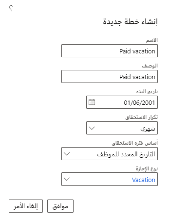
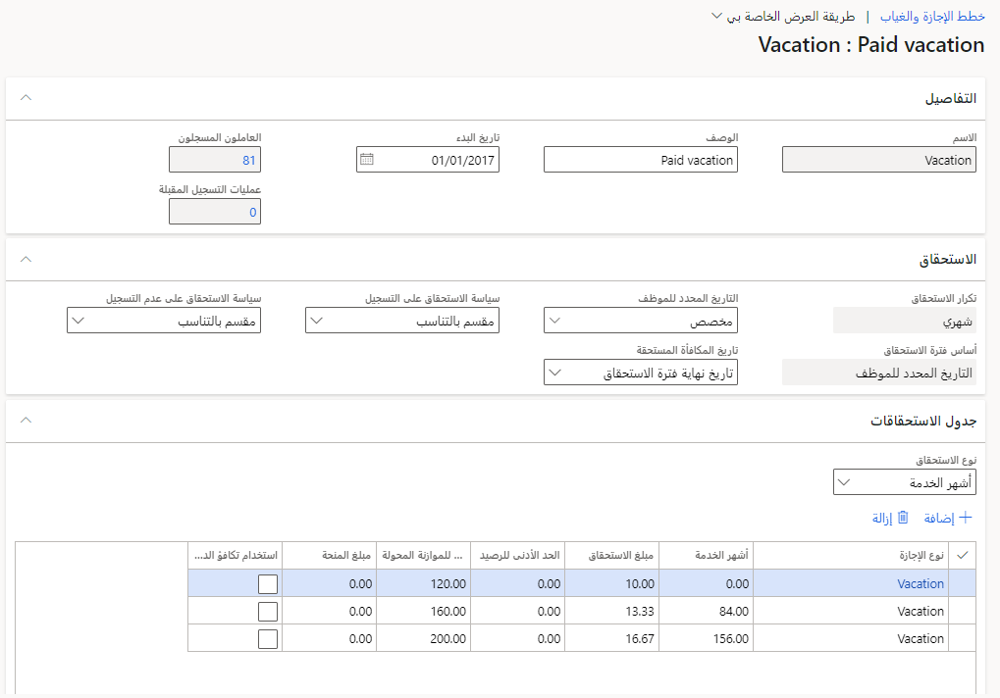

في هذه العملية، ستقوم بإنشاء خطة إجازة للموظفين ثم تعيين معدل استحقاق 10 ساعات شهرياً للموظفين الجدد و12 ساعة شهرياً للموظفين الذين بلغوا الذكرى السنوية الخامسة.
ستسمح كل خطة للموظفين بتحويل إجازة مدفوعة الأجر لمدة عام إلى العام المقبل.

## قبل البدء

تفترض التمارين في هذه الوحدة أنك تعمل في بيئة وضع حماية لـ Dynamics 365 Human Resources.

لتحقيق أقصى استفادة من كلا التدريبين، نوصي بتوفر البيانات القياسية النموذجية في Human Resources.

## إنشاء خطة إجازة عطلة

لإنشاء خطة إجازة عطلة، اتبع الخطوات التالية:

1.  في صفحة **الإجازة والغياب**، حدد **إنشاء خطة جديدة**.

1.  ضمن **التفاصيل**، أدخل المعلومات التالية لكل حقل:

    - **الاسم** - عطلة مدفوعة الأجر

    - **الوصف** - عطلة مدفوعة الأجر

    - **تاريخ البدء** -‏ 1/‏1/‏2021

    - **تكرار الاستحقاق** - شهرياً

    - **أساس فترة الاستحقاق** - تاريخ خاص بالموظفين

    - **نوع الإجازة** - عطلة

1.  حدد **موافق**.

    > [!div class="mx-imgBorder"]
    > 

1.  ضمن **جدول الاستحقاق**،، قم بتغيير قيم الحقل لـ **العطلة** كما يلي:

    - **مبلغ الاستحقاق** -‏ 10

    - **الحد الأقصى للموازنة المحولة** -‏ 120

1.  حدد **إضافة**، ثم أدخل القيم التالية:

    - **نوع الإجازة** - عطلة

    - **أشهر الخدمة** -‏ 60

    - **مبلغ الاستحقاق** -‏ 12
    
    - **الحد الأقصى للموازنة المحولة** -‏ 144

1.  حدد **حفظ**.

    > [!div class="mx-imgBorder"]
    > 
