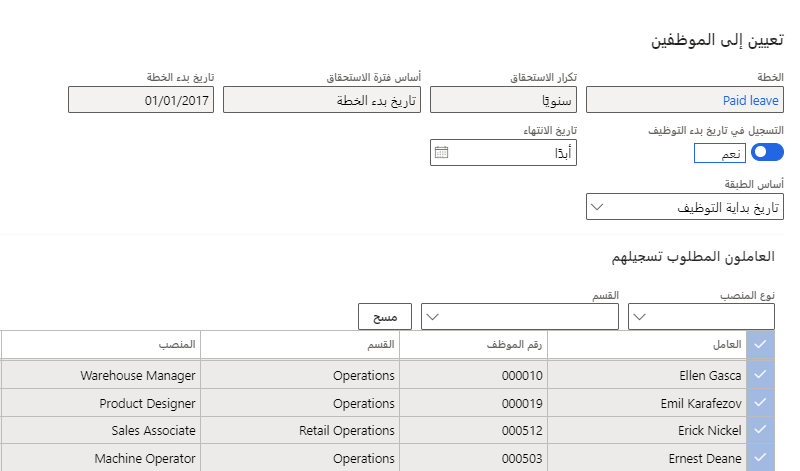

تحتاج إلى إنشاء خطة الإجازة في التمرين السابق لإكمال الخطوات اللاحقة بنجاح.

في هذه العملية، ستقوم بتسجيل موظف في خطة إجازة:

1.  في خطة الإجازة التي أنشأتها في التمرين السابق، حدد **تعيين إلى موظفين**.

1.  قم بتعيين خيار **التسجيل في تاريخ بدء العمل** إلى **نعم**.

1.  ضمن **العمال للتسجيل**، حدد علامة الاختيار لتحديد جميع الموظفين.

1.  حدد **تعيين خطة**.

    > [!div class="mx-imgBorder"]
    > 
