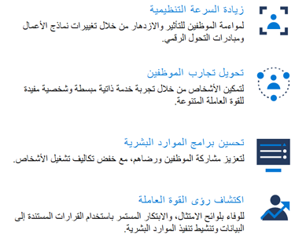
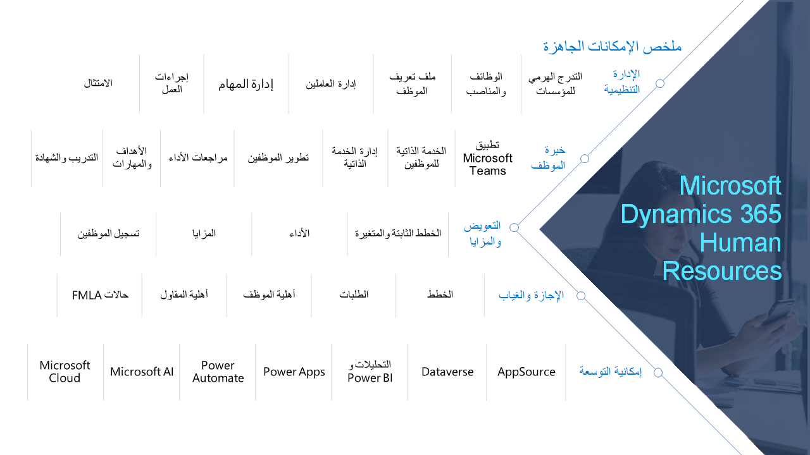

يساعدك Dynamics 365 Human Resources على تحقيق التوازن بين التميز التشغيلي وسرعة الحركة التنظيمية وتجربة الموظف لإنشاء مكان عمل يزدهر فيه الأفراد وأعمالك.Dynamics 365 Human Resources helps you balance operational excellence, organizational agility, and the employee experience to create a workplace where people and your business thrive.

> [!div class="mx-imgBorder"]
> 

يساعدك Dynamics 365 Human Resources على إدارة الموظفين وتطويرهم، مع كل شيء بدءاً من تجارب التعلم الموجهة إلى تقييمات الأداء.Dynamics 365 Human Resources helps you manage and develop your employees, with everything from guided learning experiences to performance assessments. يمكنك إنشاء عمليات مبسطة تركز على المواهب وبرامج فعالة تعمل على تحسين تكاليف القوى العاملة، وتحقيق تأثير الأعمال، وتعزيز ثقافة الأداء العالي والسريع.You can create streamlined, talent-centric processes and effective programs that optimize workforce costs, deliver business impact, and drive an agile, high-performance culture. يساعدك Human Resources على إعداد وإدارة جميع برامج الموارد البشرية الخاصة بك، ويمنحك القدرات اللازمة لإدارة ما يلي بشكل أفضل:Human Resources helps you set up and manage all your HR programs, and gives you capabilities to better manage:

-   الموظفون والإدارة التنظيميةPersonnel and organizational management

-   المزايا والتعويضBenefits and compensation

-   إدارة الإجازة والغيابLeave and absence management

-   الامتثال (السلامة والأمان)Compliance (health and safety)

> [!div class="mx-imgBorder"]
> 

من خلال الإمكانات الشاملة لـ Human Resources، يمكنك تحويل المهام التالية وتنفيذها تلقائياً:With the extensive capabilities of Human Resources, you can transform and automate the following tasks:

-   إدارة الهياكل المؤسسية.Administer organizational structures.

-   الاحتفاظ بمعلومات شاملة حول الموظف بدءاً من مرحلة التوظيف إلى مرحلة التقاعد.Maintain comprehensive employee information from hire to retire.

-   إدارة اختصاصات الموظفين.Manage employee competencies.

-   تعريف وإدارة خطط الميزات وتسجيل الموظفين وتعيين تغطية التابعين وتعيين المستفيدين.Define and administer benefit plans, enroll employees, assign dependent coverage, and designate beneficiaries.

-   وضع سياسات الغياب ورصدها.Establish and monitor absence policies.

-   تطبيق إدارة الوقت المستندة إلى ملف تعريف وتتبعها وإنشاء معلومات الدفع لتصديرها إلى نظام رواتب.Implement and track profile-based time management and generate pay information to export to a payroll system.

-   مراجعة الأداء وتنفيذ أهداف الموظفين.Review performance and implement employee goals.

-   إعداد الدورات التدريبية التي تتضمن جداول الأعمال والجلسات والمسارات وتقديمها وتحليلها.Set up, deliver, and analyze training courses that include agendas, sessions, and tracks.

-   تعقب الامتثال (الصحة والسلامة).Track compliance (health and safety).

-   إدارة تطوير الموظفين (التدريب الموحد، الشهادات، تعقب المهارات، تعليقات الأداء).Manage employee development (standardized training, certifications, skills tracking, performance feedback).

-   إدارة تجربة الموظف والمدير (الخدمة الذاتية، لوحات معلومات المديرين، ملفات تعريف الموظفين).Manage the employee and manager experience (self-service, manager dashboards, employee profiles).

-   أكمل تقارير الموارد البشرية مع لوحات المعلومات المضمنة وMicrosoft Power BI لتحليلات القوى العاملة.Complete HR reporting with embedded dashboards and Microsoft Power BI for workforce analytics.

-   دمج كشوف المرتبات من خلال Ceridian Dayforce.Integrate payroll through Ceridian Dayforce.

تعمل إمكانات Dynamics 365 Human Resources على تبسيط وتحسين المزايا وبرامج التعويض والإجازات والغياب والشهادات والتدريب والامتثال.Dynamics 365 Human Resources capabilities simplify and optimize benefits, compensation programs, leave and absence, certifications and training, and compliance.
