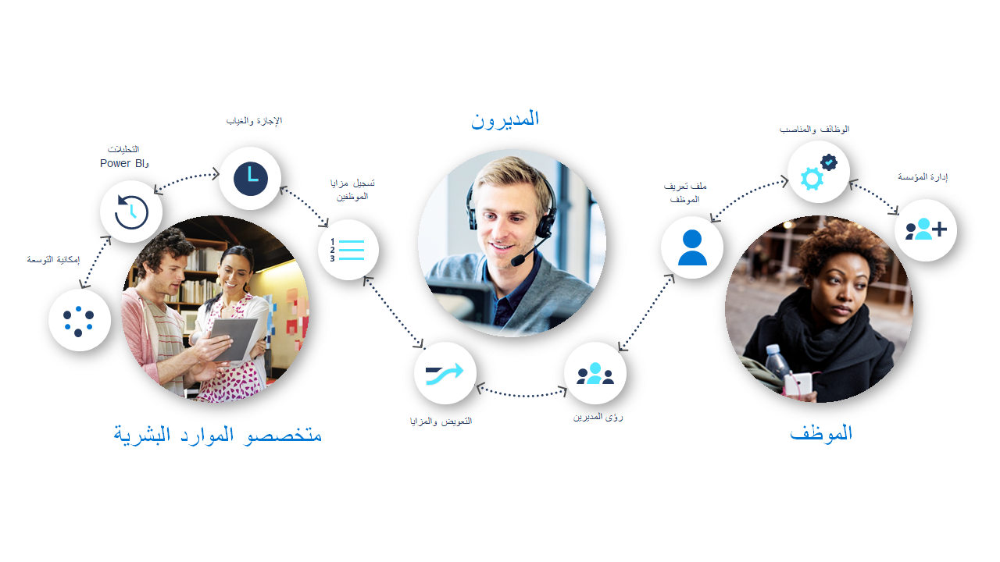
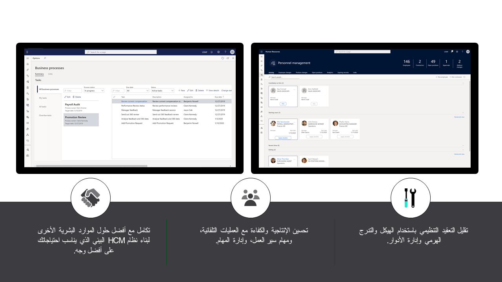

يبسط Dynamics 365 Human Resources مهام الموارد البشرية الروتينية وينفذ العمليات المتعلقة بإدارة الموظفين داخل مؤسستك تلقائياً. يمكّنك من إدارة موظفيك، والتعويضات، والمزايا، وتعقب الإجازات والغياب، والكفاءات، والتطوير. يمنحك Dynamics 365 Human Resources  أيضاً إطار عمل لمتخصصي الموارد البشرية لديك لتحفيز الاتساق والكفاءة وتحسين العمليات.

يتيح لك Dynamics 365 Human Resources إدارة الموارد البشرية في تجربة مستخدم غنية قائمة على المستعرض مع مساحات عمل مخصصة لأدوار محددة.

> [!div class="mx-imgBorder"]
> 

باستخدام Dynamics 365 Human Resources، تضمن مهامك الأولى إعداد مؤسستك وتكوين جميع الإعدادات على مستوى المؤسسة.
تتضمن هذه العملية الخطوات التالية:

-   إعداد الكيانات القانونية.

-   إنشاء تدرج هرمي مؤسسي.

-   إعداد دفتر العناوين العمومي.

-   تكوين الإعدادات العمومية.

-   إنشاء عمليات وتدفقات عمل ومهام تلقائية لتحسين الاتساق والامتثال وسهولة الاستخدام.

> [!div class="mx-imgBorder"]
> 

لمزيد من المعلومات، راجع [الصفحة الرئيسية لإدارة المؤسسة](/dynamics365/fin-ops-core/fin-ops/organization-administration/organization-administration-home-page?azure-portal=true&toc=/dynamics365/human-resources/toc.json/).
