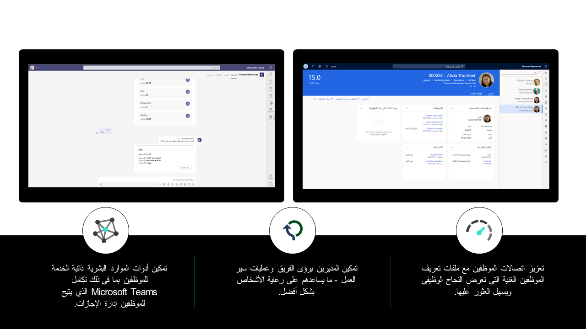

Dynamics 365 Human Resources توفر مدخل خدمة ذاتية للمديرين والموظفين للوصول إلى ملفات تعريف الموظفين وتطويرهم وأدائهم وتفاصيل كشف الرواتب الخاصة بهم.Dynamics 365 Human Resources provides a self-service portal for managers and employees to access employee profiles, development, performance, and payroll details. كما يمكن للموظفين عرض أرصدة الإجازات وتقديم طلبات الإجازة في Microsoft Teams.Employees can also view time-off balances and submit leave requests in Microsoft Teams.

من خلال تجربة Human Resources، يمكنك:With the Human Resources experience, you can:

-   إنشاء طريقة عرض شاملة لموظفيك تتضمن مناصبهم الحالية وخبراتهم وبياناتهم من Microsoft 365.Create a 360-degree view of your employees that includes their present position, experience, and data from Microsoft 365.

-   إنشاء تجارب تعاونية بين المرشحين والموظفين والمديرين والموارد البشرية لتقليل المهام الإدارية وإتاحة الوقت لمزيد من المبادرات الاستراتيجية.Create collaborative experiences across candidates, employees, managers, and HR to reduce administrative tasks and free up time for more strategic initiatives.

-   إنشاء عمليات قابلة للتكوين تدفع إلى القيام بالإجراء الصحيح بواسطة الموظف المناسب في الوقت المناسب.Build configurable processes that drive the right action, by the right employee, at the right time.

-   تبسيط الامتثال للوائح العالمية ومتطلبات السلامة والصحة.Simplify compliance to global regulations and safety and health requirements.

> [!div class="mx-imgBorder"]
> [تجربة الموظف والمدير في ](../media/employee-experience-c.png#lightbox)

تتسم الشاشة الرئيسية لـ Human Resources بأنها سهلة التنقل.The Human Resources home screen is simple to navigate. يضمن العرض الخاص بالأدوار أن تظل المعلومات الحساسة أكثر أماناً مع توفير وصول سريع إلى التفاصيل المهمة.The role-specific display ensures that sensitive information remains more secure while providing quick access to important details.

على سبيل المثال، عندما يقوم مديرو الموارد البشرية بتشغيل مساحة عمل **إدارة شؤون العاملين**، فيمكنهم عرض بيانات الموظفين الأكثر أهمية على الفور، بما في ذلك:For example, when HR managers launch the **Personnel management** workspace, they can immediately view their most important employee data, including:

-   المرشحون المُراد توظيفهمCandidates to hire

-   عمليات التوظيف الجديدةNew hires

-   عمليات التوظيف التي ستبدأ قريباًStarting soon

-   أحدث عمليات توظيفRecent hires

-   الموظفون المستقيلونExiting employees

يمكن للمديرين تحديد أحد الموظفين للوصول بسرعة إلى سجلاتهم وتنفيذ إجراءات العاملين الضرورية، مثل:Managers can select an employee to quickly access their records and perform necessary personnel actions, such as:

-   عمليات التحقق من صحة التوظيفEmployment verifications

-   تسجيل الميزاتBenefits enrollment

-   تغييرات الدورRole changes

-   الإنهاءاتTerminations

يمكنك تخصيص مساحة عمل **إدارة شؤون العاملين** لتفي بالاحتياجات الفريدة لمؤسسك.You can customize the **Personnel management** workspace to meet the unique needs of your organization.

## تعزيز ثقافة الخدمة الذاتيةFoster a culture of self-service

Dynamics 365 Human Resources يساعدك في تحسين تكاليف القوى العاملة من خلال توفير نظام أساسي منسق للخدمة الذاتية لمساعدة الموظفين في إكمال مهام الموارد البشرية بأنفسهم.Dynamics 365 Human Resources helps you optimize workforce costs by providing a rich self-service platform to help employees complete HR tasks on their own. وتقلل هذه الميزة التكاليف الإدارية وتُعطي لفريق الموارد البشرية لديك المجال للتركيز على المهام الاستراتيجية.This feature reduces administrative costs and frees up your HR team to focus more on strategic tasks. من مساحة عمل **الخدمة الذاتية للموظف**، يمكن للموظفين:From the **Employee self-service** workspace, employees can:

-   إكمال مراجعات الأداءComplete performance reviews

-   عرض الدورات المقبلةView upcoming courses

-   مراجعة أهداف الأداءReview performance goals

-   تحديث المعلومات الشخصيةUpdate personal information

-   إرسال طلبات الإجازات ومراجعتهاSubmit and review time-off requests

-   التحقق من أرصدة الإجازات المتبقيةCheck remaining time-off balances

-   إنشاء ملف تعريف يعرض مهاراتهمCreate a profile that showcases their skills

-   تعقب التقدم وتسجيل الإنجازات في دفتر يومية الأداءTrack progress and record achievements in their performance journal

تساعد مساحة عمل **الخدمة الذاتية للمدير** في تبسيط وظائف المديرين أيضاً.The **Manager self-service** workspace helps simplify managers' jobs as well.
يُتيح هذا المدخل للمديرين:This portal lets managers:

-   عرض ملخص لعناصر الإجراءات والشهادات المنتهية والمواعيد النهائية القادمة.View a summary of action items, expiring certifications, and upcoming deadlines.

-   طلب موظفين جدد أو بدء نقل موظف إلى منصب آخر.Request new employees or start an employee transition to another position.

-   عرض المعلومات الأساسية حول أعضاء الفريق، بما في ذلك التعويضات والإجازات وأهداف الأداء والتقييمات.View key information about their team members, including compensation, time off, performance goals, and reviews.

للحصول على مزيد من المعلومات، راجع [نظرة عامة حول الخدمة الذاتية للموظف والمدير](https://docs.microsoft.com/dynamics365/human-resources/hr-employee-manager-self-service-overview/?azure-portal=true).For more information, see the [Employee and Manager self service overview](https://docs.microsoft.com/dynamics365/human-resources/hr-employee-manager-self-service-overview/?azure-portal=true).
