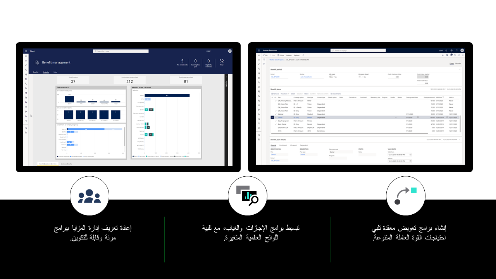

تساعدك Dynamics 365 Human resources على إنشاء برامج موارد بشرية ميسورة التكلفة وأتمتة العمليات لتعقب المزايا والتعويضات والامتثال وبرامج الغياب والإجازات.

كما تساعدك Human Resources على الاحتفاظ بالموظفين، وذلك بتزويدك بأدوات:

-   تقديم حزم ميزات حديثة تسمح بمجموعات ميزات وترقيات هرمية واعتمادات مرنة وتسجيل تلقائي.

-   عرض برامج الإجازات والغياب التنافسية.

-   إدارة برامج التعويض المعقدة.

-   إدارة الشهادات والتدريب.

> [!div class="mx-imgBorder"]
>  

تساعد الموارد البشرية على خفض التكاليف الإدارية باستخدام إدارة الميزات الشاملة وبرامج التعويضات وتعقب الإجازات والغياب وأدوات الامتثال.
