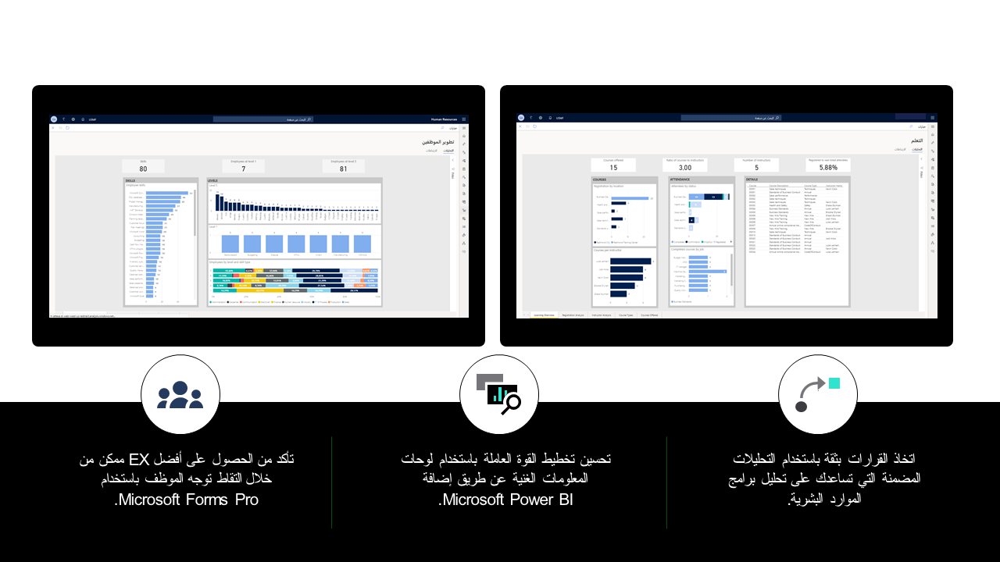

يستفيد Dynamics 365 Human Resources من الجهود التي تبذلها الموارد البشرية حيث يمنحك القدرة علي:

-   أخذ قرارات أفضل باستخدام بيانات القوى العاملة المركزية والتحليلات المضمنة.

-   تحسين تخطيط القوى العاملة من خلال لوحات معلومات Power BI.

-   مراقبة مستوى الرضا لدى الموظفين.

> [!div class="mx-imgBorder"]
> 
