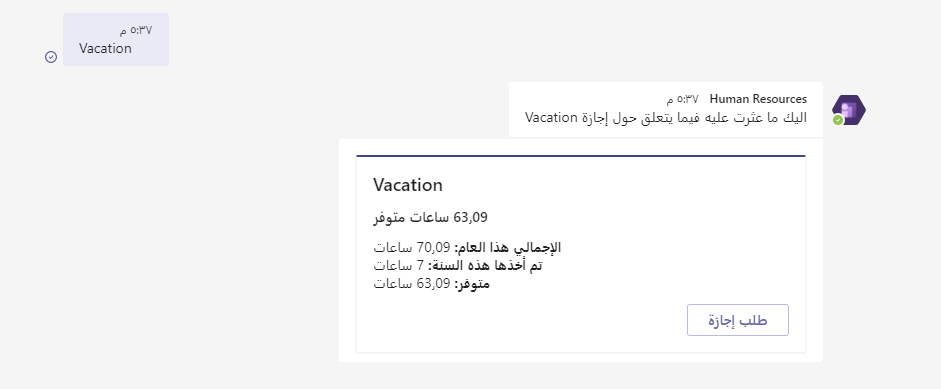
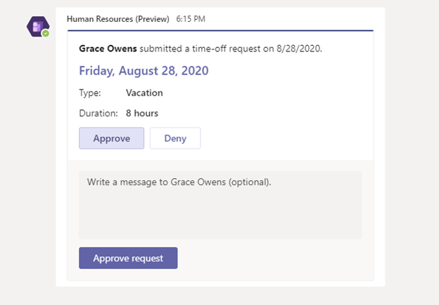

يساعدك Dynamics 365 Human Resources على توفير مزايا إجازات ممتازة للعاملين لديك. توفر مساحة العمل **‏‫الإجازة والغياب‬** إطاراً مرناً لإنشاء خطط إجازة جديدة. كما يوفر أيضاً مهام سير عمل لإدارة الطلبات وصفحة خدمة ذاتية بديهية للموظفين لطلب إجازة. وتساعد التحليلات مؤسستك على قياس أرصدة الإجازات والاستخدام لخطط الإجازات ومراقبتها.

وتوفر ميزة إدارة الإجازة والغياب إطار عمل مرن لتحديد عملية إدارة الغياب. يمكنك إنشاء خطط الإجازة والغياب لتحديد كيفية استحقاق الموظفين للإجازات أو كيفية منحهم للإجازات. بعد تسجيل الموظفين في خطة، يمكنهم إرسال طلبات إجازة للموافقة عليها من قبل المديرين.

ويسمح تعقب الإجازات لمديري المستوى الأول ومديري الموارد البشرية بمعرفة الموظفين الذين حصلوا على إجازة وعدد الأيام المتبقية لدى كل موظف.

يتيح تطبيق Dynamics 365 Human Resources في Microsoft Teams للموظفين طلب الإجازة بسرعة وعرض معلومات رصيد الإجازات في Microsoft Teams. ويمكن للموظفين التفاعل مع روبوت لطلب المعلومات وبدء طلب إجازة. كما يمكنهم إرسال معلومات إلى الآخرين حول الإجازة القادمة خارج تطبيق Human Resources.

> [!div class="mx-imgBorder"]
>  

يمكن للمديرين اعتماد طلبات الإجازة في Teams.

> [!div class="mx-imgBorder"]
> 

لمزيد من المعلومات، راجع [نظرة عامة حول الإجازة والغياب](https://docs.microsoft.com/dynamics365/human-resources/hr-leave-and-absence-overview/?azure-portal=true).
