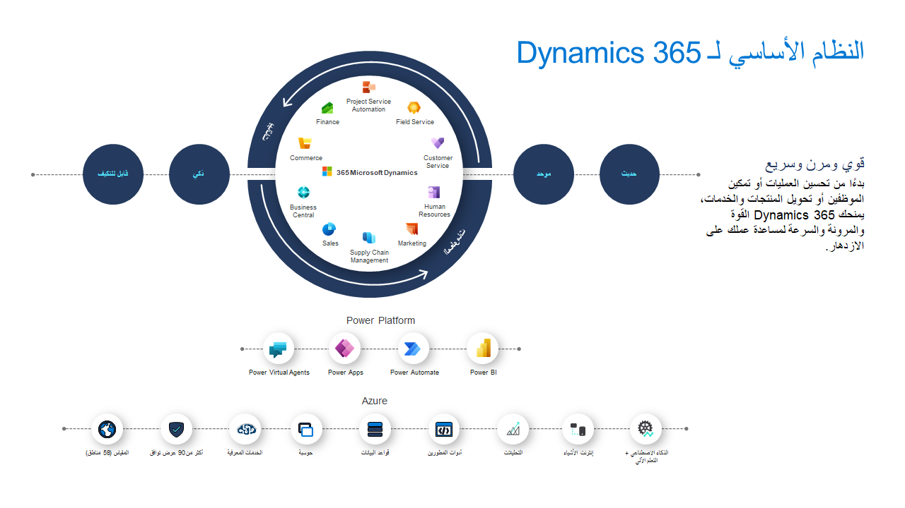
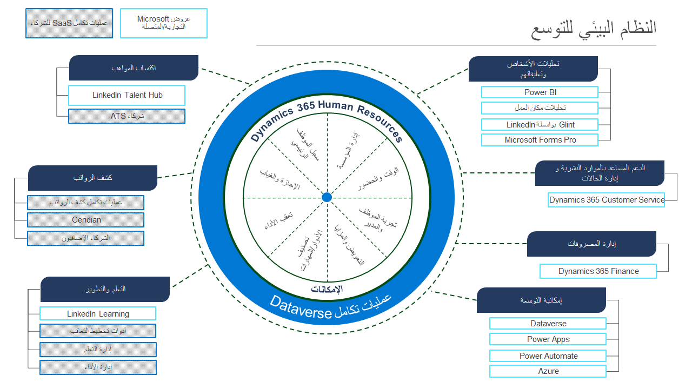
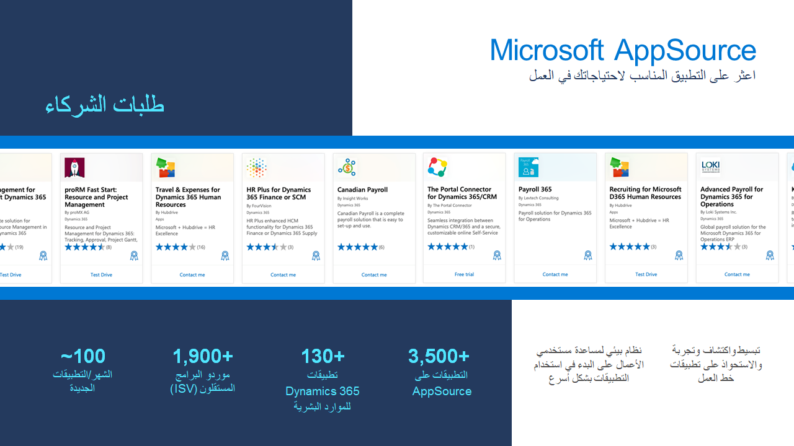

يتكامل Dynamics 365 Human Resources مع Microsoft 365 وغيرها من أنظمة الموارد البشرية الأكثر استخداماً، بما في ذلك كشوف المرتبات وإدارة المواهب والتوظيف وLinkedIn لمركزة برامج الموارد البشرية الخاصة بك.Dynamics 365 Human Resources integrates with Microsoft 365 and other best-of-breed HR systems, including payroll, talent management, recruiting, and LinkedIn, to centralize your HR programs.

> [!div class="mx-imgBorder"]
> 

## إنشاء حلول باستخدام Power PlatformCreate solutions with Power Platform

باستخدام Microsoft Power Platform، يمكنك إنشاء حلول باستخدام الموارد البشرية ومن أجلها لتلبية الاحتياجات الفريدة لمؤسستك.With Microsoft Power Platform, you can create solutions with and for Human Resources to meet your organization's unique needs.

-   **تحليل البيانات باستخدام Power BI**  - اتخذ قرارات عمل مستنيرة وواثقة من خلال وضع الرؤى المستندة إلى البيانات في متناول الجميع.**Analyze data with Power BI** - Make informed, confident business decisions by putting data-driven insights into everyone's hands.

-   **التنفيذ التلقائي للعمليات باستخدام Microsoft Power Apps**  - تعزيز زيادة إنتاجية الأعمال للحصول على المزيد من الأعمال المنجزة من خلال منح الجميع القدرة على التنفيذ التلقائي للعمليات التنظيمية.**Automate process with Microsoft Power Apps** - Boost business productivity to get more done by giving everyone the ability to automate organizational processes.

-   **إنشاء حلول باستخدام Microsoft Power Automate**  - تحويل الأفكار إلى حلول تنظيمية من خلال تمكين الجميع من إنشاء تطبيقات مخصصة لحل تحديات الأعمال.**Build solutions with Microsoft Power Automate** - Turn ideas into organizational solutions by enabling everyone to build custom apps that solve business challenges.

-   **إنشاء مندوبين افتراضيين باستخدام Microsoft Power Virtual Agents**  - أنشئ روبوتات محادثة للتفاعل مع عملائك وموظفيك بشكل تحاوري، باستخدام القليل من التعليمات البرمجية أو بدونها.**Create virtual agents with Microsoft Power Virtual Agents** - Build chatbots to engage conversationally with your customers and employees, with little to no coding required.

## توسيع نظامك بمزيد من الإمكاناتExtend your system with more capabilities

توفر الموارد البشرية نظاماً بيئياً ثرياً للتوسع يمكن للشركاء وموزعي القيمة المضافة (VARs) والعملاء استخدامه لتخصيص حلولهم وتوسيع نطاقها والتكامل مع التطبيقات الأخرى.Human Resources provides a rich extensibility ecosystem that partners, value added resellers (VARs), and customers can use to customize and extend their solutions and integrate with other apps.

> [!div class="mx-imgBorder"]
> 

لست بحاجة في البداية لتوسيع Dynamics 365 Human Resources.You don't need to start from the beginning to extend Dynamics 365 Human Resources. يمكنك العثور على التطبيقات المهمة لك ولأعمالك وتقييمها.You can find and evaluate apps that are critical to you and your business. بالإضافة إلى ذلك، يمكنك العثور على تطبيقات فريدة لمجالك والأدوار التي تم إنشاؤها بواسطة شركاء النظام البيئي لـ Microsoft AppSource مع قوة Dynamics 365 وMicrosoft 365 ونظام Microsoft Azure الأساسي.Additionally, you can find apps that are unique to your industry and the roles that are built by Microsoft AppSource ecosystem partners with the power of Dynamics 365, Microsoft 365, and the Microsoft Azure platform.

> [!div class="mx-imgBorder"]
> 

لمزيد من المعلومات، راجع [اختيار تقنية تكامل البيانات](https://docs.microsoft.com/dynamics365/human-resources/hr-admin-integration-choose-technology/?azure-portal=true).For more information, see [Choose a data integration technology](https://docs.microsoft.com/dynamics365/human-resources/hr-admin-integration-choose-technology/?azure-portal=true).
