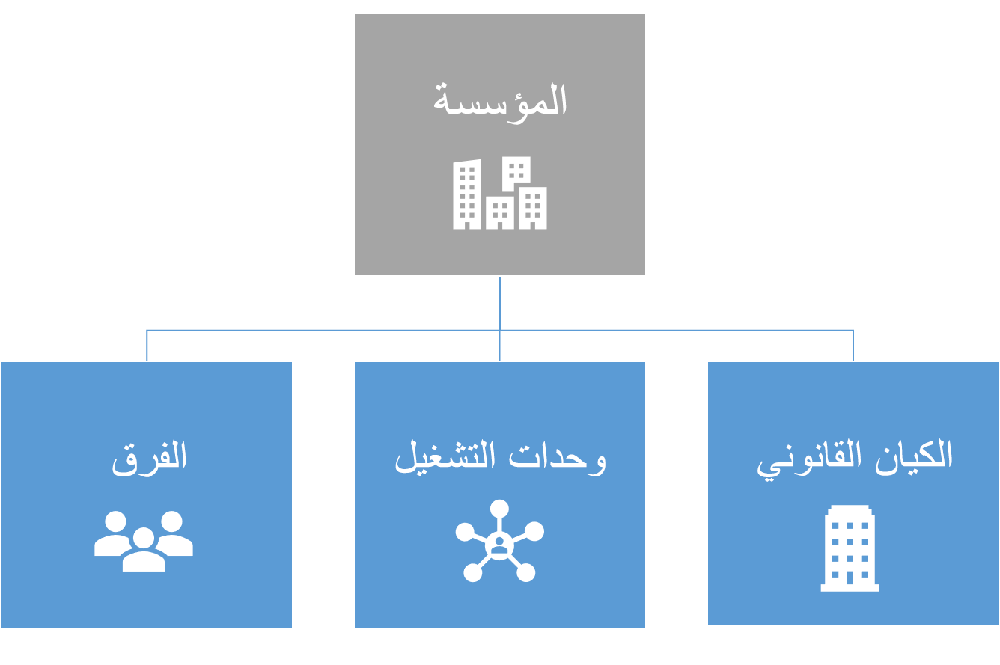

الشرط الأساسي العام الأول لاستخدام Dynamics 365 Human Resources هو إعداد التدرج الهرمي المؤسسي الخاص بك. تمثل التدرجات الهرمية المؤسسية التي تقوم بإعدادها العلاقات بين المؤسسات التي يتألف منها عملك. عند البدء في إعداد التدرج الهرمي المؤسسي، تأكد من تخطيط كيفية تصميم نشاطك التجاري. التدرج الهرمي المؤسسي له تأثير كبير على التنفيذ وعمليات الأعمال الخاصة بك. نوصي بتحديد هياكل المؤسسة استناداً إلى التعليقات من المديرين التنفيذيين وكبار الموظفين من المجالات الوظيفية في العمل. أيضاً، يجب أن تفكر في العلاقة بين التدرج الهرمي المؤسسي والأبعاد المالية الخاصة بك.

تناقش المقاطع التالية المكونات التي تشكل التدرج الهرمي للمؤسسة.

> [!div class="mx-imgBorder"]
> 

أولاً، ستحدد أنواع المؤسسات الداخلية، والتي قد تتضمن **كياناً قانونياً** وكذلك **وحدات تشغيل** **وفرق**.

**الكيان القانوني** عبارة عن مؤسسة ذات هيكل قانوني تم تسجيله أو إصدار تشريعاته. يمكن للكيانات القانونية إبرام عقود قانونية ومطلوبة لتقديم بيانات الأداء. الشركة هي نوع من الكيانات القانونية. حالياً، الشركات هي الكيانات القانونية الوحيدة التي يمكن إنشاؤها، ويتم تعيين معرف شركة لكل كيان قانوني. لأن بعض المناطق الوظيفية البرنامج توظيف معرف الشركة أو DataAreaId في نماذج البيانات الخاصة بهم، هذا الارتباط موجود. في هذه المجالات الوظيفية، يتم استخدام الشركات كحدود لأمن البيانات. يمكن للمستخدمين الوصول إلى البيانات فقط للشركة التي قاموا بتسجيل الدخول إليها حالياً.

لإنشاء كيان قانوني جديد، اتبع الخطوات التالية:

1. انتقل إلى **إدارة المؤسسة > المؤسسة‏‎ > الكيانات القانونية**.

1. حدد **جديد** في جزء الإجراءات.

1. في حقل **الاسم**، أدخل اسماً فريداً للكيان القانوني.

1. في حقل **الشركة**، أدخل اسماً قصيراً للشركة. على سبيل المثال، إذا كان اسم الكيان القانوني الخاص بك هو **Contoso Consulting USA**، يمكنك إدخال وحدة **CCU** **لشركة**.

1. في حقل **البلد/المنطقة**، حدد الخيار المناسب. ضع في اعتبارك أنه، استناداً إلى الخيار الذي تحدده، قد تتغير بعض الوظائف استناداً إلى الموقع.

1. حدد **حفظ** في جزء الإجراءات.

> [!div class="mx-imgBorder"]
> 

تعتبر **وحدة التشغيل** هي مؤسسة مستخدمة لتقسيم التحكم في الموارد الاقتصادية وعمليات التشغيل للشركة. يتحمل الأشخاص في وحدة التشغيل مسؤولية الاستخدام الأفضل للموارد المحدودة، وتحسين العمليات، وتحميل أنفسهم المسؤولية عن نتائجهم. تتوفر عدة أنواع من وحدات التشغيل في Dynamics 365 Human Resourcesبما في ذلك مراكز التكلفة ووحدات الأعمال وتدفقات القيمة والأقسام والقنوات التجارية.

يجب أن يكون لديك كيان قانوني واحد على الأقل لتمثيل أعمالك. يمكن للكيان القانوني إبرام عقود قانونية ومطلوب منه إعداد البيانات المالية التي تقوم بالإبلاغ عن أداءها. يمكن استخدام الكيانات القانونية للحركات والدمج. وبالتالي، فإن الكيان القانوني في Microsoft Dynamics 365 Finance and Operations قد يتوافق أو لا يتوافق (محليًا) مع كيان حقيقي في شركتك.

على سبيل المثال، يمكن لشركة تشارك في علميات الحركات امتلاك كيانات قانونية خاصة بشركة تابعة. مطلوب كيان قانوني للحركات في هذا السيناريو، والكيان القانوني الظاهري ضروري لدمج نتائج وأرصدة الكيانات القانونية الفرعية.

يمكنك التعامل مع مؤسسات الأعمال الداخلية، مثل المكاتب الإقليمية، ككيانات قانونية منفصلة أو كوحدات عاملة للهيئة القانونية الأصل.
ليس من الضروري أن تكون وحدة التشغيل كياناً محدداً قانونياً.
تستخدم وحدات التشغيل لإدارة الموارد الاقتصادية للشركة والإجراءات التشغيلية.

الأقسام ومراكز التكلفة، على سبيل المثال، هي وحدات تشغيل. لمزيد من المعلومات، راجع [تخطيط التدرج الهرمي للمؤسسة](/dynamics365/fin-ops-core/fin-ops/organization-administration/plan-organizational-hierarchy?toc=/dynamics365/human-resources/toc.json&azure-portal=true).

تستعرض القائمة التالية كل نوع من وحدات التشغيل في التطبيق وكيف يتم استخدامها بشكل شائع داخل المؤسسات:

- **مركز التكلفة** - وحدة تشغيل يكون مديروها مسؤولين عن النفقات المدرجة بالموازنة والنفقات الفعلية. يمكن استخدام هذا النوع من وحدات التشغيل للإدارة والتحكم التشغيلي في عمليات الأعمال التي قد تمتد عبر الكيانات القانونية.

- **وحدة الأعمال** - وحدة تشغيل شبه مستقلة تم إنشاؤها لتحقيق أهداف العمل الإستراتيجية. يستخدم هذا النوع من وحدات التشغيل لإعداد التقارير المالية التي تستند إلى الصناعات أو خطوط الإنتاج المحددة التي تخدمها المؤسسة بشكل مستقل عن الكيانات القانونية الأخرى.

- **تدفق القيم** - وحدة تشغيل تتحكم في عملية واحدة أو أكثر من عمليات تدفق الإنتاج. يتم استخدام تدفق القيمة في lean manufacturing للتحكم في الأنشطة والتدفقات اللازمة لتزويد المستهلكين بمنتج أو خدمة.

- **القسم** - وحدة تشغيل تمثل فئةً أو جزءاً وظيفياً من إحدى المؤسسات تقوم بتنفيذ مهمة معينة، مثل المبيعات أو المحاسبة.
يتم استخدام قسم للإبلاغ عن المناطق الوظيفية. قد يكون للقسم مسؤولية عن الأرباح والخسائر، ويمكن أن يتكون من مجموعة من مراكز التكلفة.

- **قناة التجارة** - وحدة تشغيل تمثل متجراً تقليدياً أو متجراً أو سوقاً على الإنترنت. تُستخدم قناة التجارة للتحكم في الإدارة والعمليات لواحد أو أكثر من المتاجر داخل أو عبر الكيانات القانونية.

لإنشاء وحدة تشغيل جديدة، اتبع الخطوات التالية:

1. انتقل إلى **دارة المؤسسة > المؤسسة > وحدات التشغيل**.

1. حدد **جديد** في جزء الإجراءات.

1. في القائمة المنسدلة، حدد نوع وحدة التشغيل التي تخطط لإنشائها.

1. بعد تحديد نوع وحدة التشغيل التي تريد إنشاؤها، حدد **موافق**.

1. حدد اسماً لوحدة التشغيل في حقل **الاسم**.
على سبيل المثال، إذا كنت تقوم بإنشاء قسم، فقد تسمي وحدة التشغيل **المالية**.

   سيتم ملء رقم وحدة التشغيل تلقائياً.

1. في علامة التبويب السريعة **عام**، حدد مدير لوحدة التشغيل ثم قم بإضافة مذكرة ورقم DUNS، إذا كان ذلك ممكناً.

1. في علامة التبويب السريعة **عناوين**، أضف العنوان ومعلومات العنوان لوحدة التشغيل، إذا لزم الأمر.

1. في علامة التبويب السريعة **معلومات جهة الاتصال**، أضف العنوان ومعلومات الاتصال لوحدة التشغيل، إذا لزم الأمر.

1. حدد **حفظ** في جزء الإجراءات.

**الفريق** هو مجموعة من الأفراد الذين يشتركون في مهمة أو اهتمام أو هدف. لا تسمح التدرجات الهرمية للمؤسسة باستخدام الفرق.

## إنشاء تدرج هرمي مؤسسي

بعد تخطيط التدرج الهرمي للمؤسسة وهيكله، يمكنك إنشاء التدرج الهرمي أو التدرجات الهرمية في Dynamics 365 Human Resources. قد تقوم بإنشاء عدة تدرجات هرمية، اعتماداً على احتياجات نشاطك التجاري. على سبيل المثال، يمكنك إعداد تدرج هرمي واحد لتقرير ضريبي أو قانوني أو تشريعي. يمكنك أيضاً إعداد تدرج هرمي للإبلاغ عن المعلومات المالية غير المطلوبة قانوناً ولكنها تُستخدم لإعداد التقارير الداخلية.

> [!NOTE]
> يجب تكوين الكيانات القانونية ووحدات التشغيل قبل أن تتمكن من تكوين التدرج الهرمي الخاص بك.

شاهد الفيديو التالي للحصول على عرض توضيحي لكيفية إنشاء وإعداد التدرج الهرمي للمؤسسة في Dynamics 365 Human Resources.

> [!VIDEO https://www.microsoft.com/videoplayer/embed/RWGpjj]
