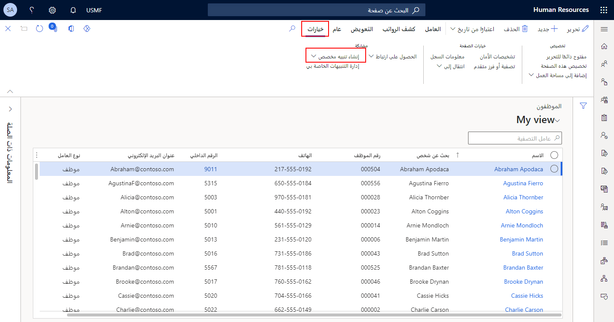

تعمل التنبيهات كنظام إعلام لأحداث النظام الهامة. يمكنك استخدام الإعلامات لتتعرف على التكرارات التي تريد تتبعها. يمكنك إنشاء مجموعتك الخاصة من قواعد التنبيه ليتم إعلامك بالتسليمات الفائتة، والأوامر التي تم حذفها، وتغييرات الأسعار، والأحداث الأخرى التي تتطلب انتباهك.

يمكنك إقران حدث محدد بحقل معين عند إنشاء قواعد التنبيه، مثل وقت وصول التاريخ المقدم في الحقل أو تغيير محتويات الحقل. بدلاً من ذلك، يمكنك ربط حدث بمجموعة من السجلات على صفحة واحدة، على سبيل المثال، عند إنتاج سجل أو عند حذف سجل.

يمكنك تكوين التنبيهات على معظم الصفحات في التطبيق عن طريق الانتقال إلى علامة التبويب **خيارات** وتحديد **إنشاء تنبيه مخصص**.

> [!div class="mx-imgBorder"]
> 

في Dynamics 365 Human Resources، يمكنك استخدام التنبيهات لسيناريوهات مختلفة متعددة.
على سبيل المثال، يمكنك إعداد تنبيه لإعلام المستخدمين عند:

- يتم إنشاء منصب جديد.

- شخص ما تم توظيفه.

- تم تغيير سجل الموظف أو حذفه أو إضافته.

- لقد تغيرت خطة الميزات‬.

- تم إنشاء حالة أو تعديلها أو إغلاقها.

هذه الأمثلة هي بعض أنواع التنبيه التي يمكنك إعدادها. شاهد الفيديو التالي للحصول على عرض توضيحي لكيفية إعداد التنبيهات والاحتفاظ بها في Dynamics 365 Human Resources.

> [!VIDEO https://www.microsoft.com/videoplayer/embed/RWGrSb]

عند إنشاء قاعدة تنبيه، يمكنك تحديد المعايير التي يجب الوفاء بها قبل تشغيل تنبيه. المعايير هي في الأساس المباراة بين وقوع حدث والوفاء بشروط محددة. عند وقوع حدث، يبدأ النظام في إجراء فحص وفقاً للمعايير التي تم تعريفها.
