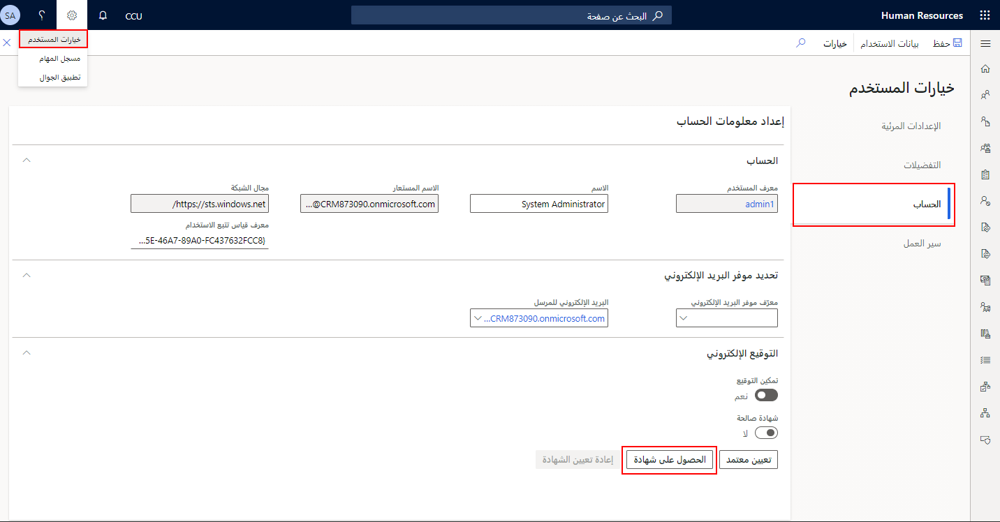
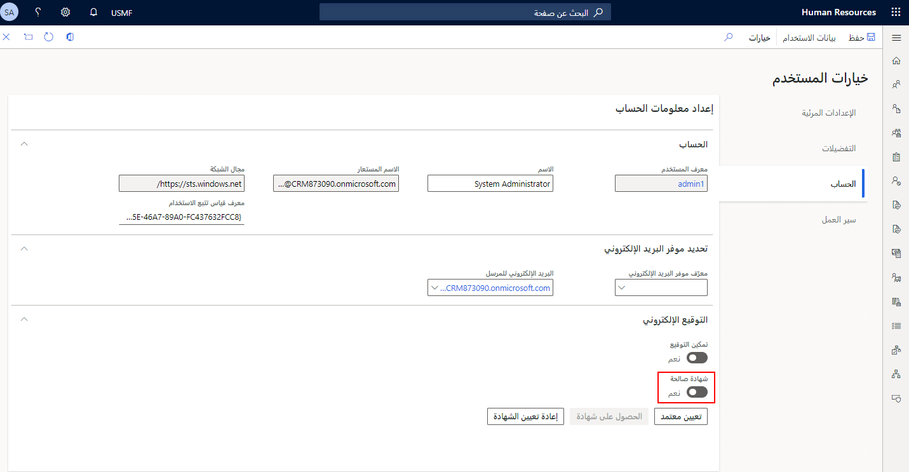

قد تطلب مؤسستك توقيعات إلكترونية لمتطلبات التنظيم والامتثال، خاصةً إذا كنت ضمن الصناعات الدوائية أو الغذائية أو المشروبات أو الصناعات الدفاعية، على سبيل المثال.
تستخدم التوقيعات الإلكترونية لتأكيد وتحديد هوية الشخص الذي على وشك بدء عملية الحوسبة أو الموافقة عليها.

ويمكن استخدام التوقيعات الإلكترونية في إجراءات الأعمال الحاسمة.
يتم تضمين قدرات التوقيع الإلكتروني في العديد من الإجراءات.
بالنسبة لأي جدول وحقل قاعدة بيانات، يمكنك أيضاً تعيين متطلبات توقيع مخصصة. تحتوي التوقيعات الإلكترونية على وظائف توقيع رقمي مضمنة. يجب على كل مستخدم يقوم بتوقيع المستندات الحصول على شهادة تشفير صالحة. عند توقيع مستند، يتم التحقق من صحة المفتاح الخاص المقترن بتلك الشهادة. يتم تسجيل معلومات التوقيع الإلكتروني في سجل لتوفير مسار تدقيق.

تتضمن عدة أدوار تتعلق بالتوقيعات الإلكترونية ما يلي:

- **‏‫مسؤول التوقيع الإلكتروني‬**: بشكل عام، يقوم هذا الشخص بإعداد معلمات متطلبات التوقيع والموافقين عليها، ويتلقى التنبيهات عندما يتعذر التحقق من التواقيع.

- **الموقّع**: هو الشخص الذي يوفر التوقيعات الإلكترونية للمستندات والعمليات التي تتطلب توقيعاً.

- **مدقق التوقيع الإلكتروني**: هو شخص يستعرض سجل قاعدة البيانات وسجل مراجعة التوقيع.. بشكل افتراضي، لدى المستخدم الذي ينتمي إلى دور أمان إدارة تكنولوجيا المعلومات إذن لمراجعة التواقيع الإلكترونية.

سيحتاج المستخدمون إلى البدء بالحصول على شهادة لاستخدام التوقيعات الإلكترونية. يمكنك البدء بالانتقال إلى صفحة **خيارات المستخدم**، وتحديد علامة التبويب **الحساب**، ثم تحديد **الحصول على الشهادة**.

> [!div class="mx-imgBorder"]
> 

بعد تحديد الزر **الحصول على الشهادة**، أكمل الخطوات التالية:

1.  أدخِل كلمة المرور المتصلة بالشهادة.

    > [!NOTE]
    > يتم استخدام كلمة المرور لحماية المفتاح الخاص بك وتخويل استخدام الشهادة الخاصة بك. لا يتم تخزين كلمة المرور هذه في قاعدة البيانات، ولا تتوفر لأي شخص آخر، ولا حتى للمسؤول.

1.  إذا كنت لا تعرف كلمة مرور الشهادة، يمكنك إعادة تعيين الشهادة بتحديد الزر **إعادة تعيين الشهادة** في صفحة **خيارات المستخدم**.

    > [!NOTE]
    > إذا قمت بإعادة تعيين الشهادة، فلن يؤثر ذلك على المستندات التي قمت بتوقيعها باستخدام الشهادة السابقة.

1.  بعد التحقق من صحة الشهادة الخاصة بك عن طريق إدخال كلمة المرور وتأكيدها، سيتم تبديل **الشهادة الصالحة** تلقائياً إلى **نعم**.

    > [!div class="mx-imgBorder"]
    > 

1.  بالإضافة إلى ذلك، يمكنك تعيين المعتمدين من هذه الصفحة. للقيام بذلك، حدد الزر **تعيين الموافق**.

1.  في الصفحة **تعيين معتمد**، حدد **جديد** في جزء الإجراءات.

1.  في **تسجيل الدخول لمستخدم معرف**، حدد المستخدم الذي يتم توقيع التغييرات الخاصة به.

1.  حدد **حفظ** في جزء الإجراءات ثم أغلق الصفحة.

بعد الحصول على شهادة والتحقق من صحتها، يمكنك توقيع مستند إلكترونياً في Dynamics 365 Human Resources.
