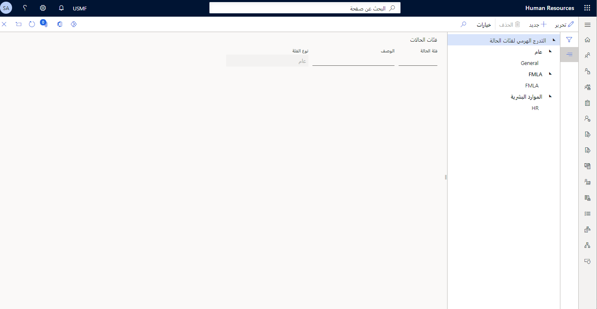
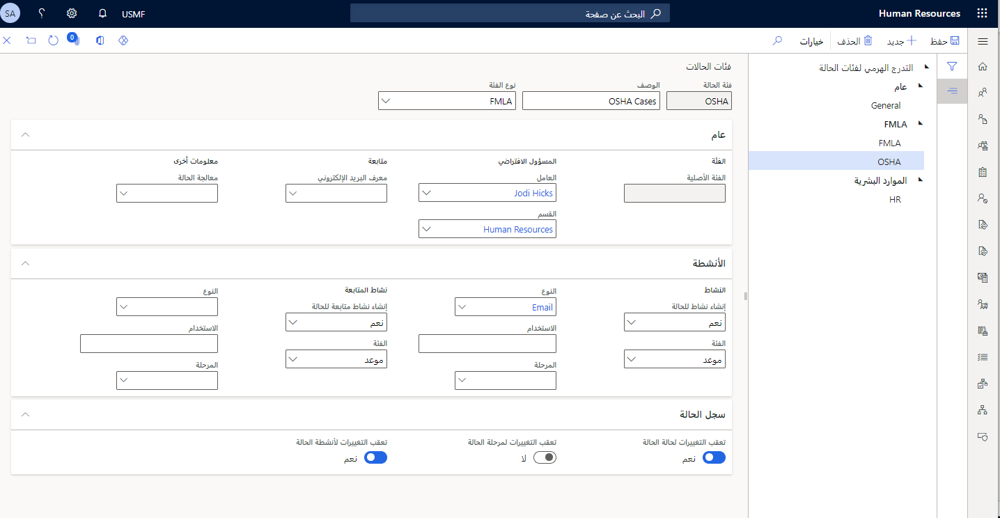
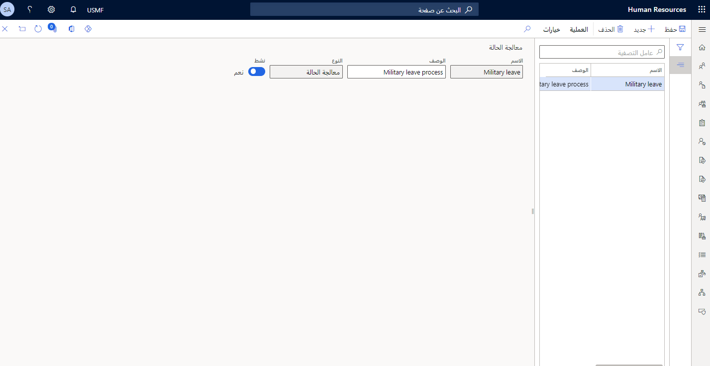
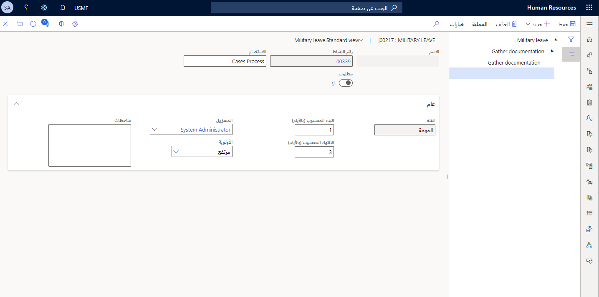

تمنح إدارة الحالات في Dynamics 365 Human Resources المنظمات القدرة على تخطيط قرارات فعالة وتتبعها وتحليلها وتطويرها. تسمح لك إدارة الحالات بإعداد إدارة الحالات التي قد تكون مشابهة بحيث يمكنك توفير حلول متسقة عبر مؤسستك. على سبيل المثال، يمكنك إعداد إدارة حالات للسيناريوهات التالية:

- متطلبات قانون الإجازة العائلية والطبية (FMLA).

- العمليات المنظمة

- حالات الإصابة أثناء العمل

- حالات تعميم الموارد البشرية

تستعرض المقاطع التالية سيناريو لكيفية استخدام إدارة الحالات في Dynamics 365 Human Resources.

## إدارة الحالات وقانون الإجازة العائلية والطبية (FMLA)

عمل Abraham في شركة Contoso Electronics لمدة 12 عاماً كأخصائي عمليات. وقد تواصل Abraham مؤخراً مع Lisa، جنرال الموارد البشرية في Contoso لتقديم إخطار عن حاجته إلى أخذ إجازة لأسباب طبية.
يريد Abraham أن يعرف عدد ساعات إجازة FMLA لديه لبدء الإجازة.

Lisa تستخدم Dynamics 365 Human Resources لإنشاء حالة FMLA جديدة لسجل الموظف Abraham. بعد إنشاء الحالة، يمكن أن تبدأ Lisa في إعداد تفاصيل الإجازة وعرض عدد ساعات FMLA التي لدى Abraham. يمكن لـ Lisa أيضاً جمع معلومات مثل تاريخ الإجازة المقدرة والساعات المعتمدة لهذه الحالة. بالإضافة إلى ذلك، يمكن لـ Lisa إرفاق المستندات المطلوبة للإجازة. باستخدام إدارة الحالات، يمكن لـ Lisa ومجموعة الموارد البشرية:

- عرض المعلومات المرتبطة بالطلب.

- إضافة ملاحظات إلى الحالة.

- اتبع عملية عمل شفافة ومتسقة.

- تحديث السجل حسب الحاجة.

- تحديث حالة الحالة من **مفتوحة** إلى **قيد التقدم** أو **مغلقة** أو **ملغية**.

شاهد الفيديو الآتي لرؤية عرض توضيحي لهذا المثال.

> [!VIDEO https://www.microsoft.com/videoplayer/embed/RWGrSc]

لاستخدام إدارة الحالات، ستحتاج إلى البدء بالتكوين الأساسي.
قبل تكوين المكونات الضرورية، يجب:

- تحديد العمليات المتعلقة بالموارد البشرية التي تتشابه في خطواتها مع الحل، مثل حالات FMLA. قد يكون لديك أنواع مختلفة من حالات FMLA مثل الإجازة الطبية أو الإجازة العائلية أو الإجازة العسكرية، ولكن قد تكون هذه عمليات مماثلة.

- حدد عمليات الموارد البشرية التي تريد مؤسستك تعقبها وتحليلها.

- حدد حالات معينة قد تحتاج إلى اتباع خطوات معينة. إذا كانت هذه الحالات موجودة، يمكنك إعداد عملية حالة Dynamics 365 Human Resources يجب اتباعها.
يمكن أن يساعد هذا النهج على التأكد من اتباع عملية متسقة في كل مرة.

تتضمن العديد من المكونات التي ستحتاج إلى تكوينها ما يلي:

- **فئات الحالات**: يوفر التسلسل الهرمي لفئة الحالة قائمة بالفئات التي يمكنك تعيين الحالات إليها. تتضمن كل فئة من فئات المستوى الأعلى فئات فرعية بحيث يمكنك إنشاء فئات أكثر تحديداً للحالات التي تعمل بها مؤسستك.

- **أمان نوع فئة الحالة**: يجب أن يكون للموظفين المناسبين فقط في المؤسسة حق الوصول إلى الحالات والمعلومات المتعلقة بها. للتحكم في الموظفين الذين لديهم حق الوصول لعرض أنواع مختلفة من الحالات وإنشائها وتحديثها، يمكنك تعيين أدوار أمان لأنواع فئات الحالات. حدد أدوار الأمان التي يجب أن يكون لها حق الوصول إلى أنواع فئة الحالة المختلفة. حدد أدوار الأمان التي يجب أن يكون لها حق الوصول إلى فئات الحالات المختلفة.

- **عمليات الحالة**: وضع الإجراءات التي يجب على الموظفين اتباعها عند فتح الحالات في شركتك. تساعد العمليات على ضمان الاتساق للأشخاص الذين يشاركون في الحالات وتساعد الموظفين على حل الحالات بشكل أسرع وأكثر كفاءة. يمكنك إعداد عملية لكل فئة حالة يتم تعيين الحالات إليها.على الرغم من أن تصميم إجراء مختلف لكل نوع حالة يستغرق وقتاً طويلاً، إذا كانت العمليات مدروسة بشكل صحيح، فإن حل الحالة يتم بشكل أكثر سلاسة.

يمكنك إعداد كل من هذه المكونات عن طريق الانتقال إلى **إدارة النظام > الارتباطات > الحالات**.

## تكوين فئات الحالات

لتكوين فئات الحالات في Dynamics 365 Human Resources، اتبع الخطوات التالية:

1.  انتقل إلى **إدارة النظام > الارتباطات > الحالات > فئات الحالات**.

1.  في صفحة **فئات الحالات**، يمكنك إعداد التسلسل الهرمي لفئة الحالة. يوضح المثال التالي ثلاث فئات رئيسية للحالة: **عام** و **FMLA** و **الموارد البشرية**. يمكنك تجميع حالات مشابهة أسفل كل عقدة رئيسية في التسلسل الهرمي.

    > [!div class="mx-imgBorder"]
    > 

1.  لإضافة عقدة جديدة في التسلسل الهرمي، حدد فئة الحالة التي تريد إضافة عقدة إليها، على سبيل المثال **FMLA**.

1.  في الحقل **فئة الحالة**، أدخِل اسماً لفئة الحالة، على سبيل المثال **OSHA**.

1.  حدد **نوع الفئة**، حيث يمكنك تحديد **عام** أو **FMLA** أو **الموارد البشرية**.

1.  في علامة التبويب السريعة **عام**، يمكنك تحديد الحقول التالية:

    -   **العامل**: المالك الافتراضي للحالات في الفئة التي تقوم بإعدادها.

    -   **القسم**: القسم الافتراضي المسؤول عن الفئة التي تقوم بإعدادها.

    -   **معرّف البريد الإلكتروني**: في هذا الحقل، يمكنك تحديد قالب بريد إلكتروني لاستخدامه في عمليات متابعة البريد الإلكتروني.

    -   **عملية الحالة**: يمكنك تعيين عملية حالة افتراضية لهذه الفئة.

1.  في علامة التبويب السريعة **الأنشطة**، يمكنك تحديد الحقول التالية:

    -   **إنشاء نشاط للحالة**: قم بتعيين هذا الحقل إلى **نعم** أو **لا** أو **مطالبة** أو **مطالبة متقدمة** إذا كنت تريد إنشاء نشاط تلقائياً عند إنشاء حالة في هذه الفئة. على سبيل المثال، يمكنك تحديد **نعم** في هذا الحقل ثم تحديد **الفئة** للمهمة و **النوع** و **الغرض** و **المرحلة** للنشاط.

    -   **إنشاء نشاط متابعة للحالة**: استخدم هذا القسم لإعداد أنشطة المتابعة التلقائية لحالة في هذه الفئة.

1.  في علامة التبويب السريعة **سجل الحالة**، يمكنك تعيين الخيارات التالية إلى **نعم** إذا كنت تريد تعقب هذه الإجراءات في سجل الحالات داخل الفئة:

    - تعقب التغييرات لحالة الحالة

    - تعقب التغييرات لمرحلة الحالة

    - تعقب التغييرات لأنشطة الحالة

    > [!div class="mx-imgBorder"]
    > 

## تكوين عمليات الحالة

يمكنك تعيين عملية حالة إلى حالة معينة أو إلى فئة حالة في Dynamics 365 Human Resources. من خلال تعيين عملية حالة إلى فئة حالة أو حالة، يمكنك التأكد من اتباع عملية متسقة للحالات في التطبيق. لإعداد عملية حالة‬، اتبع الخطوات التالية:

1. انتقل إلى **إدارة النظام > الارتباطات > الحالات > عمليات الحالات**.

1. حدد **جديد** في جزء الإجراءات.

1. أدخِل **اسم** للعملية، مثل **الإجازة العسكرية**.

1. أدخِل **الوصف**.

1. حدد **حفظ** في جزء الإجراءات.

1. قم بتعيين شريط التمرير **نشط** إلى **نعم** لتنشيط العملية.

   > [!div class="mx-imgBorder"]
   > 

1. إعداد خطوات العملية ومتطلباتها.

1. في جزء الإجراء، حدد **عملية**، ثم حدد **التفاصيل**.

1. إنشاء تسلسل هرمي للخطوات التي سوف تشكل العملية في هذه الصفحة.

1. لبدء إنشاء العملية، حدد **جديد > مستوى إنشاء**.

1. أدخِل اسم الخطوة في الحقل **الغرض**، مثل **إنشاء الحالة الأولية**.

1. حدد **حفظ** في جزء الإجراءات. سيتم ملء **الاسم** تلقائياً، وسيتم تعيين **رقم نشاط**.

1. قد تكون هناك عدة خطوات ضمن هذا المستوى. على سبيل المثال، يجب أولاً إنشاء الحالة، ثم إضافة مستندات إلى الحالة قبل الانتقال إلى الخطوة التالية في العملية. الآن، أضِف الخطوات في هذا المستوى.

1. مع تحديد المستوى الجديد، حدد **جديد > إنشاء مهمة**.

    > [!NOTE]
    > يمكنك تحديد إنشاء مستوى جديد أو إجراء أو موعد أو حدث أو مهمة جديدة من القائمة المنسدلة **جديد**.

1. أدخِل **الغرض**، مثل **جمع المستندات**.

1. يمكنك جعل هذه الخطوة إلزامية عن طريق تعيين مفتاح التبديل **مطلوب** إلى **نعم**.

1. يمكنك تحديد توقيت بدء المهمة، وتوقيت إنهائها، بالأيام في الحقلين **حساب تاريخ البدء (بالأيام)** و **احتساب تاريخ الانتهاء (بالأيام)**.

1. في الحقل **المسؤول**، يمكنك تحديد الموظف المسؤول عن المهمة.

1. قم بتعيين الأولوية **منخفضة** أو **متوسطة** أو **قصوى** في الحقل **الأولوية**.

1. استخدم قسم الملاحظات لإضافة معلومات قد تكون مفيدة للمستخدم لهذه المهمة.

   > [!div class="mx-imgBorder"]
   > 

1. تابع إضافة خطوات في العملية حسب الحاجة عن طريق تحديد العقدة المناسبة، وتحديد **جديد** في جزء الإجراء، ثم تحديد نوع العملية.

## تكوين أمان نوع فئة الحالة

للتحكم في الموظفين الذين لديهم حق الوصول لعرض أنواع مختلفة من الحالات وإنشائها وتحديثها، يمكنك تعيين أدوار أمان لأنواع فئات الحالات. شاهد الفيديو التالي للحصول على عرض توضيحي حول كيفية تكوين أمان نوع فئة الحالة.

> [!VIDEO https://www.microsoft.com/videoplayer/embed/RWGrSd]
