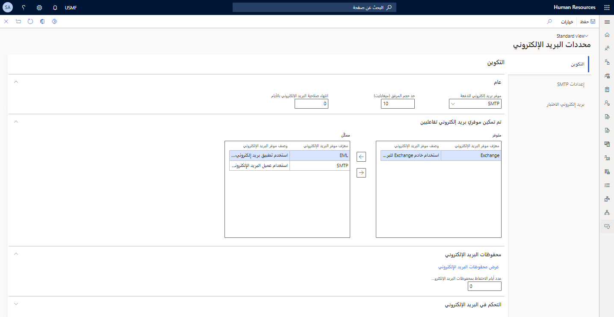
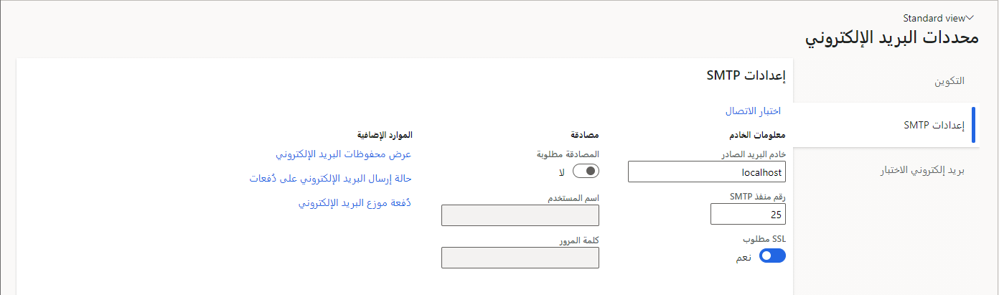
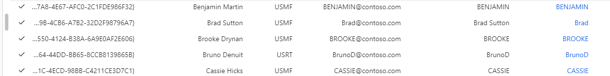

أصبح البريد الإلكتروني جزءاً لا يتجزأ من الحياة اليومية للعمل، وينفرد Dynamics 365 بالإمكانات التي تعزز استخدامك للبريد الإلكتروني كجزء من تكامل Microsoft 365 المتوفر. تتناول هذه الوحدة خيارات التكوين المختلفة المتوفرة.

يتأثر سلوك النظام الفرعي للبريد الإلكتروني بتكوين المسؤول وتكوين المستخدم وخيارات المستخدم. لمساعدتك على العثور على المعلومات ذات الصلة، تم تقسيم هذه الوحدة إلى أقسام للمسؤولين والمستخدمين.

## تكوين المسؤول

عادةً، يقوم المسؤولون والمستخدمون بتكوين النظام الفرعي للبريد الإلكتروني.
تناقش الأقسام التالية الإعدادات التي عادةً ما يتم تناولها من قِبل مسؤول.

### صفحة محددات البريد الإلكتروني

تعرض لقطة الشاشة التالية الإعدادات الموجودة في علامة التبويب **التكوين** ضمن صفحة **محددات البريد الإلكتروني**.

> [!div class="mx-imgBorder"]
> 

| الحقل | الوصف |
|-------|-------------|
| موفر بريد إلكتروني للدفعة | يحدد موفر البريد الإلكتروني الذي سيُستخدَم لإرسال رسائل البريد الإلكتروني التي يتم إرسالها بواسطة العمليات دفعة واحدة أو بطريقة غير تفاعلية. سيستخدم موفر Exchange الحساب المرتبط بعملية الدُفعة. |
| حد حجم المرفقات | يحدد الحد الأقصى لحجم البريد الإلكتروني المفرد الذي يمكن إرساله باستخدام النظام الفرعي للبريد الإلكتروني. |

قسم **محفوظات البريد الإلكتروني** يتضمن غرضين. الغرض الأول هو توفير رابط إلى صفحة **محفوظات البريد الإلكتروني**، والتي تسمح للمسؤولين بمراجعة جميع رسائل البريد الإلكتروني المرسلة والأخطاء التي حالت دون إرسال رسالة بريد إلكتروني.
والغرض الثاني هو مساعدتك على تحديد المدة التي يجب الاحتفاظ فيها بمحفوظات بريدك الإلكتروني. يتم حفظ آخر 30 يوماً من محفوظات البريد الإلكتروني بشكل افتراضي. قم بتغيير عدد الأيام لإبقاء حقل محفوظات البريد الإلكتروني بقيمة غير صفرية لتعديل هذا المبلغ.
تقوم القيمة صفر بإرجاع المبلغ والسلوك إلى حالتهما الافتراضية.

### علامة التبويب إعدادات SMTP

تعرض لقطة الشاشة التالية الإعدادات الموجودة في علامة التبويب **إعدادات SMTP** ضمن صفحة **محددات البريد الإلكتروني**.

> [!div class="mx-imgBorder"]
> 

| الحقل | الوصف |
|-------|-------------|
| خادم البريد الصادر | اسم مضيف خادم البرتوكول البسيط لنقل رسائل البريد (SMTP). بالنسبة لإنتاج Microsoft 365 (بما في ذلك حسابات ‎*.onmicrosoft.com) استخدم `smtp.office365.com`. (يمكنك العثور على هذا الإعداد في outlook.office.com من خلال الانتقال إلى **إعدادات > البريد > POP وIMAP**.) بالنسبة إلى Outlook وHotmail، استخدم `smtp-mail.outlook.com`. |
| رقم منفذ SMTP | يجب عادةً تعيين رقم المنفذ على 587 للنقل الآمن. |
| تحديد إذا كان SSL مطلوباً | حدد ما إذا كان النقل الآمن مستخدماً أم لا. عادةً، يتم تعيين ذلك الحقل على **نعم**، إلا في السيناريوهات الداخلية أو سيناريوهات استكشاف الأخطاء وإصلاحها. |
| اسم المستخدم وكلمة المرور | إذا كانت المصادقة مطلوبة، فحدد حساب البريد المناسب لإرسال البريد الإلكتروني منه. ويحتاج جميع المستخدمين إلى توفير أذونات **إرسال كـ** و **إرسال نيابةً عن** لحساب SMTP لإتاحة إمكانية إرسال بريد SMTP. يمكنك تكوين أذونات **إرسال كـ** في مركز مسؤولي Microsoft 365 ‏(portal.office.com/Admin) من خلال الانتقال إلى **المستخدمون > المستخدمون النشطون > المستخدم > تحرير أذونات صندوق البريد > إرسال بريد إلكتروني من صندوق البريد هذا**. |

### عملية دُفعة موزع البريد الإلكتروني

تقوم عملية **دُفعة موزع البريد الإلكتروني** بإرسال بريد إلكتروني من الخادم مباشرةً، بدون تفاعل المستخدم، عبر SMTP. يجب بدء عملية الدُفعة لمعالجة قائمة انتظار البريد الإلكتروني. افتح جزء **دُفعة موزع البريد الإلكتروني** (**‎إدارة النظام > مهام دورية > معالجة البريد الإلكتروني > الدُفعة**) وقم بتمكين **معالجة الدُفعة** لبدء العملية. حساب المستخدم المقترن بعملية الدُفعة (عادةً المسؤول) سيكون هو المرسل إذا تم استخدام موفر Exchange.

### البريد الإلكتروني للمستخدم

يمكنك استخدام الحقل **‎البريد الإلكتروني** في صفحة **المستخدمون‏‎** (**إدارة النظام > المستخدمون > المستخدمون**) لتحديد عنوان **إرسال من** افتراضي لكل مستخدم. إذا لزم الأمر، يمكن للمسؤولين استخدام الحقل **البريد الإلكتروني للمرسل** في الصفحة **خيارات** لتجاوز الإرسال الافتراضي.

> [!div class="mx-imgBorder"]
> 

### إعلامات البريد الإلكتروني لسير العمل

للتحقق من إعدادات البريد الإلكتروني، اتبع الخطوات التالية:

1. انتقل إلى **إدارة النظام > إعداد > البريد الإلكتروني > محددات البريد الإلكتروني**.

1. تحقق من تمكين SMTP.

1. قم بتعيين إعدادات خادم البريد SMTP.

للتحقق من أن عملية معالجة دُفعة البريد الإلكتروني قيد التشغيل، اتبع الخطوات التالية:

1. انتقل إلى **إدارة النظام > المهام الدورية > معالجة البريد الإلكتروني > دُفعة موزع البريد الإلكتروني**.

1. قم بتمكين الخيار **معالجة الدُفعة** .

اختيارياً، يمكنك ضبط تكرار عملية البريد الإلكتروني باتباع الخطوات التالية:

1. حدد **لا يوجد تاريخ انتهاء** لضبط كافة تكرارات عملية دُفعة البريد الإلكتروني.

1. اضبط العدد.

1. اضبط للتشغيل كل دقيقة إذا لزم الأمر.

للتحقق من قوالب البريد الإلكتروني لنظام إعلام سير العمل، اتبع الخطوات التالية:

1. انتقل إلى **‎إدارة النظام > إعداد >البريد الإلكتروني > قوالب البريد الإلكتروني للنظام** (للقوالب على مستوى النظام).

1. تحقق من تعيين حقل **البريد الإلكتروني للمرسل** وصلاحيته.

للتحقق من قوالب البريد الإلكتروني لمؤسسة إعلام سير العمل، اتبع الخطوات التالية:

1. انتقل إلى **إدارة المؤسسة > إعداد > قوالب البريد الإلكتروني للمؤسسة** (للقوالب الخاصة بالمؤسسة).

1. تحقق من تعيين حقل **البريد الإلكتروني للمرسل** وصلاحيته.

للتحقق من أن المستخدم يمكنه تلقي إعلامات البريد الإلكتروني، اتبع الخطوات التالية:

1. انتقل إلى **إعدادات‏‎ > خيارات المستخدم**.

1. انتقل إلى علامة التبويب **الحساب** .

1. قم بتعيين **معرّف موفر البريد الإلكتروني** (على سبيل المثال، SMTP).

1. بشكل اختياري، قم بتعيين تجاوز  **البريد الإلكتروني للمرسل** إذا كان لا ينبغي استخدام عنوان **إرسال من** الافتراضي للمستخدم الحالي.

1. انتقل إلى علامة التبويب **سير العمل** . قم بتعيين خيار إرسال الإعلامات عبر البريد الإلكتروني على **نعم**.

للتحقق من أن نظام سير العمل سوف يرسل إعلامات البريد الإلكتروني، اتبع الخطوات التالية:

1. لكل سير عمل يجب أن يكون له إعلام، افتح خصائص سير العمل في محرر سير العمل.

1. حدد **إعدادات أساسية**. اضبط قالب البريد الإلكتروني لإعلامات سير العمل.

1. حدد **الإعلامات**.

1. قم بتمكين الأحداث التي يجب إعلام المستخدم بها.

1. قم بتعيين مستلم إعلام سير العمل لكل إعلام حدث ممكّن.

اتبع الخطوات التالية على عنصر الموافقة على سير العمل الذي يجب إعلام المستخدم به:

1. انتقل إلى **الخصائص**.

1. قم بتمكين الأحداث التي يجب إعلام المستخدم بها.

1. قم بتعيين مستلم إعلام سير العمل لكل إعلام حدث ممكّن.

## تكوين المستخدم

تصف الأقسام التالية الإعدادات التي تتعامل مع تكوين المستخدم.

### مربع حوار تحديد موفر البريد الإلكتروني

يمكنك فتح الصفحة **خيارات** بالانتقال إلى **إعدادات > خيارات المستخدم**.
تقع منطقة **تحديد موفر البريد الإلكتروني** ضمن علامة التبويب **الحساب**.

| الحقل | الوصف |
|-------|-------------|
| معرّف موفر البريد الإلكتروني | يسمح للمستخدم بتحديد موفر البريد الإلكتروني الذي يجب استخدامه عند إرسال بريد إلكتروني. ويُعد تحديد خيار ضمن هذا الحقل مكافئاً لتحديد **لا تسأل مرة أخرى** في مربع الحوار **كيف تريد إرسال البريد الإلكتروني** . سيؤدي تحديد الخيار الفارغ **المطالبة التي يتم استخدام موفر بريد إلكتروني لها** إلى عرض مربع الحوار **كيف تريد إرسال البريد الإلكتروني** عندما يتم إرسال رسالة بريد إلكتروني. |
| البريد الإلكتروني للمرسل | يسمح للمسؤول بتوفير تجاوز عنوان بريد إلكتروني لحقل **من** الخاص بالبريد الإلكتروني. افتراضياً، يتم استخدام الاسم المستعار للبريد الإلكتروني المقترن بحساب المستخدم كحقل **من** في رسائل البريد الإلكتروني الجديدة، ولكن عنوان البريد الإلكتروني لخيار المستخدم هذا سيتجاوز ذلك. عند إرسال رسالة بريد إلكتروني عبر SMTP، يجب على المستخدم تكوين أذونات **إرسال كـ** وكذلك **‎إرسال نيابةً عن** المناسبة في Exchange أو على خادم SMTP. |

### كيف تريد إرسال البريد الإلكتروني

عند إرسال بريد إلكتروني، سيرى المستخدم مربع الحوار (الاختياري) **كيف تريد إرسال البريد الإلكتروني** الذي سيسرد الخيارات المتوفرة لإرسال البريد الإلكتروني.

| الحقل | الوصف |
|-------|-------------|
| استخدام تطبيق بريد إلكتروني، على سبيل المثال Outlook | يوفر للمستخدم ملف بريد إلكتروني (.eml) تم إنشاؤه. |
| استخدام خادم Exchange للبريد الإلكتروني | يستخدم الخادم Exchange Online المقترن بالمستأجر. حالياً، موفر البريد Exchange غير معتمد خارج المجموعة العامة بما في ذلك البيئات المحلية. |
| استخدام عميل البريد الإلكتروني للنظام | يفتح مربع الحوار **إرسال تركيب البريد الإلكتروني** ثم يرسل البريد الإلكتروني الناتج باستخدام SMTP. |
| لا تسأل مرة أخرى | إذا لم تحدد هذا الحقل، في المرة التالية التي ترسل فيها رسالة بريد إلكتروني، سيتم استخدام الخيار الذي تم تحديده مؤخراً ولن يتم فتح مربع الحوار. |

### مربع حوار إرسال البريد الإلكتروني 

عند ظهور مربع الحوار **إرسال بريد إلكتروني** (اختياري)، يمكن للمستخدم إجراء تغييرات على محتويات البريد الإلكتروني قبل إرساله. سيظهر ضمن هذه النافذة بعض الحقول المعبأة مسبقاً.

| الحقل | الوصف |
|-------|-------------|
| من | تمت التعبئة من الحقل **البريد الإلكتروني** في الصفحة **خيارات**. |
| إلى ونسخة ونسخة مخفية والموضوع والنص | تمت تعبئة هذه الحقول بالقيم التي تم تحديدها بواسطة العملية التي بدأت في إرسال البريد الإلكتروني. يمكن تحرير هذه الحقول حسب الحاجة من قِبل المستخدم. |
| قائمة المرفقات‬ | يمكن تعبئة هذه الحقول بالمرفقات التي تم تحديدها بواسطة العملية التي بدأت في إرسال البريد الإلكتروني. يمكن تحرير هذه القائمة حسب الحاجة من قِبل المستخدم. |

## سيناريوهات الاستخدام للتحقق من تكوين البريد الإلكتروني

تصف الأقسام التالية بعض سيناريوهات الاستخدام التي يجب التحقق منها للتأكد من إعداد تكوين بريدك الإلكتروني على النحو الذي تريده.

### إرسال بريد إلكتروني عن طريق عميل بريد إلكتروني محلي

لإرسال بريد إلكتروني باستخدام عميل بريد إلكتروني محلي، اتبع الخطوات التالية:

1. يمكن أن تقوم عمليات البريد الإلكتروني التي يتم تمكينها بواسطة إطار عمل SysEmail‎ بإنشاء رسائل بريد إلكتروني تحتوي على مرفقات (ملفات ‎.eml). ويمكنك بعد ذلك إرسال هذه الرسائل عن طريق استخدام Microsoft Outlook أو عميل بريد إلكتروني آخر.

1. في Microsoft Internet Explorer، انتقل إلى **حسابات مدينة > العملاء > كافة العملاء**.

1. حدد **US-008 Sparrow Retail**.

1. حدد **التحصيل > أرصدة العميل > التحصيلات** لفتح صفحة **التحصيلات‏‎‏‎** .

1. حدد **اتصال > البريد الإلكتروني > كشوف الحسابات إلى جهة الاتصال**.

1. حدد **موافق** لقبول القيم الافتراضية في مربع الحوار.

1. إذا تمت مطالبتك باستخدام خيار البريد، فامسح الخيار **عدم السؤال مرة أخرى** (يمكنك تغيير هذا الخيار من صفحة **خيارات المستخدم** )، وحدد **استخدام تطبيق بريد إلكتروني، مثل Outlook**، ثم حدد **موافق**.

1. إذا كنت تستخدم مستعرض Internet Explorer على الكمبيوتر الخاص بك، فافتح ملف البريد الإلكتروني (‎.eml) الذي تم إنشاؤه. إذا كنت تستخدم مستعرض Internet Explorer إنترنت على الجهاز الظاهري، فانسخ الملف إلى الكمبيوتر الخاص بك وافتحه هناك. (لا يوصى باستخدام متصفح Internet Explorer.)

1. لاحظ عنوان البريد الإلكتروني في الحقل **إلى** ومرفق المصنف الذي تم إنشاؤه.

### إرسال بريد إلكتروني باستخدام SMTP

يمكن أيضاً إنشاء عمليات سير عمل بريد إلكتروني يتم تمكينها من خلال إطار عمل SysEmail في مربع حوار بريد إلكتروني بسيط ثم إرسالها باستخدام SMTP.

1. انتقل إلى الصفحة **محددات البريد الإلكتروني** .

1. حدد **إعدادات SMTP**.

1. قم بتعيين **خادم البريد الصادر** على خادم SMTP الذي تريده:

    - بالنسبة [لإنتاج Microsoft 365](https://support.office.com/article/Outlook-settings-for-POP-and-IMAP-access-for-Office-365-for-business-or-Microsoft-Exchange-accounts-7fc677eb-2491-4cbc-8153-8e7113525f6c/?azure-portal=true) (بما في ذلك حسابات ‎*.onmicrosoft.com)، استخدم `smtp.office365.com`. (يمكنك العثور على هذا الإعداد في outlook.office.com من خلال الانتقال إلى **‎إعدادات > البريد > POP وIMAP**.)

    - بالنسبة إلى Outlook وHotmail، استخدم `smtp-mail.outlook.com`.

1. قم بتعيين اسم المستخدم وكلمة المرور لحساب بريد إلكتروني وكلمة مرور مناسبين.

1. اترك **SSLRequired** قيد التشغيل واترك **رقم منفذ SMTP** معيّناً على **587**.

1. حدد **حفظ**.

1. في Internet Explorer، انتقل إلى **حسابات مدينة > العملاء > كافة العملاء**.

1. حدد **US-008 Sparrow Retail**.

1. حدد **التحصيل > أرصدة العميل > التحصيلات** لفتح صفحة **التحصيلات‏‎** .

1. حدد **اتصال > البريد الإلكتروني > كشوف الحسابات إلى جهة الاتصال**.

1. حدد **موافق** لقبول القيم الافتراضية في مربع الحوار.

1. في حالة مطالبتك بخيار البريد الإلكتروني المراد استخدامه، حدد **استخدام عميل البريد الإلكتروني لتطبيقات Microsoft Dynamics 365 for Finance and Operations**، ثم حدد **موافق**.

1. لتلقي رسالة الاختبار، قم بتغيير **إلى العنوان** إلى عنوان البريد الإلكتروني الخاص بك. تأكد من أن الحساب المحدد في إعدادات SMTP يمكنه **‎إرسال كـ** وكذلك **‎إرسال نيابةً عن** حساب البريد الإلكتروني الخاص بك. وأسهل طريقة لضمان هذا الإعداد هي استخدام حساب البريد الكتروني الخاص بك في إعدادات SMTP.

1. أدخِل موضوعاً ونصاً للرسالة.

1. حدد **إرسال**. يجب تسليم الرسالة في غضون دقيقة إلى خمس دقائق.

### موفر البريد الإلكتروني Exchange

يمكن للمسؤول اختيار **Exchange** كموفر بريد إلكتروني تفاعلي وموفر بريد إلكتروني للدفعة في صفحة **محددات البريد الإلكتروني**. سيتم استخدام حساب المستخدم الحالي على Exchange Online لإرسال رسائل البريد الإلكتروني من قِبل موفر البريد الإلكتروني **Exchange**. سيتم استخدام حساب الدُفعة عند استخدامه كموفر بريد إلكتروني للدفعة. لا شيء آخر يحتاج إلى إعداد. إذا كان استكشاف الأخطاء وإصلاحها مطلوباً، فتأكد من أنه يمكن الوصول إلى حساب المستخدم الحالي ومن أنه يمكن إرسال رسائل البريد الإلكتروني من هذا الحساب إلى المستلمين المناسبين.

> [!NOTE]
> لا يتم اعتماد موفر البريد الإلكتروني Exchange للمستخدمين الخارجيين لأنه لن يكون لديهم حسابات Exchange ضمن المستأجر هذا.

للحصول على مزيد من المعلومات، راجع [استكشاف أخطاء البريد الإلكتروني وإصلاحها](/dynamics365/fin-ops-core/fin-ops/organization-administration/configure-email?toc=/dynamics365/commerce/toc.json/?azure-portal=true#troubleshooting).
