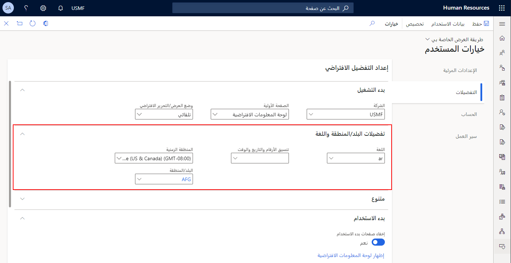

ضمن خضام الأعمال التجارية التي تسود جميع أنحاء العالم، من الضروري أن تكون على دراية بخياراتك لحقول التاريخ والوقت والمناطق الزمنية.

## حقول التاريخ والوقت

يوجد ثلاثة أنواع من حقول التاريخ والوقت تتوافق مع أنواع بيانات مختلفة في قاعدة البيانات:

- **حقول التاريخ/الوقت المجمعة** : تُعد هذه الحقول المفضلة لإدخال بيانات التاريخ والوقت. يخزن نوع بيانات **utcdatetime** بيانات الوقت والتاريخ في حقل واحد في التوقيت العالمي المنسق (UTC) وهو معيار الوقت الأساسي الذي ينظم به العالم الساعات والوقت. يقع ضمن حوالي ثانية واحدة، توقيت شمسي عند صفر من درجات الطول؛ لا يلاحظ التوقيت الصيفي. يتم التعبير عن المناطق الزمنية حول العالم باستخدام الإزاحات الإيجابية أو السالبة من UTC. بالنسبة لمعظم الأغراض، يعتبر UTC قابلة للتبديل مع توقيت غرينتش (GMT). تعرف الصيغة الحالية من التوقيت العالمي المنسق بتوصية الاتحاد الدولي للاتصالات (ITU-R TF.460-6).

- **حقول التاريخ** : يتم استخدام هذه الحقول لإدخال التواريخ فقط. يخزن نوع بيانات **التاريخ** اليوم والشهر والسنة. ومع ذلك، لا يتم تخزين هذه القيم في UTC ولا يمكن إقرانها بمنطقة زمنية.

- **حقول الوقت** : يتم استخدام هذه الحقول لعرض عدد الثواني المنقضية منذ منتصف الليل في التاريخ الحالي. يخزن نوع بيانات **timeofDay** قيمة عدد صحيح. لا يتم تخزين قيم الوقت في UTC.

## المناطق الزمنية

للتعبير عن أوقات UTC بالتوقيت المحلي، تحتاج إلى توفير منطقة زمنية.
تتحكم المنطقة الزمنية في الإزاحة من UTC التي هي مكافئة التوقيت المحلي. على سبيل المثال، الإزاحة لموسكو بمقدار ثلاث ساعات إضافية على UTC. يتم تعيين المنطقة الزمنية المفضلة لديك أولاً وفقاً لموضع Microsoft Windows على جهازك، على الرغم من أنه قد تم تغييره من قبل مسؤول.
يتم استخدام المنطقة الزمنية المفضلة فقط عند عرض التواريخ والأوقات المجمعة. لتعيين المنطقة الزمنية المفضلة للمستخدم، انتقل إلى صفحة **المستخدمين**، التي تعرض قائمة مستخدمي النظام. حدد المستخدم الذي تريد تعيين المنطقة الزمنية المفضلة له ثم حدد **خيارات المستخدم**. في علامة التبويب **اللغة والمنطقة** ، حدد المنطقة الزمنية المفضلة.

> [!div class="mx-imgBorder"]
> 
