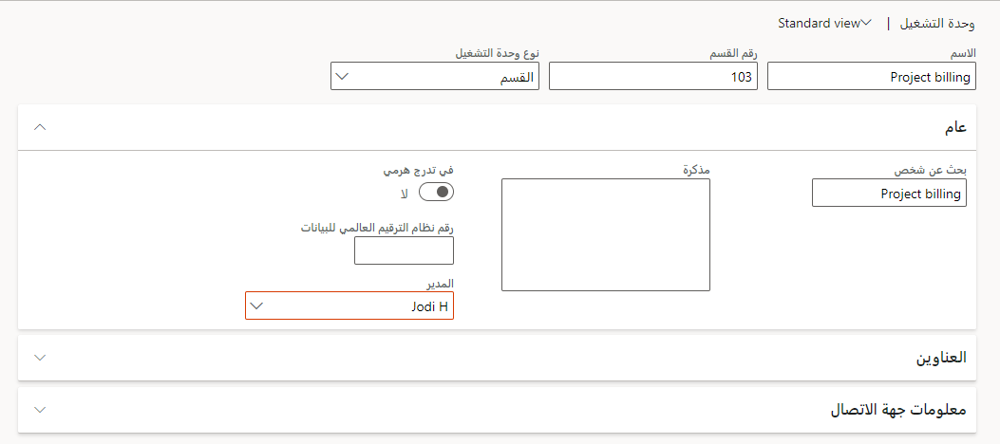
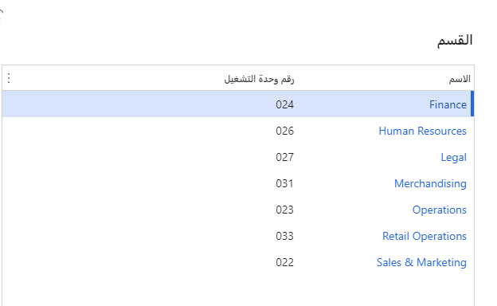

يشار إلى الوحدات التنظيمية التي تمثل مجالاً وظيفياً محدداً في نشاط تجاري، مثل المبيعات أو المحاسبة، باسم الأقسام.
العديد من الشركات لديها التسلسلات الهرمية التنظيمية التي تظهر العلاقات بين مختلف الإدارات داخل الشركة. يرشدك هذا الإجراء من خلال إنشاء أقسام ودمج هذه الأقسام في التدرج الهرمي للإدارات في المؤسسة. عند اتباع هذه الخطوات، استخدم بيانات العرض التوضيحي USMF.

1.  انتقل إلى **إدارة المؤسسة > الأقسام > الأقسام**.

1.  حدد **جديد** لفتح مربع الحوار المنسدل.

1.  في حقل **الاسم**، أدخل قيمة.

    مثال: فوترة المشروع

1.  في حقل **مذكرة‬**، أدخل قيمة.

    مثال: فوترة المشروع

1.  في حقل **المدير**، أدخل قيمة أو حددها.

    مثال: Jodi H

    > [!div class="mx-imgBorder"]
    > 

1.  حدد **حفظ**.

1.  أغلق الصفحة.

1.  انتقل إلى **إدارة المؤسسة > الأقسام > التدرج الهرمي للأقسام**.

1.  حدد **تحرير**.

1.  حدد **إدراج**.

1.  حدد **القسم**.

1.  من القائمة، ابحث عن السجل الذي تريده وحدده.

    مثال: فوترة المشروع

    > [!div class="mx-imgBorder"]
    > 

1.  حدد **موافق**.

1.  حدد **نشر** لفتح مربع الحوار المنسدل.

1.  في الحقل **تاريخ السريان**، أدخل التاريخ والوقت.

    عند نشر التدرج الهرمي للقسم، يمكنك تحديد متى يتم تفعيل التغييرات. يمكن أن تكون التغييرات مؤرخة في المستقبل. على سبيل المثال، قد تعرف أنك ستقوم بإضافة قسم في بداية السنة المالية. يمكنك تعيين تاريخ سريان إلى بداية السنة المالية، وستكون التغييرات في التدرج الهرمي سارية المفعول في ذلك التاريخ.

1.  في حقل **وصف التغييرات**، أدخل قيمة.

1.  حدد **نشر**.
