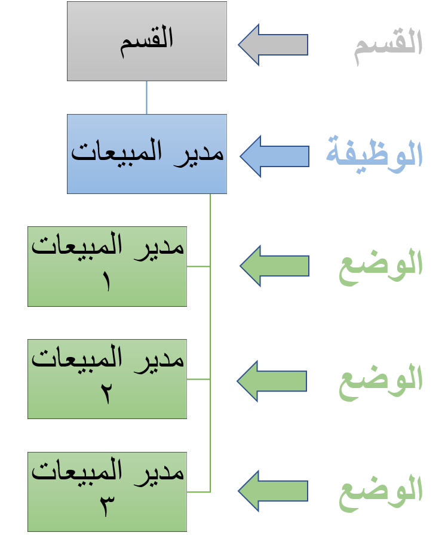

بعد تنظيم الأقسام بالطريقة التي تريدها لمؤسستك، حان الوقت لتوظيفهم بوظائف ومناصب مختلفة. الوظيفة هي مصطلح يشير إلى دور معين داخل مؤسستك، على سبيل المثال، مدير المبيعات. من ناحية أخرى، يشير المنصب إلى عدد الأشخاص الذين يمكنهم الحصول على وظيفة محددة مثل مدير المبيعات.
على سبيل المثال، إذا كان لدى Contoso وظيفة مدرجة لمدير المبيعات، وكانوا يقومون بتعيين ثلاثة مديرين للمبيعات، فسيتم اعتبار فرص العمل الثلاثة هذه منصبًا.

> [!div class="mx-imgBorder"]
> 

تركز هذه المهمة على إنشاء وظيفة جديدة.

1.  انتقل إلى **إدارة المؤسسة > الوظائف > الوظائف**.

1.  حدد **جديد**.

1.  في حقل **الوظيفة**، أدخل قيمة.

1.  في حقل **الوصف**، أدخل قيمة.

1.  حدد عنواناً قياسياً سيتم استخدامه للوظيفة. سيتم استخدام العنوان الذي تقوم بإدخاله كعنوان افتراضي للمناصب الجديدة التي تم تعيينها إلى الوظيفة.

1.  من القائمة، ابحث عن السجل الذي تريده وحدده.

1.  في القائمة، حدد الارتباط في الصف المحدد.

1.  في مجموعة **الحد الأقصى لعدد المناصب**، حدد **الحد الأقصى للمناصب**.

1.  أدخل الحد الأقصى لعدد المناصب. لن يُسمح بتعيينات المناصب فوق الحد الأقصى للقيمة التي تم إدخالها في هذا الحقل.

1.  قم بتوسيع قسم **الوصف**.

1.  في حقل **الملاحظة**، أدخل **إدخال وصف قياسي للوظيفة**. 
    ينطبق الوصف على كافة المناصب التي تم تعيينها إلى المهمة التي تم تعريفها في هذا الحقل.

1.  قم بتوسيع قسم **تصنيف الوظائف**.

1.  حدد مهمة الوظيفة سيتم استخدامها في إعداد التقارير القياسية ضمن الموارد البشرية.

1.  من القائمة، ابحث عن السجل الذي تريده وحدده.

1.  في القائمة، حدد الارتباط في الصف المحدد.

1.  حدد نوع الوظيفة لتصنيف الوظائف بشكل أكبر داخل مؤسستك.
    يمكن استخدام أنواع الوظائف في إعداد التقارير عبر الموارد البشرية.

1.  من القائمة، ابحث عن السجل الذي تريده وحدده.

1.  في القائمة، حدد الارتباط في الصف المحدد.

1.  قم بتوسيع قسم **التعويض**.

1.  حدد مستوى التعويض. سيحدد مستوى التعويض الحد الأدنى والحد الأقصى للتعويض الذي يمكن أن يحصل عليه الموظف مقابل الوظيفة.
    ستحدد قواعد التعويض ما إذا كان يمكن أن يكون تعويض الموظف خارج النطاق.

1.  من القائمة، ابحث عن السجل الذي تريده وحدده.

1.  في القائمة، حدد الارتباط في الصف المحدد.

1.  قم بتوسيع قسم **المهارات**.

    > [!NOTE]
    > الحقول في علامات التبويب السريعة **المهارات**، **التعليم**، **الشهادات** فارغة. بعد نسخ معلومات من قالب مهمة، يمكن إدخال المعلومات في هذه الحقول في خطوة واحدة. 

1.  حدد **حفظ**.

1.  حدد **نسخ من**.

1.  حدد **نسخ من القالب**.

1.  في الحقل **قالب الوظيفة**، حدد زر القائمة المنسدلة لفتح البحث.

1.  من القائمة، ابحث عن السجل الذي تريده وحدده.

1.  في القائمة، حدد الارتباط في الصف المحدد.

1.  حدد الخيار **ملاحظة**. سيتم نسخ العناصر التي تحددها فقط إلى الوظيفة المحددة.

1.  حدد **موافق**.

1.  قم بتوسيع قسم **الشهادات**.

1.  قم بتوسيع قسم **التعليم**.

1.  حدد **حفظ**.
