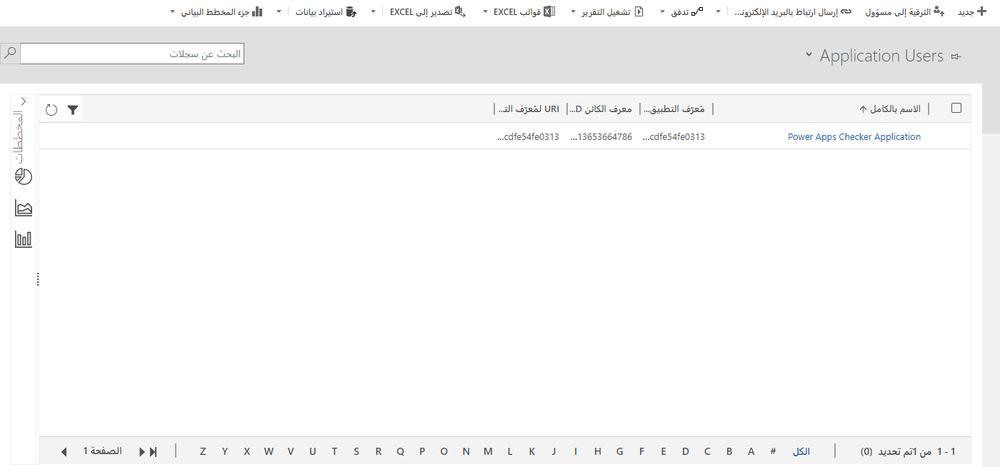

LinkedIn Talent Hub هو نظام تتبع مقدّم الطلب الذي يوفر لك موقعاً واحداً للعثور على الموظفين وإدارتهم وتوظيفهم. من خلال دمج Microsoft Dynamics 365 Human Resourcesمع LinkedIn Talent Hub، يمكنك إنشاء سجلات الموظفين في الموارد البشرية للمتقدمين الذين تم توظيفهم لشغل وظيفة.

## الإعداد

لتمكين الاتصال مع LinkedIn Talent Hub، يجب على مسؤول النظام إكمال أنشطة الإعداد. لمنح LinkedIn Talent Hub الأذونات المناسبة لكتابة البيانات في الموارد البشرية، يجب أولاً إنشاء دور المستخدم والأمان في بيئة Microsoft Power Apps.

## ربط بيئتك بـ LinkedIn Talent Hub
اتبع الخطوات التالية لربط البيئة الخاصة بك إلى LinkedIn Talent Hub:

1.  افتح [LinkedIn Talent Hub](https://business.linkedin.com/talent-solutions/talent-hub/?azure-portal=true).

1.  في القائمة المنسدلة للمستخدم، حدد **إعدادات المنتج**.

1.  في جزء التنقل الأيمن، في قسم  **متقدم** وحدد **عمليات تكامل**.

1.  حدد **تخويل** تكامل Dynamics 365 Human ResourcesMicrosoft.

1.  في الصفحة **Dynamics 365 Human Resources** ، حدد البيئة لربط LinkedIn Talent Hub، ثم حدد **ربط**.

    > [!div class="mx-imgBorder"]
    > 

## إنشاء دور أمان Power Apps

لمتابعة العملية، تحتاج إلى إنشاء دور أمان Power Apps.
اتبع الخطوات التالية لنشر دور الأمان بنجاح:

1.  افتح [Microsoft Power Platform مركز إدارة](https://admin.powerplatform.microsoft.com/?azure-portal=true).

1.  في قائمة **البيئات** ، حدد البيئة المقترنة ببيئة الموارد البشرية التي تريد الاتصال منها بمثيل LinkedIn Talent Hub.

1.  حدد **الإعدادات**.

1.  قم بتوسيع عقدة **المستخدمين + الأذونات** ثم حدد **أدوار الأمان**.

1.  في صفحة **أدوار الأمان** ، ضمن شريط الأدوات، حدد **دور جديد**.

1.  في علامة التبويب  **تفاصيل** ، أدخِل اسماً للدور، مثل **تكامل LinkedIn Talent Hub HRIS**.

1.  في علامة التبويب **تخصيص** ، حدد إذن **القراءة** على مستوى المؤسسة للكيانات التالية:

    -   الكيان

    -   الحقل

    -   العلاقة

1.  احفظ دور الأمان ثم إغلاقه.

## إنشاء مستخدم تطبيق Power Apps

يجب إنشاء مستخدم تطبيق لمحول LinkedIn Talent Hub لمنح أذونات للمحول لكتابة سجلات المرشح في بيئة Power Apps.

> [!NOTE]
> يمكنك الارتباط فقط بالبيئات التي يمتلك فيها حساب المستخدم الخاص بك إمكانية وصول المسؤول إلى بيئة الموارد البشرية وبيئة Power Apps المقترنة. إذا لم يتم سرد بيئات على صفحة ارتباط الموارد البشرية، تأكد من أن لديك تراخيص بيئات الموارد البشرية ضمن المستأجر، وأن المستخدم الذي قمت بتسجيل الدخول إليه في صفحة الارتباط، لديه أذونات المسؤول إلى بيئات الموارد البشرية Power Apps.

1.  افتح [Microsoft Power Platform مركز إدارة](https://admin.powerplatform.microsoft.com/?azure-portal=true).

1.  في قائمة **البيئات** ، حدد البيئة المقترنة ببيئة الموارد البشرية التي تريد الاتصال منها بمثيل LinkedIn Talent Hub.

1.  حدد **الإعدادات**.

1.  قم بتوسيع عقدة **المستخدمين + الأذونات** ثم حدد **المستخدمين**.

1.  حدد **إدارة المستخدمين في Dynamics 365**.

1.  استخدم القائمة المنسدلة أعلى القائمة لتغيير طريقة العرض من طريقة عرض **المستخدمون الممكنون** الافتراضية إلى **مستخدمي التطبيق**.

    > [!div class="mx-imgBorder"]
    > 

1.  في شريط الأدوات، حدد **جديد**.

1.  في صفحة **مستخدم جديد** ، اتبع الخطوات التالية:

    1.  قم بتغيير قيمة حقل **نوع المستخدم** إلى **مستخدم التطبيق**.

    1.  قم بتعيين حقل **اسم المستخدم** إلى **تكامل Dynamics365 HR LinkedIn HRIS**.

    1.  قم بتعيين حقل **معرّف التطبيق** إلى **3a225c96-d62a-44ce-b3ec-bd4e8e9befef**.

    1.  أدخِل أي قيمة في حقول **الاسم الأول** و **اسم العائلة** و **البريد الإلكتروني الأساسي** .

    1.  في شريط الأدوات، حدد **حفظ وإغلاق**. 

## تعيين دور أمان للمستخدم الجديد

بعد حفظ وإغلاق مستخدم التطبيق الجديد في القسم السابق، سيتم إرجاعك إلى صفحة **قائمة المستخدمين** .

1.  في صفحة **قائمة المستخدمين** ، قم بتغيير طريقة العرض إلى **مستخدمي التطبيق**.

1.  حدد مستخدم التطبيق الذي قمت بإنشائه في القسم السابق.

1.  في شريط الأدوات، حدد **إدارة الأدوار**.

1.  حدد دور الأمان الذي قمت بإنشائه مسبقاً للتكامل.

1.  حدد **موافق**.

## إضافة تطبيق Azure Active Directory في الموارد البشرية

مهمتك التالية هي إضافة تطبيق Microsoft Azure Active Directory (Azure AD) إلى الموارد البشرية باتباع الخطوات التالية:

1.  في Dynamics 365 Human Resources، افتح صفحة **تطبيقات Azure Active Directory** .

1.  أضِف سجل جديد إلى القائمة ثم قم بتعيين الحقول التالية:

    -   **معرّف العميل** - أدخِل **3a225c96-d62a-44ce-b3ec-bd4e8e9befef**.

    -   **الاسم**: أدخِل اسم دور أمان Power Apps الذي أنشأته سابقاً، مثل **تكامل LinkedIn Talent Hub HRIS**.

    -   **معرّف المستخدم**: حدد مستخدماً لديه أذونات لكتابة البيانات في إدارة شؤون الموظفين.

## قم بإنشاء جدول في Microsoft Dataverse
استخدم الإجراء التالي لإنشاء جدول في Microsoft Dataverse. 

> [!IMPORTANT]
> يعتمد التكامل مع LinkedIn Talent Hub على الجداول الافتراضية للموارد البشرية Dataverse. كشرط أساسي لهذه الخطوة في الإعداد، يجب تكوين الجداول الافتراضية. ‏‫لمزيد من المعلومات، راجع [تكوين Dataverse الجداول الافتراضية](/dynamics365/human-resources/hr-admin-integration-common-data-service-virtual-entities/?azure-portal=true).

1.  في الموارد البشرية، افتح صفحة **تكامل Dataverse** .

    > [!div class="mx-imgBorder"]
    > 

1.  حدد علامة التبويب **الجداول الافتراضية** .

1.  قم بتصفية قائمة الكيان حسب تسمية الكيان للبحث عن **مرشح تصدير LinkedIn**.

1.  حدد الكيان ثم حدد **إنشاء/تحديث**.

## تصدير سجلات المرشحين

بعد اكتمال الإعداد، يمكن لموظفي التعيين ومحترفي الموارد البشرية (HR) استخدام إمكانية تصدير LinkedIn Talent Hub إلى **نظام معلومات الموارد البشرية (HRIS)** لتصدير سجلات المتقدمين المستأجرين إلى الموارد البشرية.

## تصدير السجلات من LinkedIn Talent Hub

بعد أن يتقدم أحد المرشحين خلال عملية التوظيف ويتم تعيينه، يمكنك تصدير سجل المتقدم من LinkedIn Talent Hub إلى الموارد البشرية.

1.  في LinkedIn Talent Hub، افتح المشروع الذي وظفت الموظف الجديد من أجله.

1.  حدد سجل مرشح.

1.  حدد **تغيير المرحلة** ثم حدد **مستأجر**.

1.  في قائمة علامة الحذف (**...**) للمرشح، حدد **تصدير إلى HRIS**.

1.  في جزء **تصدير إلى HRIS** ، أدخِل المعلومات التي تحتاج إلى تصدير:

    -   في الحقل **موفر HRIS** حدد **Microsoft Dynamics 365 Human Resources**.

    -   في الحقل **تاريخ البدء** ، حدد قيمة للموظف الجديد.

    -   في حقل **المسمى الوظيفي** ، أدخِل المسمى الوظيفي لوظيفة الموظف الجديد.

    -   في الحقل **الموقع** أدخِل الموقع الذي سيكون فيه مقر الموظف.

    -   أدخِل عنوان البريد الإلكتروني للموظف أو تحقق منه.

        > [!div class="mx-imgBorder"]
        > 

## إكمال عملية الإعداد في الموارد البشرية

ستظهر سجلات المرشحين التي يتم تصديرها من LinkedIn Talent Hub إلى الموارد البشرية في قسم **المرشحين للتوظيف** في الصفحة **إدارة شؤون الموظفين** .

1.  في الموارد البشرية، افتح الصفحة **إدارة شؤون الموظفين** .

1.  في قسم **المرشحين للتوظيف** ، حدد **توظيف** للمرشح المحدد.

1.  في مربع الحوار **توظيف عامل جديد** ، راجع السجل ثم أضِف المعلومات المطلوبة. يمكنك أيضاً تحديد رقم المنصب الذي تم تعيين المرشح له.

بعد إدخال المعلومات المطلوبة، يمكنك متابعة العمليات القياسية لإنشاء سجلات الموظفين وعملية الإعداد للموظفين الجُدد.

يتم استيراد التفاصيل التالية وتضمينها في سجل الموظف الجديد:

-   الاسم الأول

-   اسم العائلة

-   تاريخ بداية التوظيف

-   عنوان البريد الإلكتروني

-   رقم الهاتف

    > [!div class="mx-imgBorder"]
    > 
    
