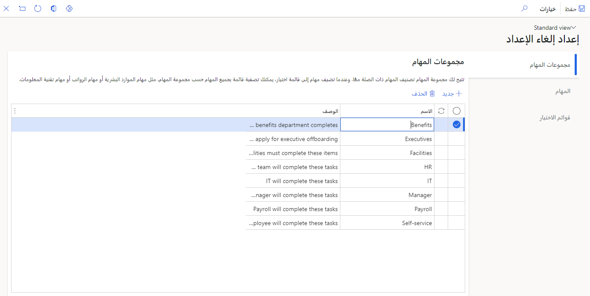
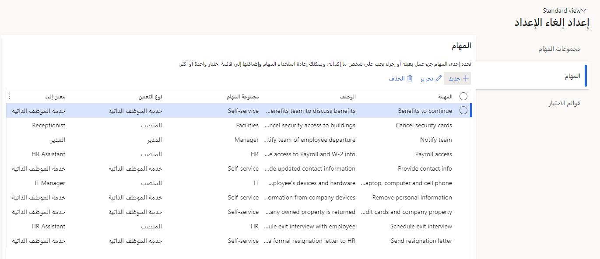
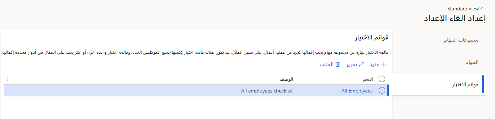
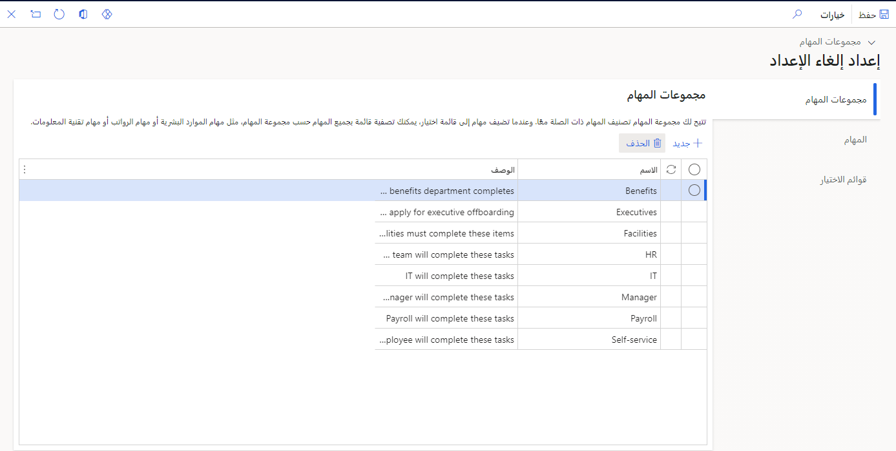
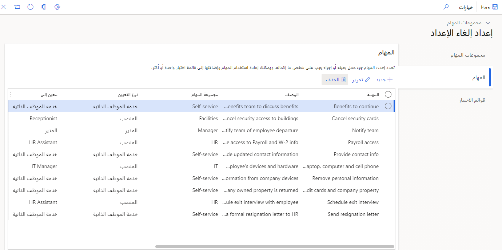
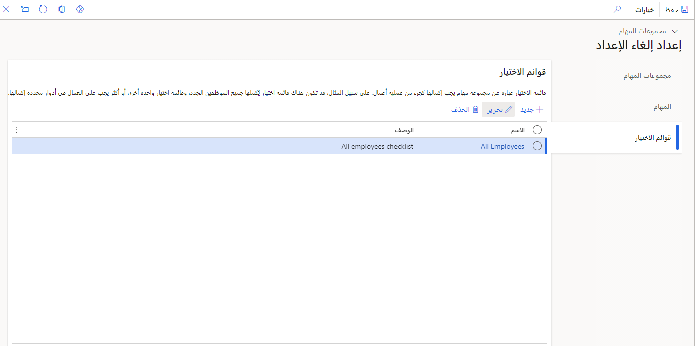

كلما تتغير حالة الموظف، مثل أثناء عمليات الإعداد والتهيئة والانتقال أو أثناء عمليات النقل بين الشركات الشقيقة، يمكنك استخدام Dynamics 365 Human Resources للتأكد من عدم تفويت أي خطوات أثناء العملية.

## عملية الإعداد‬

يُعد الإعداد وقتاً حاسماً أثناء رحلة الموظف الجديد مع المؤسسة، ويمتلك Dynamics 365 Human Resources الأدوات التي تحتاجها لتجربة إعداد لا تشوبها شائبة تقريباً. بعد استيراد بيانات التوظيف الجديدة من LinkedIn Talent Hub، يمكنك استخدام وظيفة **إعداد الإعداد** لتسريع العملية والحصول على موهبتك الجديدة في العمل بشكل أسرع.

شاهد الفيديو الآتي لرؤية عرض توضيحي لعملية الإعداد.

> [!VIDEO https://www.microsoft.com/videoplayer/embed/RWH6mg]

## عملية التهيئة

لسوء الحظ، يترك الموظفون المؤسسة لأي سبب من الأسباب. عندما يحين ذلك الوقت، تتوفر لدى Dynamics 365 Human Resources الأدوات اللازمة للمساعدة على نقل الموظف بنجاح من النظام وضمان إدارة كافة المشكلات التي لم يتم حلها.

## إعداد التهيئة

للوصول إلى وظيفة **إعداد التهيئة** في الموارد البشرية، انتقل إلى **إدارة شؤون الموظفين > الارتباطات > إعداد التهيئة**.

## مجموعات المهام

تتيح لك مجموعة المهام تصنيف المهام ذات الصلة معا. عند إضافة مهام إلى قائمة اختيار، يمكنك تصفية قائمة كافة المهام حسب مجموعة المهام، على سبيل المثال الموارد البشرية أو الرواتب أو تكنولوجيا المعلومات.
بالإضافة إلى ذلك، يمكنك إنشاء مجموعات مهام أو حذفها في هذا القسم.

> [!div class="mx-imgBorder"]
> 

## المهام

على غرار مجموعات المهام، يمكنك إنشاء مهام تنطبق عليك وعلى مؤسستك. تحدد المهمة جزءاً معيناً من العمل أو إجراء يجب على شخص ما إكماله. يمكنك إعادة استخدام المهام وإضافتها إلى قائمة اختيار واحدة أو أكثر.

> [!div class="mx-imgBorder"]
> 

## قوائم الاختيار

قائمة الاختيار هي مجموعة المهام التي يجب إكمالها كجزء من عملية تجارية. على سبيل المثال، قد تتوفر قائمة مرجعية لكافة الموظفين الجدد لإكمالها، وقد يلزم وجود قائمة اختيار إضافية أو أكثر للعمال الذين يضطلعون بأدوار محددة.

> [!div class="mx-imgBorder"]
> 

## الانتقالات

في بعض الأحيان، يتم شغل الوظائف المفتوحة من قِبل موظفي مؤسستك الحاليين. يبسط Dynamics 365 Human Resources عملية نقل موظف موجود إلى دور جديد داخل مؤسستك.

## إعداد الانتقال

للانتقال إلى منطقة **إعداد الانتقالات** في الموارد البشرية، انتقل إلى **إدارة شؤون الموظفين > الارتباطات > إعداد الانتقالات**.

## مجموعات المهام

تتيح لك مجموعة المهام تصنيف المهام ذات الصلة معا. عند إضافة مهام إلى قائمة اختيار، يمكنك تصفية قائمة كافة المهام حسب مجموعة المهام، على سبيل المثال الموارد البشرية أو الرواتب أو تكنولوجيا المعلومات. بالإضافة إلى ذلك، يمكنك إنشاء مجموعات مهام أو حذفها في هذا القسم.

> [!div class="mx-imgBorder"]
> 

## المهام

تحدد المهمة جزءاً معيناً من العمل أو إجراء يجب على شخص ما إكماله. يمكنك إعادة استخدام المهام وإضافتها إلى قائمة اختيار واحدة أو أكثر.
على غرار مجموعات المهام، يمكنك إنشاء مهام تنطبق عليك وعلى مؤسستك.

> [!div class="mx-imgBorder"]
> 

## قوائم الاختيار

قائمة الاختيار هي مجموعة المهام التي يجب إكمالها كجزء من عملية تجارية. على سبيل المثال، قد تتوفر قائمة مرجعية لكافة الموظفين الجدد لإكمالها، وقد تتوفر قائمة اختيار واحدة أو أكثر للعمال الذين يضطلعون بأدوار محددة لإكمالها.

> [!div class="mx-imgBorder"]
> 
