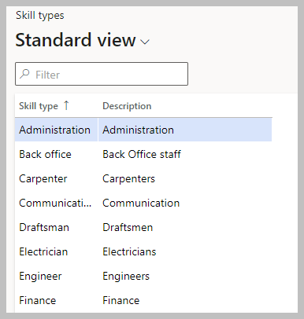
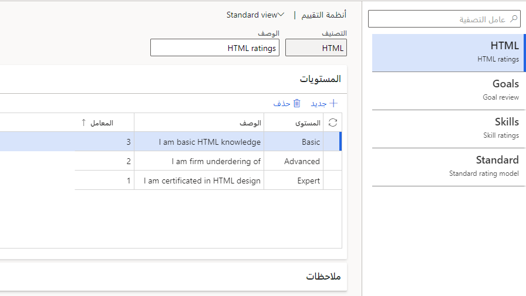
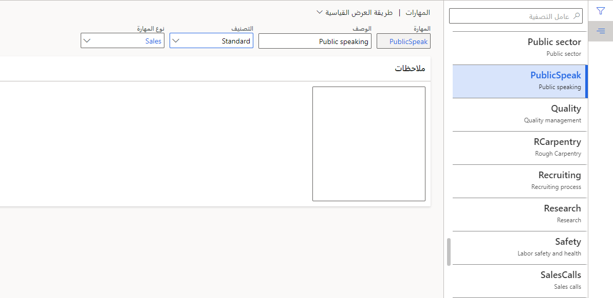

في Dynamics 365 Human Resources، يمكنك تتبع مهارات موظفيك. بالإضافة إلى ذلك، يمكنك تحديد المهارات المطلوبة لوظيفة ما.

تتضمن أمثلة المهارات التي يمكنك تعقبها ما يلي:

-   **الإشراف**: القدرة على الإشراف على عمل الآخرين.

-   **القيادة**: القدرة على قيادة الموظفين ومجالات الأعمال.

-   **التخطيط**: القدرة على التطلع إلى الأمام، وتشكيل بيانات الرؤية، وتطبيقها.

-   **HTML**: القدرة على كتابة التعليمات البرمجية لـ HTML.

يمكن للأشخاص التالين إدخال مهارات العامل:

-   يمكن للعمال إدخال المهارات لأنفسهم في الخدمة الذاتية للموظف.
    تتطلب هذه المهارات موافقة المدير.

-   يمكن للمديرين إدخال المهارات لعمالهم. يمكنك إنشاء سير عمل يوافق تلقائياً على هذه المهارات.

## إنشاء نوع مهارة

يتم تعريف نوع المهارة كفئة يمكن أن تندرج ضمنها المهارات الفردية، مثل الإدارة أو المبيعات، وهي تشبه مفاهيم مجموعات المهام والمهام التي تمت مناقشتها مسبقاً.

1.  في مساحة العمل **تطوير الموظف** ، حدد **الارتباطات**.

1.  ضمن **إعداد الكفاءة**، حدد **أنواع المهارات**.

1.  حدد **جديد**.

1.  إكمال الحقول التالية:

    -   **نوع المهارة**: أدخِل اسماً لنوع المهارة.

    -   **الوصف**: أدخِل وصف نوع المهارة.

1.  حدد **حفظ**.

    > [!div class="mx-imgBorder"]
    > 

## إنشاء نموذج التصنيف

يمكنك استخدام نماذج التقييم لتقييم المستوى الحالي لمهارة الشخص، أو مستوى المهارة الذي يجب أن يسعى إليه، أو درجة المهارة المطلوبة لوظيفة معينة. يتم تعيين عامل لكل مستوى في نموذج تصنيف.

1.  في مساحة العمل **تطوير الموظف** ، حدد **الارتباطات**.

1.  ضمن **إعداد الكفاءة**، حدد نماذج **التقييم**.

1.  حدد **جديد**.

1.  إكمال الحقول التالية:

    -   **التقييم**: أدخِل اسماً لنموذج التصنيف، مثل **المهارات**.

    -   **الوصف**: أدخِل وصفاً لنموذج التصنيف، مثل **تصنيفات المهارة**.

1.  في القسم **المستويات** ، حدد **جديد**. لكل مستوى تريد إضافته، أكمل الحقول التالية:

    -   **المستوى**: أدخِل اسماً للمستوى.

    -   **الوصف**: أدخِل وصفاً للمستوى.

    -   **العامل**: أدخِل قيمة عامل من 0-9. تساعد العوامل على تطبيع درجات المهارات التي تستخدم نماذج تصنيف مختلفة. يجب أن يكون لكل مستوى قيمة فريدة. تحمل المستويات ذات قيم عوامل أعلى وزناً أكبر في نموذج التصنيف.

        > [!div class="mx-imgBorder"]
        > 

1.  واصل إضافة مستويات، حسب الضرورة. يمكنك إدخال ما يصل إلى 10 مستويات لكل نموذج تصنيف.

1.  حدد **حفظ**.

## إنشاء مهارة

قبل أن تتمكن من تعيين مهارة أو إنشاء بحث في تعيين المهارات أو ملف تعريف المهارة، يجب عليك أولاً إكمال صفحة **المهارات** عن طريق إدخال معلومات حول المهارات. لديك خيار تحديد نوع المهارة ونموذج التصنيف لكل مهارة.

1.  في مساحة العمل **تطوير الموظف** ، حدد **الارتباطات**.

1.  ضمن **إعداد الكفاءة**، حدد **المهارات**.

1.  حدد **جديد**.

1.  إكمال الحقول التالية:

    -   **المهارة**: أدخِل اسماً للمهارة.

    -   **الوصف**: أدخِل وصف المهارة.

    -   **التقييم**: حدد نموذج التصنيف الذي تريد استخدامه لهذه المهارة.

    -   **نوع المهارة**: حدد من قائمة أنواع المهارات.

1.  حدد **حفظ**.

    > [!div class="mx-imgBorder"]
    > 
