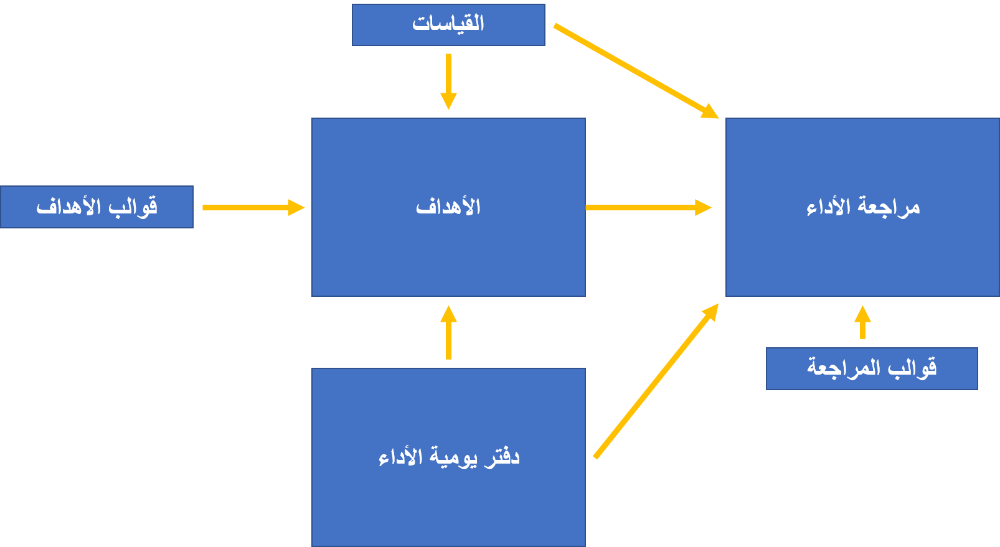

عندما يقوم الموظفون بتوثيق أدائهم ومناقشته مع مديرهم، فإنهم يكونون في عملية إدارة الأداء. ونتيجة لذلك، يمكن للمديرين تباعاً تقديم تعليقات وتوجيهات لموظفيهم.

كما يظهر الرسم التخطيطي التالي، تتوفر ثلاث صفحات لمساعدتك على إدارة العملية:

-   دفتر يومية الأداء

-   الأهداف

-   مراجعة الأداء

يوضح الرسم التالي كيفية ارتباط المكونات الأساسية لإدارة الأداء ببعضها البعض.

> [!div class="mx-imgBorder"]
> 

## دفتر يومية الأداء

كموظف، يمكنك جمع معلومات حول الإجراءات أو الأحداث التي ساهمت في إنجازك خلال فترة المراجعة قبل إكمال التقييم. يمكنك إنشاء إجراءات مستقبلية يجب إكمالها لتحقيق هدف ما، أو تحقيق أهداف خطة التطوير، أو الوفاء بالتزام الأداء. يمكنك تعقب هذه الأنشطة والأحداث في دفتر يومية الأداء. ليس من الضروري الاحتفاظ بدفتر يومية الأداء لتحديد الأهداف أو إجراء مراجعات الأداء.

دفتر يومية الأداء متوفر في إصدارين: إصدار موظف يتم الوصول إليه من خلال مساحة العمل **خدمة الموظف الذاتية** وإصدار إدارة يتم الوصول إليه من خلال مساحة العمل **الخدمة الذاتية للمدير**. يمكن للموظفين الاحتفاظ بالدفاتر اليومية الشخصية واختيار ما إذا كانوا سيشاركونها مع مديرهم أم لا. يمكن للمديرين إنشاء دفاتر يومية للفريق وتحديد ما إذا كانوا سيشاركونها مع موظفيهم أم لا.

عند الوصول إليها من مساحة العمل **خدمة الموظف الذاتية** ، تتيح لك صفحة **دفتر يومية الأداء** التقاط المعلومات التالية:

-   عنوان النشاط

-   وصف النشاط، والذي يتضمن معلومات تفصيلية حول النشاط

-   تاريخ إنشاء دفتر اليومية

-   تاريخ بدء النشاط وتاريخ انتهائه

-   إعداد الحالة يشير إلى ما إذا كان النشاط قد تمت مشاركته مع المدير أم لا

-   إعداد يشير إلى ما إذا كان الإدخال جزءاً من خطة تطوير

-   الكلمات الرئيسية التي ستساعدك في البحث عن عناصر دفتر يومية أداء مماثلة

يمكنك أيضاً ربط دفتر يومية الأداء بموقع ويب خارجي عن طريق تخزين عنوان URL لموقع الويب. بالإضافة إلى ذلك، يمكنك الارتباط بدفتر يومية الأداء من خلال عنوان URL خارجي. كما يمكنك ربط دفتر اليومية بمراجعة أداء أو هدف. عندما تكون في صفحة **الخدمة الذاتية للمدير**، يمكنك إدخال نفس المعلومات التي أدخلتها في دفتر يومية الموظف. يمكنك أيضاً تحديد الموظف الذي تم إنشاء دفتر اليومية له وتحديد ما إذا كنت تريد جعل سجل المدير عاماً أم لا.

## إرسال تعليقات

يحتوي دفتر يومية الأداء أيضاً على ميزة تسمى **التعليقات**. يمكنك تحديد موظف وإرسال تعليقات إليه عبر البريد الإلكتروني عن طريق تحديد **إرسال تعليقات**.
يتم إرسال الرسالة إلى الموظف الذي يتلقى التعليقات ومديره والموظف الذي يقوم بإرسال التعليقات ومديره. يتم إنشاء إدخال دفتر يومية الأداء لكل شخص يتلقى رسالة التعليقات.

## الأهداف

تتيح لك صفحة **أهداف الأداء** تعقب الأهداف التي حددتها أنت ومديرك من أجلك. يمكنك تحديد أكبر عدد تريده من الأهداف، ويمكن أن تمتد إلى فترات مختلفة ومراجعات الأداء. يمكنك إنشاء أهداف بسيطة أو معقدة، اعتماداً على مقدار المعلومات التي تريد إدخالها حول الأهداف. لا تتطلب مراجعات الأداء أهدافاً.

يشمل الهدف الأساسي المعلومات التالية:

-   اسم قصير

-   وصف أطول للهدف

-   تاريخ البدء المتوقع للهدف

-   تاريخ الانتهاء المقدر للهدف

يمكنك إضافة فئة هدف لمساعدتك بشأن التنظيم. سيكون اسم الشخص المسؤول عن الهدف مرئياً للمديرين.

وفي كثير من الأحيان، ستكون للأهداف نتائج قابلة للقياس. يمكنك تعقب النتائج المرجوة من الهدف والنتائج الفعلية عن طريق إضافة القياسات. إذا كان هدفاً واسع النطاق، فيمكنك استخدام الخيار **توسيع نطاق الهدف** لوضع علامة على القياس.

سيتضمن دفتر يومية الأداء الخاص بك الأنشطة التي تُعلم مديرك بكيفية تحقيق هدفك. إذا قمت بربط دفتر يومية أداء بهدف، سيتم عرضه في قسم **الأنشطة** الخاص بالهدف. من صفحة **أهداف الأداء**، يمكنك أيضاً إضافة دفتر يومية أداء جديد.
سيتم ربط الهدف بدفتر يومية الأداء هذا تلقائياً.

## مراجعات الأداء

المناقشات هي المصطلح المقبول لمراجعات الأداء. وقد تطورت لاستيعاب التعليقات المتواصلة، وخطط التطوير، والمراجعات الأكثر رسمية.
يمكنك تنظيم اجتماعات قصيرة لفردين، مثل اجتماع وجهاً لوجه، أو يمكنك تصميم مراجعة أكثر شمولاً تتوافق مع إجراء المراجعة الخاص بشركتك.

على سبيل المثال، الاجتماع وجهاً لوجه هو مراجعة مباشرة تتطلب عنواناً مختصراً ووصفاً أطول لمحتويات الاجتماع وتاريخه. تتضمن المراجعة البسيطة المعلومات نفسها وفترة المراجعة التي تجري مناقشتها. كما سيرى المديرون اسم المراجع.

يمكنك تضمين الأهداف والتعليقات النشطة والمكتملة في مراجعاتك للحصول على تقرير أكثر تفصيلاً. سيتم تضمين جميع أنشطة وقياسات دفتر يومية الأداء المرتبطة بهدف ما في المراجعة. بعد انتهاء المراجعة، يتم حفظ لقطة من القياسات لتعقب محفوظات العناصر في وقت المراجعة.

يمكن أن يساعدك قسم **الاختصاصات** على مناقشة قدرات الموظف ومراجعتها وتقييمها. يمكنك إضافة العديد من الاختصاصات حسب حاجتك ثم تحديد ما إذا كان يجب تقييم كل واحد.

يمكنك إنشاء مراجعات جديدة باستخدام قوالب تم إنشاؤها مسبقاً. على سبيل المثال، يمكنك استخدام قالب للاجتماعات وجهاً لوجه أو خطط التطوير أو المراجعات الدورية.
عند إنشاء مراجعة جديدة، يكون لديك خيار تحديد قالب.

## المكونات التي يجب تضمينها في مراجعات الأداء

يمكن أن تتضمن مراجعات الأداء أنواعاً متنوعة من المعلومات. ويمكن أن تتكون من تفاصيل المراجعة والقياسات والأنشطة والتقييمات والموافقات والمرفقات.

-   **تفاصيل المراجعة** - إدخال أهدافك في تفاصيل المراجعة وإضافة التعليقات. يمكنك أيضاً إنشاء الاختصاصات وإضافة تعليقات عليها.

-   **القياسات** - عرض القياسات المرتبطة بهدف أو مراجعة. يمكنك أيضاً إضافة قياس جديد مرتبط بالمراجعة.

-   **الأنشطة** - إظهار عناصر دفتر يومية الأداء المرتبطة بالمراجعة. يمكنك أيضاً إضافة دفتر يومية أداء، والذي يرتبط تلقائياً بالمراجعة.

-   **التقييمات** - تطبيق تقييم على أي هدف أو اختصاص في المراجعة. يمكنك تحديد نماذج التقييم لكل مراجعة. توجد الإعدادات الافتراضية للتقييمات في صفحة  **محددات الموارد البشرية المشتركة** ضمن **الأداء**.

-   **عمليات الموافقة** - استناداً إلى محددات المراجعة، يمكنك تحديد الموظف و/أو المدير الذي سيتم إدراجه في المراجعة. يمكن أن تكون المراجعات إلزامية أو اختيارية. عند الحصول على كافة عمليات الموافقة المطلوبة، سيتم وضع علامة على حالة المراجعة على أنها **مكتمل**.

-   **المرفقات** - في القسم **المرفقات** من الصفحة **المراجعات** ، يمكنك إرفاق مستند. يتم تضمين عارض مستند لعرض محتويات أي مستند مرفق بسرعة.

## سير العمل لإدارة الأداء

يمكن استخدام سير العمل **مراجعة العامل** للمساعدة على إدارة الموافقات على المراجعة. يمكنك أيضاً تخطي سير العمل التلقائي وتغيير حالة المراجعة يدوياً، مما سيسمح لك بإنشاء مستندات مبسطة، مثل المراجعات الخاصة، دون المرور بعملية سير العمل. تحدد حالة المراجعة مَن يمكنه الوصول إليها.

1.  عند إنشاء المراجعة، يتم تعيينها على الحالة **‏‏لم تبدأ** . المراجعة قابلة للتعديل من قبل أي شخص.

1.  عندما يضغط الموظف على الزر  **بدء المراجعة** ، يتم تعيين حالة المراجعة على **قيد التقدم**. ثم يقوم الموظف بإضافة المحتوى. في هذه المرحلة، لم يعد بإمكان المدير عرض مستند المراجعة.

1.  يقوم الموظف بتغيير الحالة إلى **جاهز للمراجعة**.

1.  يضيف المدير تعليقاته وتقييماته. في هذه المرحلة، يمكن للمدير فقط الاطّلاع على المراجعة.

1.  يقوم المدير بتغيير الحالة إلى **المراجعة النهائية**، والتي ستسمح لكل من المدير والموظف بالاطّلاع على المراجعة ومناقشتها. في المحددات، يمكنك تحديد ما إذا كان يمكن تحرير المراجعة في هذه المرحلة. هذه الخطوة اختيارية أيضاً إذا كان المدير يريد ببساطة مشاركة المراجعة مع الموظف ثم وضع علامة عليها على أنها **مكتمل** عند الانتهاء منها.

1.  بعد اكتمال عمليات الموافقة، يتم تغيير الحالة إلى **مكتمل**.
    في هذه المرحلة، لا يمكن تغيير المراجعة.

يتكون سير العمل **مراجعة العامل** من عنصرين:

- **الموافقة على المراجعة** - أضف هذا العنصر للتحكم في تغيير الحالة من **قيد التقدم** إلى **جاهز للمراجعة**. قم بتغيير المهمة لاستخدام التدرج الهرمي الإداري حيث يكون مستوى مدير سطر الموظف = 1.

- **المراجعة النهائية** - أضف هذا العنصر للتحكم في تغيير الحالة من **جاهز للمراجعة** إلى **المراجعة النهائية**.

   -    إذا كنت تريد أن يوافق المدير على المراجعة النهائية، فقم بتغيير المهمة لاستخدام التدرج الهرمي الإداري حيث يكون مستوى مدير سطر الموظف = 1.

    -   إذا كنت تريد أن يوافق عليها الموظف، فقم بتغيير المهمة إلى **مستخدم سير العمل**.

    -   إذا كنت تريد أن يوافق كل من المدير والموظف على ذلك، فقم بإضافة خطوتين في سير العمل، ثم قم بإجراء المهمة المناسبة لكل خطوة بالترتيب الذي تريد أن تتبعه الموافقات.

## الإعداد

يتم توفير ثلاث صفحات لمساعدتك على تكوين المعلومات المطلوبة لإكمال عملية الأداء: صفحة **القياسات** وصفحة **أنواع مصدر دفتر يومية الأداء** وصفحة **أنواع المراجعة**. 

## القياسات

يمكنك إنشاء قياسات قياسية في صفحة القياسات المستخدمة في صفحات أهداف الأداء ومراجعاته. بالإضافة إلى ذلك، يمكنك إنشاء تواريخ ومبالغ وكميات ونسب مئوية وقياسات استناداً إلى نموذج التقييم.

## أنواع مصدر دفتر يومية الأداء

تصف أنواع مختلفة من أنواع مصدر دفتر يومية الأداء أصول دفاتر اليومية. يمكنك تحديد ما إذا كان عنصر دفتر اليومية مرئياً للمدير فقط أو للموظف فقط أو لكل من المدير والموظف بشكل افتراضي. حالياً، لا يمكنك تعطيل أنواع المصدر.

## أنواع المراجعة

تساعدك أنواع مراجعة الأداء على التحكم في سلوك المراجعة. يمكنك تمكين سير العمل أو تعطيله للمراجعة. إذا لم تستخدم المراجعة سير العمل، فيمكنك تحديد الحالة الافتراضية المستخدمة عند إنشاء المراجعة. يمكنك أيضاً تحديد ما إذا كان الموظف أو المدير أو كلاهما سيُطلب منه التوقيع على المراجعة.
