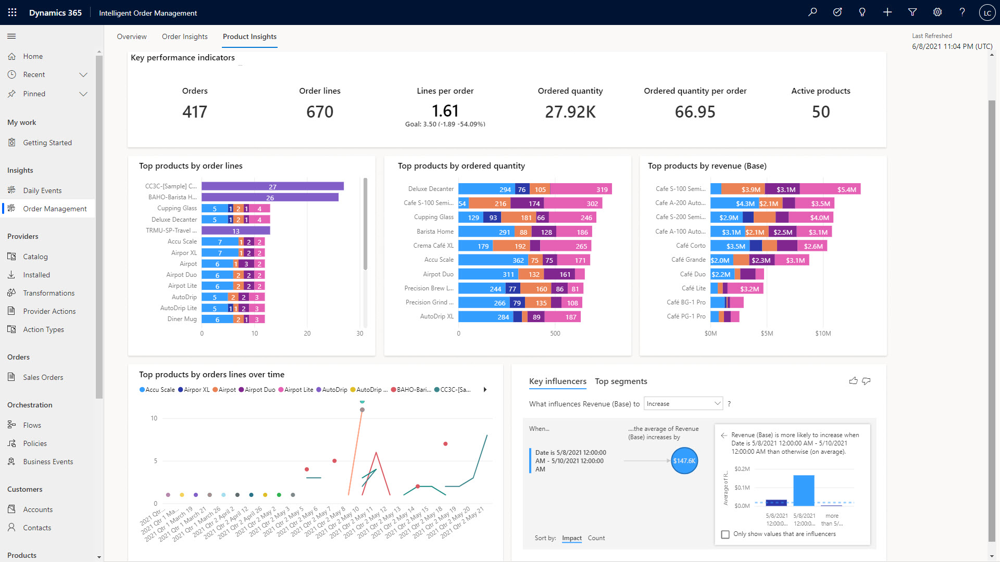

يتم تسليم Intelligent Order Management كحل قائم على المجموعة. تحتوي القائمة التالية على المكونات الأساسية للحل:

- **التطبيق** - يوفر تطبيق Intelligent Order Management واجهة حيث يمكنك عرض الطلبات وحالة التنفيذ. يوفر مكان واحد لعرض الطلبات، بغض النظر عن مصدر الطلب أو كيفية تنفيذها.

- **الموفرون** - يتيح موفرو الخدمة نقل الأوامر ومعلومات التنفيذ بين الأنظمة الأساسية والتطبيقات المختلفة.

- **التزامن** - يتم تكوين التدفقات لإدارة رحلة أمر. يؤدي الاتصال بموفري الخدمة إلى إنشاء أحداث تدفع الأمر من خلال التدفق. يقوم العملاء بتنفيذ العمليات التجارية لمنتجاتهم ومتطلبات أعمالهم.

- **خدمة رؤية المخزون** - توفر هذه الخدمة رؤية للمخزون في الوقت الفعلي في شبكة التوريد بحيث يمكن اتخاذ القرارات من خلال تدفق الأمر. يمكن توصيل المخزون من أنظمة المصدر والهدف من خلال تدفقات التزامن وموفري الخدمات.

- **تحسين التنفيذ** - يمكن استخدام هذه الخدمة من خلال تدفق التزامن. تتيح الخدمة اتخاذ قرارات التحسين حول المكان الذي يمكن فيه تنفيذ أمر باستخدام مفاهيم مثل التكلفة والأقرب من حيث المسافة.

- **الرؤى** - يعد فهم مقاييس الأمر والتنفيذ أمراً بالغ الأهمية في عملية اتخاذ القرار. توفر لوحات المعلومات رؤية لبيانات الأوامر الرئيسية ومؤشرات الأداء الأساسية (KPIs).

> [!div class="mx-imgBorder"]
> 
