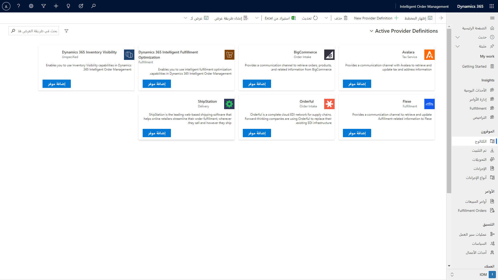
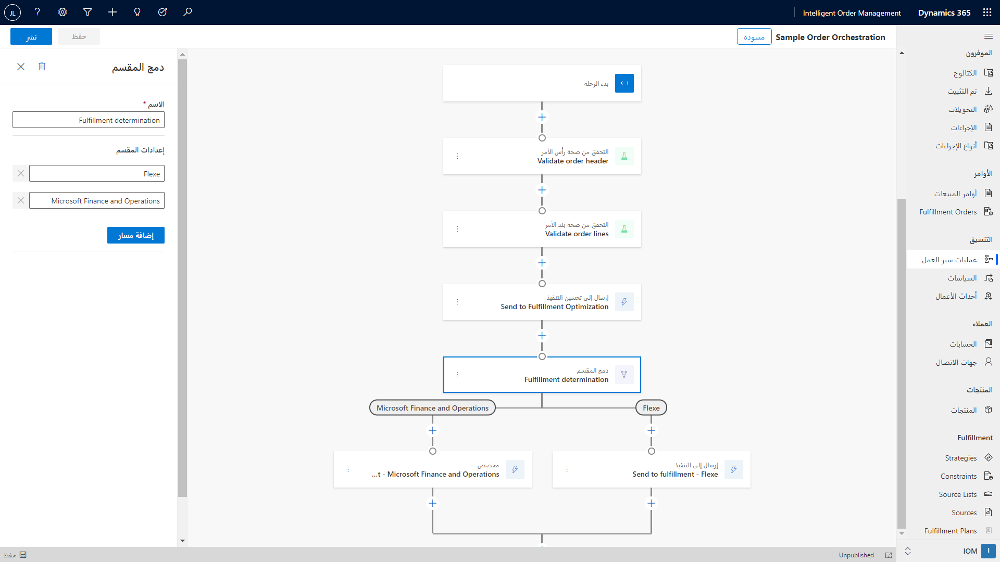
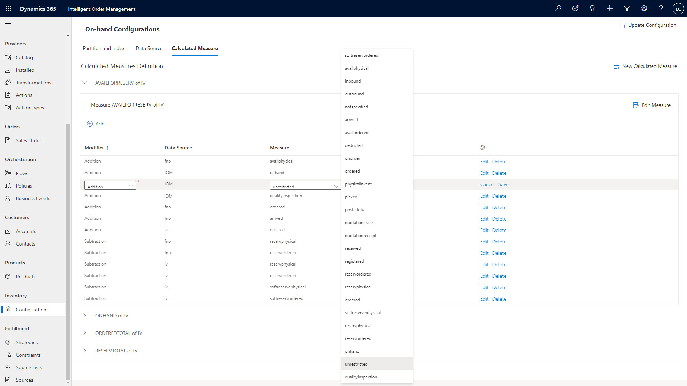
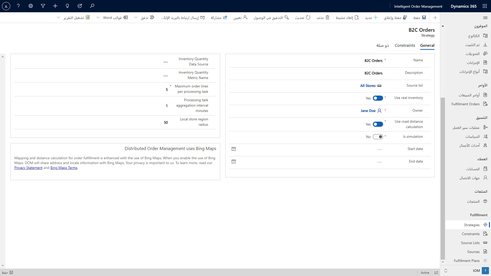
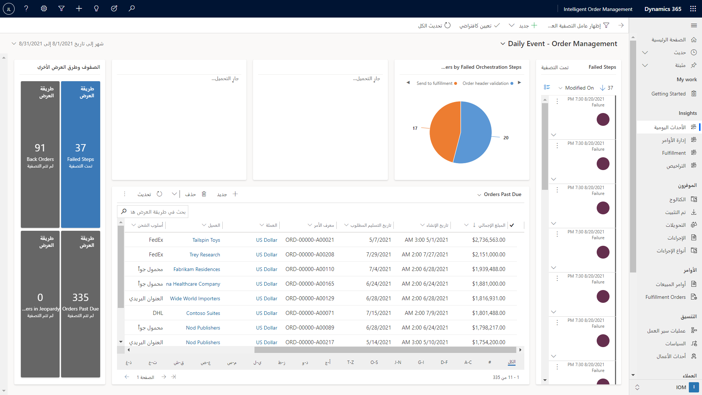

توفر Intelligent Order Management طريقة عرض واحدة لأمر يساعد المؤسسات على فهم حالة التنفيذ. يمكن أن تنشأ الأوامر في أنظمة التجارة الإلكترونية المختلفة وأنظمة نقاط البيع وتبادل البيانات الإلكتروني (EDI) وتطبيقات إدارة علاقة العميل (CRM).

## الموفرون

يسمح الموفرون للعملاء بدمج Intelligent Order Management مع الأنظمة الأخرى. يقوم الموفرون بتغليف مكالمات واجهة برمجة التطبيقات (API) بين الأنظمة وتقديمها إلى المؤسسة كإجراءات. يمكن أن تثير الإجراءات الأحداث التي تدفع بالتزامن.

يستخدم الموفرون موصلات Microsoft Power Automate. تتيح هذه التقنية لـ Intelligent Order Management الاتصال ببيئة من الأنظمة الأساسية والتطبيقات التي يختارها العملاء.

تقوم Intelligent Order Management بشحن الموصلات لملء السوق وأنظمة التجارة الإلكترونية وأنظمة التنفيذ والخدمات اللوجستية والشركاء. يمكن للعملاء والشركاء استخدام إمكانات النظام الأساسي لأدوات تطوير Power Automate وMicrosoft Dataverse لإنشاء موفري خدمات جدد.

قد يرغب العميل في إنشاء موفر لمستودع موجود أو نظام تصنيع في مؤسسته. يمكن للشريك بناء موفري خدمات لدمج الأنظمة الأساسية أو التطبيقات الخاصة بهم مع النظام البيئي لموفر Intelligent Order Management.

هناك نوعان من الموفرين هما الطرف الأول والطرف الثالث. 

- **موفرو الطرف الأول** - للتواصل مع تطبيقات Microsoft، مثل Dynamics 365 Supply Chain Management أو Dynamics 365 Commerce أو Dynamics 365 Finance. كما يتم تنفيذ الخدمات التي يتم شحنها مع Intelligent Order Management كموفر وتستخدم للتواصل بين خدمة تحسين التنفيذ وخدمة رؤية المخزون.

- **موفري الطرف الثالث** - للخدمات التي لا تشحنها Microsoft. يمكن للعملاء استخدامها لدمج Intelligent Order Management مع إمكانات مختلفة في أنظمة التجارة الإلكترونية وأنظمة التنفيذ والخدمات اللوجستية.

> [!div class="mx-imgBorder"]
> 

لمزيد من المعلومات، راجع [العمل مع الموفرين](/dynamics365/intelligent-order-management/work-providers/?azure-portal=true).

## التزامن

تمكن Intelligent Order Management مستخدم العمل من تغيير تدفقات الطلبات مباشرة بحيث لا يحتاج إلى الاعتماد على مسؤول تكنولوجيا المعلومات الخاص به. يمكن لفريق سلسلة التوريد استخدام مصمم النهج المضمن لتصميم القواعد لتحسين عمليات الأعمال الخاصة بهم.

يمكن لفريق سلسلة التوريد استخدام أدوات مصمم تنسيق الرحلة لنمذجة وأتمتة الاستجابة لقيود التنفيذ واستخدام التعلم الآلي للتأثير في تدفق الأمر وتحسينه. إذا تنبأت مؤسسة أو اكتشفت القيود في شبكة التنفيذ الخاصة بها، يمكن أن تساعدها أدوات مصمم تنسيق الرحلة على التغلب بشكل استباقي على الاختناقات ودفع الكفاءة عبر سلسلة التوريد.

يمكن للمؤسسات أن تتدرج خلال ذروة أحجام الأوامر من خلال دعم مختلف الشركاء في استلام الأوامر والتنفيذ والتسليم باستخدام الموصلات التي تم إنشاؤها مسبقاً. تم بناء محرك تنسيق معالجة الأوامر على Microsoft Power Platform، والذي يحتوي على أكثر من 200 موصل تم إنشاؤه مسبقًا، مما يسمح لمستخدمي الأعمال بالاتصال بهذا النظام البيئي. ستستمر Microsoft في تنمية النظام البيئي للموصلات من خلال العمل مع شركاء التصميم الخارجيين.

> [!div class="mx-imgBorder"]
> 

## خدمة رؤية المخزون

تأتي Intelligent Order Management بخدمة رؤية المخزون المتكاملة في الوقت الفعلي القابلة للتوسعة والتوسيع بشكل كبير، مما يوفر رؤية عالمية واحدة لمواقع المخزون عبر جميع الكيانات القانونية.

يستخدم محرك تزامن التنفيذ بيانات المخزون في الوقت الفعلي لتحسين التنفيذ وضمان مستويات المخزون المثلى عبر القناة.

> [!div class="mx-imgBorder"]
> 

## تحسين التنفيذ

تأتي Intelligent Order Management مزودة بخدمة تحسين التنفيذ التي تتيح للمستخدمين تحديد استراتيجيات التنفيذ المختلفة. إنها بمثابة محرك من خلال عملية التزامن لتحديد أفضل موقع لتنفيذ الأمر منه.

> [!div class="mx-imgBorder"]
> 

## الرؤى

تأتي Intelligent Order Management مع لوحات معلومات Microsoft Power BI لتوفير رؤية لمقاييس الأمر والتنفيذ، مما يساعد على إدارة عمليات الأوامر. يمكنك توسيع لوحات المعلومات التي تم إنشاؤها مسبقاً باستخدام أدوات Power BI والبيانات المخزنة في Dataverse.

> [!div class="mx-imgBorder"]
> 
