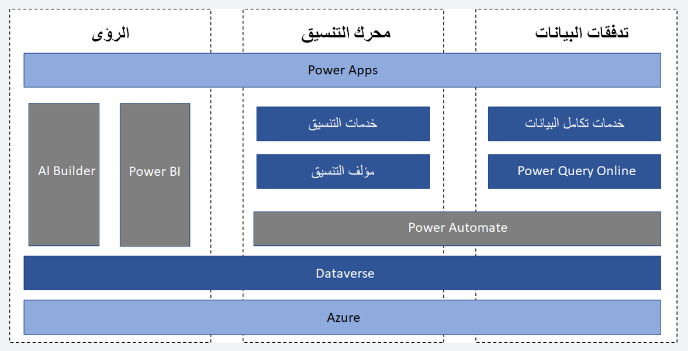
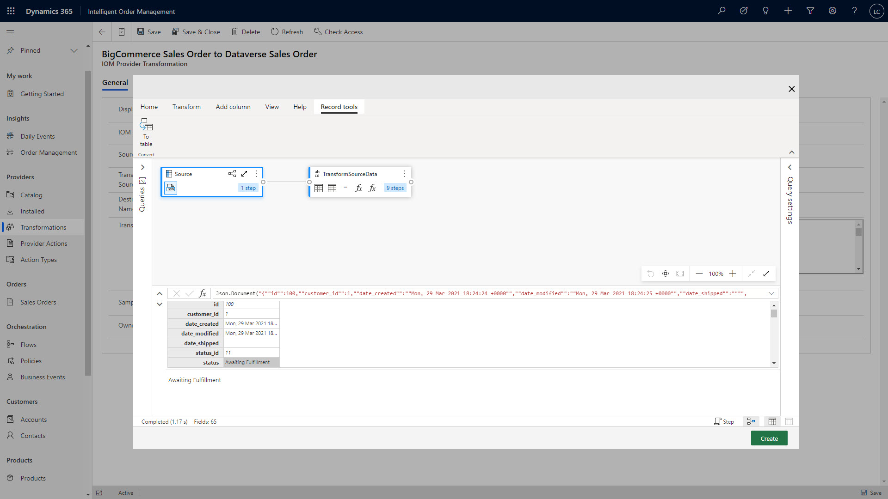
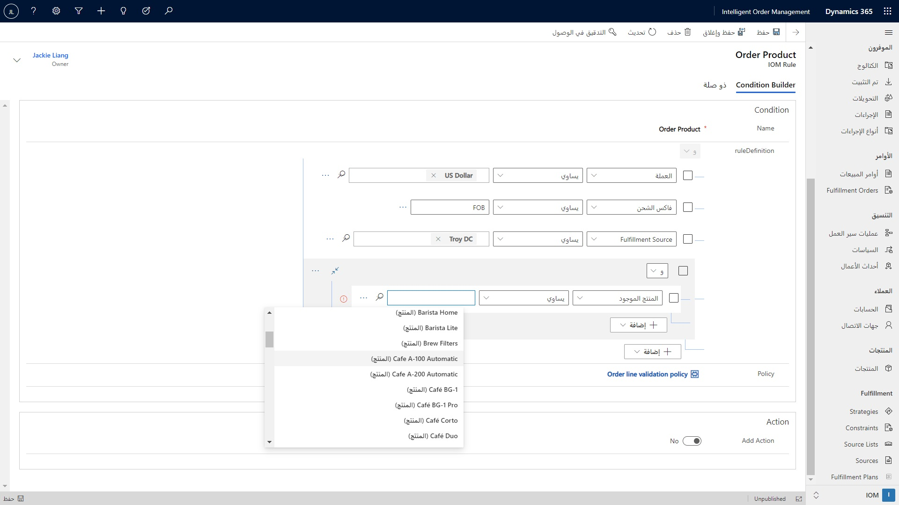
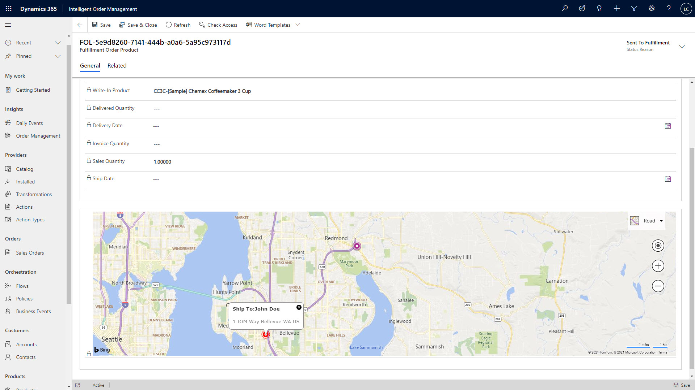

تم إنشاء Intelligent Order Management على Microsoft Power Platform باستخدام البنية الأساسية للتطبيقات المستندة إلى النموذج من [Microsoft Power Apps](/powerapps/maker/model-driven-apps/?azure-portal=true). تم تصميم البنية لدعم متطلبات بيئة معالجة الأوامر المعقدة حيث توجد العديد من الأنظمة والتطبيقات في العملية الشاملة من الأمر إلى التنفيذ.

يمكن نشر Intelligent Order Management التي يتم تقديمها كحل مجموعة، بسرعة في مراكز بيانات Microsoft Azure. يتم نشر التطبيق والنظام الأساسي في منطقة مركز البيانات التي يختارها العملاء لأعمالهم، وتدير Microsoft البنية الأساسية. ونتيجة لذلك، يمكن للعملاء التركيز على تكوين التطبيق ليناسب متطلبات أمر العمل والتنفيذ. لمزيد من المعلومات، راجع [العولمة‬](/dynamics365/intelligent-order-management/globalization/?azure-portal=true).

تم تصميم التطبيق والنظام الأساسي وفقاً لهذه المبادئ الأساسية:

- **القابلية للتوسعة** - فهم أن كل مؤسسة لديها مزيج فريد من التطبيقات والأنظمة التي تعمل معها. تمكين تكوين العملية التجارية لتتناسب مع متطلبات المؤسسة، وتوفير المرونة في توسيع النظام الأساسي والتطبيق.

- **المقياس** - فهم أن الحاجة إلى التوسع لدعم حجم الحركات المرتفعة ليست فقط للمؤسسات المؤسسية. تحتاج المؤسسات من جميع الأنواع إلى تطبيق ونظام أساسي يمكن تغيير حجمها وتقليصها حسب الحاجة.

- **استخدام Power Platform** - فهم أن العملاء يبحثون عن بائعي التكنولوجيا الذين يمكنهم دعمهم في خططهم طويلة الأجل، واستخدام مهارات المؤسسة الداخلية أو مهارات الشركاء الاستشاريين.

تم تصميم النظام الأساسي باستخدام مفاهيم البنية الثلاثة التالية:

- **البنية الأساسية لبرنامج ربط العمليات التجارية للبيانات** - تنقل البنية الأساسية لبرنامج ربط العمليات التجارية لتكامل البيانات؛ البيانات داخل وخارج Intelligent Order Management. فهي تتصل بأنظمة المراحل التمهيدية والمراحل النهائية لتلقي التغييرات ودفعها أثناء تحرك الأوامر عبر تدفق الأمر.

- **محرك التزامن** - يوفر محرك التزامن الرسوم المرئية للعملية التجارية ويجمع العملية المصممة في تدفقات Power Automate للمستخدم التجاري.

- **الرؤى** - تتيح مكونات الرؤى تدفق البيانات لدعم الرسوم المرئية من البيانات في Power BI والسماح للبيانات ليتم تحليلها في نماذج التعلم الآلي مع AI Builder.

> [!div class="mx-imgBorder"]
> 

## البنية الأساسية لبرنامج ربط العمليات التجارية للبيانات

توفر البنية الأساسية لبرنامج ربط العمليات التجارية للبيانات في Intelligent Order Management الأساس للموفرين لنقل البيانات داخل وخارج التطبيق. يتم تنفيذ تحويل مستندات الأعمال التي تتحرك عبر البنية الأساسية لبرنامج ربط العمليات التجارية للبيانات بواسطة Microsoft Power Query Online.

> [!div class="mx-imgBorder"]
> 

تصف المصطلحات التالية المكونات الموجودة في البنية الأساسية لبرنامج ربط العمليات التجارية للبيانات:

- **الموفر** - في Intelligent Order Management، يتم استخدام الموفر لتكوين حركة البيانات في البنية الأساسية لبرنامج ربط العمليات التجارية للبيانات. تتضمن Microsoft موفرين، ولكن يتم تشجيع العملاء والشركاء على إنشاء موفري الخدمات الخاصين بهم. لمزيد من المعلومات، راجع [العمل مع الموفرين](/dynamics365/intelligent-order-management/work-providers/?azure-portal=true).

- **الموصلات** - يتم إنشاء الموصلات باستخدام Power Automate. تقوم الموصلات بتغليف واجهة برمجة تطبيقات الخدمة الخارجية (API) التي سيستخدمها الموفر. يمكن للعملاء استخدام الكتالوج المتوفر من الموصلات لإنشاء الموفر الخاص بهم. لمزيد من المعلومات، راجع [وثائق الموصلات](/connectors/?azure-portal=true).

- **الاتصال** - الاتصال هو التكوين المحدد المطلوب لتمكين الاتصال الذي يستخدمه الموفر. سيقوم المسؤول بتوفير رموز تسجيل الدخول أو واجهة برمجة التطبيقات (API) للاتصال مع الخدمة الخارجية عند تمكين الموفر في التطبيق.

- **تحويل البيانات** - الخدمات لها وثيقة عمل خاصة بها ومفاهيم الكيان. أثناء انتقال البيانات بين تلك الأنظمة، يجب تحويل البيانات حتى تتواصل الأنظمة مع بعضها البعض. عندما تقوم Microsoft بإنشاء موفر، فإنه يتضمن تحويلات إلى مستندات العمل الشائعة للخدمة الخارجية. إذا لزم الأمر، يمكن تغيير التحويل أو توسيعه لدعم الموفرين الجدد أو واجهات برمجة التطبيقات الجديدة لخدمة.

- **أحداث الأعمال** - أحداث الأعمال هي إخطارات من البنية الأساسية لبرنامج ربط العمليات التجارية المعالجة لتنفيذ إجراء الموفر.

- **إجراء الموفر** - إجراء الموفر هو مهمة واحدة لوحدة تشغيل لموفر، على النحو الذي يمثله Power Automate.

## محرك التزامن

يعد تدفق الأمر إلى التنفيذ أمراً معقداً للتكرار في تطبيق أعمال واحد، ولكن عند دمجه مع خدمات المجموعة الأخرى وأنظمة شركاء سلسلة التوريد، يزداد التعقيد. لمساعدة مستخدمي الأعمال في المؤسسة على تصور هذا التعقيد وإدارته، تأتي Intelligent Order Management مع مصمم تنسيق الأعمال. يتم تجميع تدفقات إجراءات العمل المصممة بواسطة مصمم التنسيق في تدفقات Power Automate عند نشر التدفق.

> [!div class="mx-imgBorder"]
> 

تصف المصطلحات التالية المكونات الموجودة في محرك التزامن:

- **المصمم** - الأداة التي يتم استخدامها من قبل المستخدم التجاري لإنشاء تدفقات التزامن.

- **أنواع تدفقات التزامن** - توفر Intelligent Order Management نوعين من التدفق:

  - **تدفق الأمر** - يمثل تقدم أمر التنفيذ.

  - **تدفق المخزون** - يمثل تدفق المخزون من نظام رئيسي إلى خدمة المخزون أو إلى نظام خارجي.

- **النهج** - القواعد والتكوينات التي يمكن للمستخدم التجاري توفيرها للتحكم في تدفق التزامن.

- **خطوة** - خطوة في التزامن هي اللوحة المحددة في تدفق التزامن. يوفر كل نوع لوحة معلمات التكوين لتنفيذ هذه الوظيفة في تدفق التزامن.

## الرؤى

يدير النظام الأساسي البيانات من خلال دورة حياة البرنامج ويتم التصور باستخدام Power BI. توفر Intelligent Order Management العديد من لوحات المعلومات لمساعدة مستخدم العمل على فهم مقاييس ترتيب المفاتيح وتنفيذها.

> [!div class="mx-imgBorder"]
> 

يمكن للعملاء استخدام نفس التقنية لتقديم ودمج البيانات من التطبيقات الأخرى حسب الحاجة.

يستخدم التعلم الآلي لتحليل البيانات باستخدام النماذج ويستخدم خوارزميات متقدمة للعثور على أنماط في البيانات أو التنبؤ بها. يمكن للعملاء استخدام AI Builder لإنشاء نماذج تستخدم البيانات من Intelligent Order Management بحيث يتم تحديث النتائج على الكيانات التي يتم استخدامها أثناء تدفق الأمر وتنفيذه. وسيساعد هذا النهج على اتخاذ القرارات في تدفقات التزامن.

## التكنولوجيا ذات الصلة

تستخدم Intelligent Order Management تقنيات النظام الأساسي لـ Microsoft التالية:

- **Dataverse** - يتم توفير البيانات في Intelligent Order Management من خلال النظام الأساسي Dataverse. لمزيد من المعلومات، راجع دليل مطور [Microsoft Dataverse](/powerapps/developer/data-platform/overview/?azure-portal=true).

- **Power Automate** - بالنسبة لمستخدمي الأعمال، تعمل Intelligent Order Management على تجميع تدفقات المؤسسة إلى Power Automate. يمكن للمطورين توسيع نطاق الحل. لمزيد من المعلومات، راجع [الشروع في العمل باستخدام Power Automate](/power-automate/getting-started/?azure-portal=true).

- **Power Query Online** - تستخدم Intelligent Order Management قدرات Power Query ولغة الاستعلام M لدعم التحويل في البنية الأساسية لبرنامج ربط العمليات التجارية لبيانات الموفرين. لمزيد من المعلومات، راجع [ما هو Power Query؟](/power-query/power-query-what-is-power-query/?azure-portal=true).

- **Power BI** - يتم إنشاء لوحات المعلومات التي يتم توفيرها في Intelligent Order Management باستخدام أدوات Power BI. يمكن للعملاء توسيع الحلول أو إنشاء حلول خاصة بهم باستخدام Power BI. لمزيد من المعلومات، راجع [ما هو Power BI؟](/power-bi/fundamentals/power-bi-overview/?azure-portal=true).

- **AI Builder** - نماذج التعلم الآلي ستكون متاحة في الإصدارات اللاحقة من Intelligent Order Management. يمكن للعملاء والشركاء استخدام نفس التقنية لبناء نماذجهم الخاصة باستخدام قدرات AI Builder. لمزيد من المعلومات، راجع [وثائق AI Builder](/ai-builder/?azure-portal=true).
