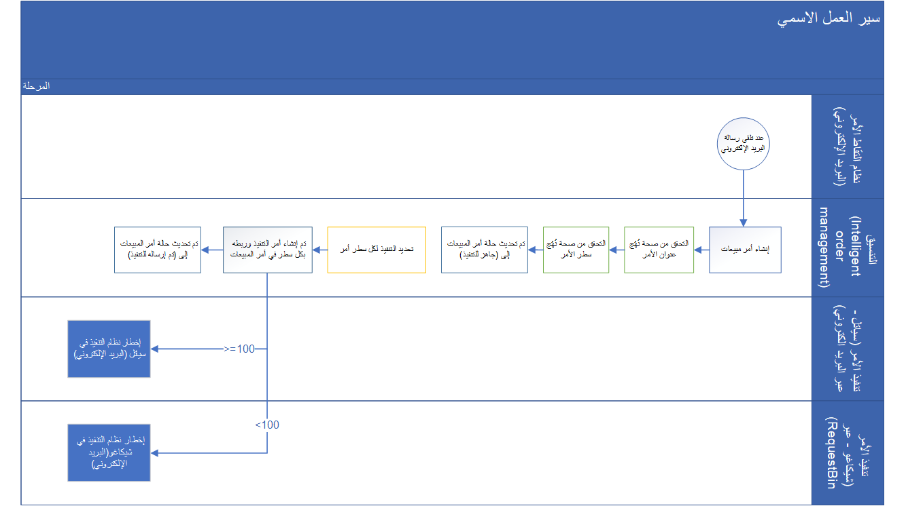
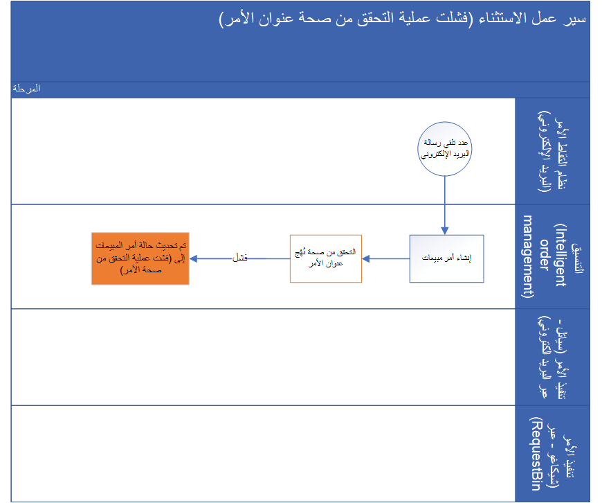
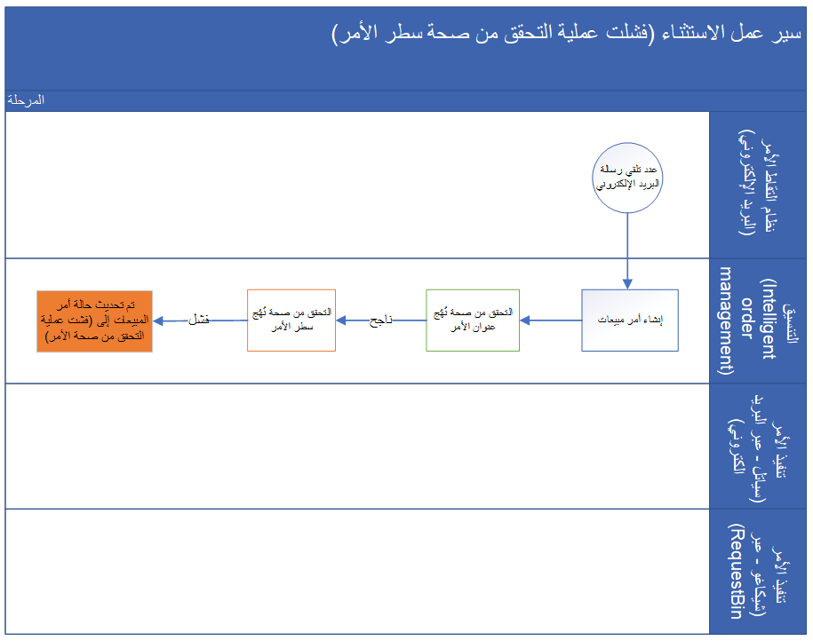

باستخدام Dynamics 365 Intelligent Order Management، بإمكان العملاء إدارة تنسيق معالجة الأوامر وصولاً إلى التنفيذ. تمكّن هذه القدرات المؤسسات من تنسيق معالجة سير عمل الأوامر عبر الأنظمة الأساسية والتطبيقات المختلفة.

هذه الوحدة النمطية هي تمرين عملي موجّه، يتضمن السيناريوهات التالية.

-   يدخل الأمر إلى Dynamics 365 Intelligent Order Management كمرفق بريد إلكتروني.
-   تحقق من صحة البيانات الرئيسية للأمر للتأكد من أن الشحن إلى بلد/مناطق هو الولايات المتحدة الأمريكية.
-   تحقق من صحة بند الأمر للتأكد من أن الكمية هي أكبر من 1.
-   وجّه الأمر بالاستناد إلى الكمية.
    - إذا كانت **الكمية** >= **100**، فأرسلها إلى متجر سياتل‬.
    - إذا كانت **الكمية** < **100**، فأرسلها إلى متجر شيكاغو‬.
-   إذا تم توجيه الأمر إلى مخزن سياتل، فسيتم إرسال رسائل بريد إلكتروني مع أمر تنفيذ مرفق بها.
-   إذا تم توجيه الأمر إلى متجر شيكاغو، فسيتم إرسال طلبات مع أمر تنفيذ كحمولة إلى RequestBin.

## مكونات عمل التمرين العملي

تستخدم الوحدة النمطية مكونات العمل التالية:

- نقطة نهاية التقاط الأمر: البريد الإلكتروني
- نقاط نهاية تنفيذ الأمر:
    - الأوامر التي تم تنفيذها من سياتل: البريد الإلكتروني
    - الأوامر التي تم تنفيذها من شيكاغو: صندوق الطلبات
- سير عمل تنسيق معالجة الأوامر والرؤية المركزية (تطبيق Dynamics 365 Intelligent Order Management)

## مهام سير عمل التمرين العملي

ستوضح الوحدة النمطية مهام سير العمل التالية.

### سير العمل الاسمي

يُظهر الشكل التوضيحي التالي سير عمل اسمياً في Intelligent Order Management.

> [!div class="mx-imgBorder"]
> 

### سير عمل الاستثناء (فشلت عملية التحقق من صحة البيانات الرئيسية للأمر)

يُظهر الشكل التوضيحي التالي سير عمل استثناء اسمي يعود سببه إلى فشل التحقق من صحة البيانات الرئيسية للأمر في Intelligent Order Management.

> [!div class="mx-imgBorder"]
> 

### سير عمل الاستثناء (فشلت عملية التحقق من صحة بند الأمر)

يُظهر الشكل التوضيحي التالي سير عمل استثناء اسمي يعود سببه إلى فشل التحقق من صحة بند الأمر في Intelligent Order Management.

> [!div class="mx-imgBorder"]

