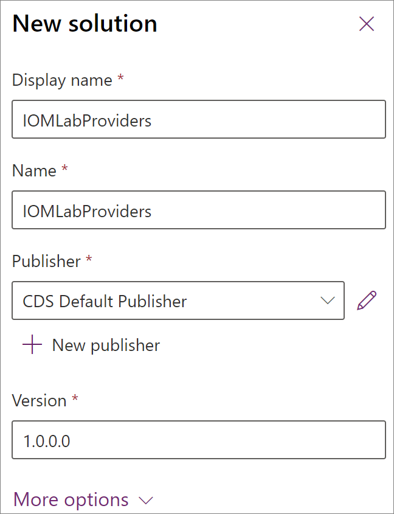

من المستحسن وجود موفر واحد لكل حل، ولكن يمكن تضمين عدة موفرين في نفس الحل. هذا هو الحل الذي يمكن مشاركته وسيتم تثبيته في بيئات Intelligent Order Management.

## إنشاء حل موفر جديد

لإنشاء حل موفر جديد، اتبع الخطوات التالية.

1. انتقل إلى [مدخل منشئ](https://make.powerapps.com) وسجل دخولك باستخدام بيانات اعتمادك في Intelligent Order Management. 
1. انتقل إلى **الحلول**.
1. حدد **حل جديد**.
1. في **اسم العرض**، أدخل **IOM LabProviders**.
1. في **الاسم**، أدخل **IOM LabProviders**.
1. في **الناشر**، حدد **ناشر CDS الافتراضي**.
1. في **الإصدار**، أدخل **1.0.0.0**.

> [!div class="mx-imgBorder"]
> 

