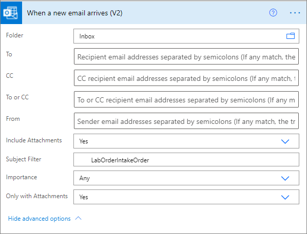
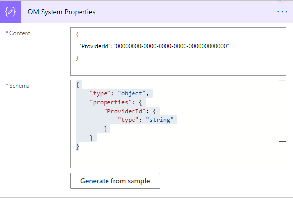
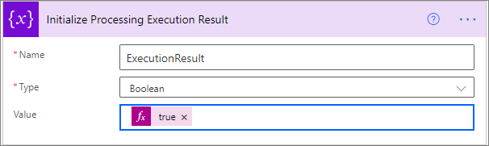
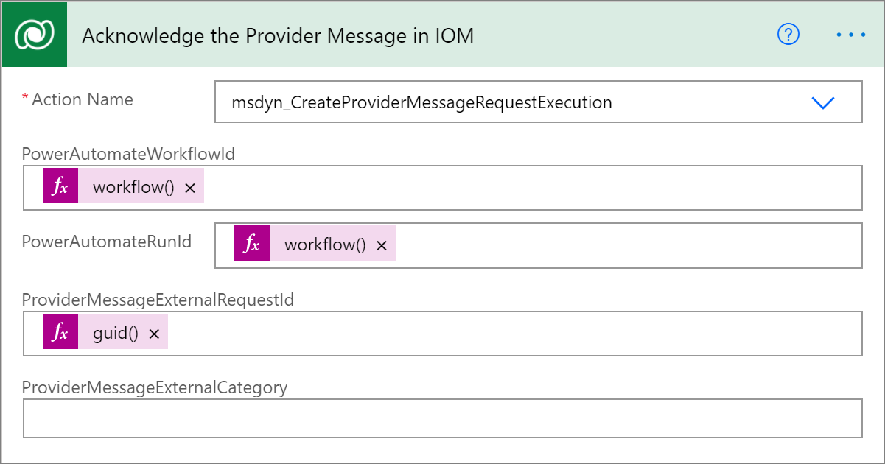
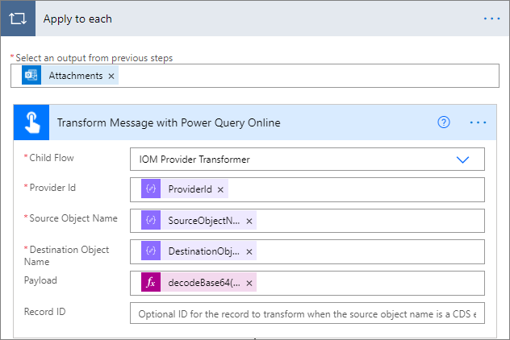
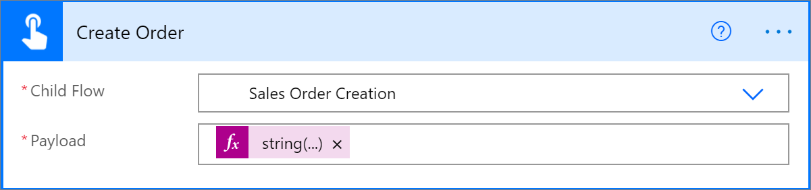
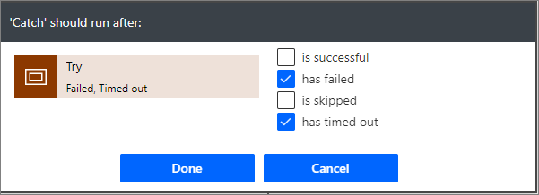
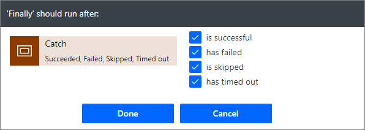
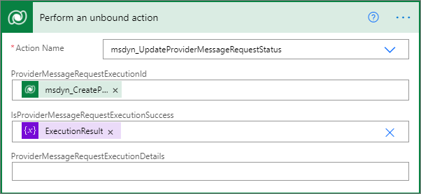

تصف هذه الوحدة الخطوات المطلوبة لإنشاء موفر استلام الأمر في Intelligent Order Management.

## <a name="create-a-new-provider-definition"></a>إنشاء تعريف موفر جديد

لإنشاء تعريف موفر جديد، اتبع هذه الخطوات:

1. انتقل إلى **الموفرون‬ > الكتالوج**.
1. حدد **تعريف موفر جديد**.
1. في **اسم العرض**، أدخل **LabOrderIntakeProvider**.
1. في **الاسم المنطقي**، أدخل **msdyn_LabOrderIntakeProvider**.
1. في **الشعار‬**، حدد **Lab.png**.
1. في **نوع الخدمة**، أدخل **استلام الأمر**.
1. في **الوصف**، أدخل **تمرين عملي - موفر استلام الأمر**.
1. حدد **حفظ وإغلاق**.

## <a name="add-a-provider-definition-to-a-solution"></a>إضافة تعريف موفر إلى حل

لإضافة تعريف موفر إلى حل، اتبع الخطوات التالية:

1. انتقل إلى [مدخل المنشئ في Power Apps](https://make.powerapps.com) وانتقل إلى الحل **LabProviders** الذي تم إنشاؤه مؤخراً.
1. حدد **إضافة موجود > تعريف الموفر**.
1. حدد **LabOrderIntakeProvider**، ثم حدد **إضافة** لإضافته إلى الحل. 

## <a name="add-a-transformation-to-the-provider-definition"></a>إضافة تحويل إلى تعريف الموفر

لإضافة تحويل إلى تعريف الموفر، اتبع الخطوات التالية:

1. انتقل إلى **الموفرون‬ > الكتالوج**.
1. حدد **LabOrderIntakeProvider** الذي تم إنشاؤه مؤخراً.
1. حدد **تحرير‬** من شريط القوائم. 
1. حدد علامة التبويب **التحويلات**.
1. حدد **+ تحويل تعريف موفر IOM جديد**.
1. في **اسم العرض**، أدخل **تمرين عملي - أمر إلى أمر Dataverse**. 
1. في **الاسم المنطقي**، أدخل **msdyn_LabOrderIntake_Order**.
1. في **تعريف الموفر**، أدخل أو حدد **LabOrderIntakeProvider**.
1. في **اسم الكائن المصدر**، أدخل **LabOrderIntakeProvider‎**.
1. في **اسم الكائن الوجهة**، أدخل **أمر Dataverse**.
1. في **تحويل**، أدخل التعليمات البرمجية لاستعلام M التالي:

    ```M
    shared ImportMappingKey = [
    account = {
            [
                ExternalRecordKey = [ProviderName = "LabOrderIntakeProvider"],
                SelectedFields = {"accountid"}
            ]
    },
        pricelevel = {
            [
                ExternalRecordKey = [ProviderName = "LabOrderIntakeProvider"],
                SelectedFields = {"pricelevelid"}
            ]
    },
        product = List.Distinct(List.Transform(Source[orderdetails], each
            [
                ExternalRecordKey = [sku = _[sku]],
                SelectedFields = {"productid"}
            ])),
        uom = List.Distinct(List.Transform(Source[orderdetails], each
            [
                ExternalRecordKey = [unit = _[unit]],
                SelectedFields = {"uomid"}
            ]))
    ];
    shared TransformSourceData =
    let
    orderProducts = Source[orderdetails],
    account = IOM.MapRecord(IOM.MappingTables[account], [ProviderName = "LabOrderIntakeProvider"]),
    pricelevel = IOM.MapRecord(IOM.MappingTables[pricelevel], [ProviderName = "LabOrderIntakeProvider"]),
            
    orderheader = Record.FromTable
                    (
                        Table.SelectRows
                        (
                            Record.ToTable
                            (
                                [
                                    ordernumber = Text.From(Source[ordernumber]),
                                    name = ordernumber,
                                    #"customerid_account@odata.bind" = "/accounts(" & Text.From(account[accountid]) & ")",
                                    #"pricelevelid@odata.bind" = "/pricelevels(" & Text.From(pricelevel[pricelevelid]) & ")",
                                    billto_city = Record.FieldOrDefault(Source, "billtocity"),
                                    billto_stateorprovince = Record.FieldOrDefault(Source, "billtostateorprovince"),
                                    billto_country = Record.FieldOrDefault(Source, "billtocountry"),
                                    billto_postalcode = Record.FieldOrDefault(Source, "billtozip"),
                                    shipto_city = Record.FieldOrDefault(Source, "shiptocity"),
                                    shipto_stateorprovince = Record.FieldOrDefault(Source, "shiptostateorprovince"),
                                    shipto_country = Record.FieldOrDefault(Source, "shiptocountry"),
                                    shipto_postalcode = Record.FieldOrDefault(Source, "shiptozip")
                                ]
                            ), each [Value] <> null
                        )
                    ),

    orderlines = List.Transform(orderProducts, each
                        Record.FromTable
                        (
                            Table.SelectRows
                            (
                                Record.ToTable
                                (
                                    [
                                        ispriceoverridden = true,
                                        #"productid@odata.bind" = "/products(" & IOM.MapRecord(IOM.MappingTables[product], [sku = Record.FieldOrDefault(_, "sku")])[productid] & ")",
                                        #"uomid@odata.bind" = "/uoms(" & IOM.MapRecord(IOM.MappingTables[uom], [unit = Record.FieldOrDefault(_, "unit")])[uomid] & ")",
                                        quantity = [quantity]
                                    ]
                                ), each [Value] <> null
                            )
                        )
                    ),

    salesorder = Record.AddField(orderheader, "order_details", orderlines)

    in Text.FromBinary(Json.FromValue(salesorder));

    ```

12. في **نوع مصدر التحويل**، أدخل **JsonPayload**.

13. حدد **حفظ**.
14. أنشئ ملف JSON، والصقه في التعليمات البرمجية التالية، ثم احفظه.
    ```JSON
    {
      "ordernumber": "LabOrder001",
      "shiptocity": "BELLEVUE",
      "shiptostateorprovince": "WA",
      "shiptocountry": "US",
      "shiptozip": "98007",
      "billtocity": "BELLEVUE",
      "billtostateorprovince": "WA",
      "billtocountry": "US",
      "billtozip": "98007",
      "orderdetails": [
    {
      "sku": "883988211855",
      "unit": "each",
      "quantity": 11
    }
      ]
    } 
    ```
15. إلى جانب حقل **عينة البيانات**، حدد **اختيار ملف** ثم حمّل ملف JSON الذي أنشأته.
16. حدد **حفظ وإغلاق**.

## <a name="add-a-provider-definition-transformation-to-a-solution"></a>إضافة تحويل تعريف الموفر إلى حل

لإضافة تحويل تعريف موفر إلى حل، اتبع الخطوات التالية:

1. انتقل إلى [مدخل المنشئ في Power Apps](https://make.powerapps.com) وانتقل إلى الحل **LabProviders** الذي تم إنشاؤه مؤخراً.
1. حدد **إضافة موجود > تحويل تعريف الموفر**.
1. حدد **تمرين عملي - أمر إلى أمر Dataverse**، ثم حدد **إضافة‏‎** لإضافته إلى الحل.

## <a name="create-a-provider-message-handler"></a>إنشاء معالج رسائل الموفر

لإنشاء معالج رسائل الموفر، اتبع الخطوات التالية:

1. انتقل إلى [مدخل المنشئ في Power Apps](https://make.powerapps.com)، وانتقل إلى **الحلول‏‎**، ثم افتح **الحل الافتراضي**. 
1. حدد **جديد**.
1. حدد **سير عمل سحابي**، وقم بتسميته **تمرين عملي - معالج طلبات الرسائل لاستلام الأمر**.
1. حدد نوع المشغّل باعتباره **Outlook.com – عند وصول بريد إلكتروني جديد (V2)**، ثم سجل دخولك باستخدام بيانات اعتماد حسابك في outlook.com.
1. في **المجلد**، حدد **علبة الوارد**.
1. في **إلى**، حدد **عناوين البريد الإلكتروني للمستلمين مفصولة بفواصل منقوطة**.
1. في **نسخة**، حدد **نسخة إلى عناوين البريد الإلكتروني للمستلمين مفصولة بفواصل منقوطة**.
1. في **إلى أو نسخة**، حدد **إلى أو نسخة إلى عناوين البريد الإلكتروني للمستلمين مفصولة بفواصل منقوطة**.
1. في **كم**، حدد **عناوين البريد الإلكتروني للمستلمين مفصولة بفواصل منقوطة**.
1. في **تضمين المرفقات**، حدد **نعم**.
1. في **عامل تصفية الموضوع**، حدد **LabOrderIntakeOrder‎**.
1. في **الأهمية**، حدد **أي خيار**.
1. في **مع المرفقات فقط**، حدد **نعم‏‎**.

    
1. حدد **خطوة جديدة**، ثم أضف **تحليل json**.
1. في **المحتوى**، الصق التعليمات البرمجية التالية:
    ```JSON
    {
    "ProviderId": "00000000-0000-0000-0000-000000000000"
    }
    ```
1. حدد **إنشاء من عينة**، ثم الصق عينة التعليمات البرمجية التالية للمخطط:
    ```JSON
    {
      "type": "object",
      "properties": {
        "ProviderID": {
          "type": "string"
        }
      }
    }
    ```
1. حدد **تم**.
1. حدد علامة الحذف (**...**)، ثم حدد **إعادة تسمية**. 
1. غيّر اسم الإجراء إلى **خصائص نظام IOM**.
1. حدد **حفظ**.

    
1. حدد **خطوة جديدة**، وأضف إجراء **تحليل JSON**، ثم غيّر اسمه إلى **تهيئة متغيرات الموفر**.
1. في **المحتوى**، الصق التعليمات البرمجية التالية:
    ```JSON
    {
      "SourceObjectName": "IOMLab Order",
      "DestinationObjectName": "Dataverse Order"
    }
    ``` 
1. حدد **حفظ**.
1. حدد **خطوة جديدة**، وأضف إجراء **تهيئة المتغير**، ثم غيّر اسمه إلى **تهيئة معالجة نتيجة التنفيذ**.
1. في **الاسم**، أدخل **ExecutionResult‎**.
1. في **النوع**، حدد **منطقي**.
1. في **القيمة**، حدد **صواب**.
1. حدد **حفظ**.

    
1. حدد **خطوة جديد**، وأضف **نطاقاً**، ثم غيّر اسمه إلى **محاولة**.
1. في النطاق **محاولة**، حدد **إضافة إجراء**.
1. أضف **تنفيذ إجراء غير مرتبط** من موصل **Dataverse**، ثم غيّر اسمه إلى **إقرار باستلام رسالة الموفر**.
1. في **اسم الإجراء**، أدخل **msdyn_CreateProviderMessageRequestExecution**.
1. في **PowerAutomateWorkflowId**، أدخل ``workflow()['tags']['xrmWorkflowId']`` كتعبير. 
1. في **PowerAutomateRunId**، أدخل ``workflow()['run']?['name']`` كتعبير. 
1. في **ProviderExternalRequestId**، أدخل ``guid()`` كتعبير. 
1. حدد **حفظ**.

    
1. حدد **إضافة إجراء**، ثم أضف عنصر تحكم **تطبيق على كل**.
1. في **حدد إخراجاً من الخطوات السابقة**، حدد **المرفقات**.
1. حدد **إضافة إجراء** داخل التكرار الحلقي **تطبيق على كل**، وأضف **تشغيل سير عمل تابع‬** من موصل **سير العمل**، ثم غيّر اسمه إلى **تحويل الرسالة بواسطة Power Query Online**.
1. في **معرف الموفر**، حدد المتغير **ProviderId‎**.
1. في **اسم الكائن المصدر**، حدد المتغير **SourceObjectName**.
1. في **اسم الكائن الوجهة**، حدد المتغير **DestinationObjectName**.
1. في **الحمولة**، أدخل ``decodeBase64(items('Apply_to_each')?['ContentBytes'])`` كتعبير.
1. حدد **حفظ**.

    
1. بعد خطوة التحويل، حدد **إضافة إجراء**، وأضف **تشغيل سير عمل تابع** من موصل **سير العمل**، وغيّر اسمه إلى **إنشاء أمر**.
1. في **سير عمل تابع**، أدخل **إنشاء أمر مبيعات**.
1. في **الحمولة**، أدخل ``string(json(outputs('Transform_Message_with_Power_Query_Online')?['Body']?['result'])?[0][0])`` كتعبير.
1. حدد **حفظ**.

    
1. قم بطي نطاق **المحاولة** عن طريق تحديد شريط عنوانه.
1. حدد **خطوة جديدة**، وأضف نطاقاً، وغيّر اسمه إلى **التقاط**.
1. في النطاق **التقاط**، حدد علامة الحذف (**...**)، ثم حدد **تكوين التشغيل بعد**.
1. حدد خانتي الاختيار **فشل** و **انتهت مهلته**، ثم حدد **تم**.

    
1. في النطاق **التقاط**، حدد **إضافة إجراء**، وأضف الإجراء **تعيين متغير**، وغيّر اسمه إلى **تعيين نتيجة التنفيذ إلى فاشلة**.
1. في **الاسم**، أدخل **Executionresult**.
1. في **القيمة**، حدد **خطأ**.
1. حدد **حفظ**.

    
1. قم بطي النطاق **التقاط** عن طريق تحديد شريط عنوانه.
1. حدد **خطوة جديدة**، وأضف نطاقاً، ثم غيّر اسمه إلى **أخيراً**.
1. في النطاق **أخيراً**، حدد علامة الحذف (**...**)، ثم حدد **تكوين التشغيل بعد**. 
1. حدد خانات الاختيار **هو ناجح** و **فشل** و **تم تخطيه** و **انتهت مهلته**. حدد **تم**.

    
1. في النطاق **أخيراً**، حدد **إضافة إجراء**، وأضف **تنفيذ إجراء غير مرتبط**، ثم غيّر اسمه إلى **حفظ نتيجة تنفيذ طلب رسالة الموفر**.
1. في **اسم الإجراء**، أدخل "msdyn_UpdateProviderMessageRequestStatus".
1. في **ProviderMessageRequestExecutionId**، أدخل ``@outputs('Acknowledge_the_Provider_Message')?["body/ProviderMessageRequestExecutionId']``.
1. حدد **حفظ**.

    

## <a name="add-a-provider-definition-logic-definition-to-the-provider-definition"></a>إضافة تعريف منطق تعريف الموفر إلى تعريف الموفر

لإضافة تعريف منطق تعريف الموفر إلى تعريف الموفر، اتبع الخطوات التالية:

1. في تطبيق Intelligent Order Management، انتقل إلى **الموفرون > الكتالوج‏‎**.
1. حدد **LabOrderIntakeProvider** الذي تم إنشاؤه مؤخراً.
1. حدد **تحرير‬** من شريط القوائم. 
1. حدد علامة التبويب **تعريفات المنطق**.
1. حدد **+ تعريف منطق تعريف موفر IOM الجديد**.
1. في **اسم العرض**، أدخل **تمرين عملي - معالج طلبات الرسائل لاستلام الأمر‬‏‫**.
1. في **الاسم المنطقي**، أدخل **msdyn_LabOrderIntakeMessageRequestHandler**.
1. في **تعريف الموفر**، أدخل **LabOrderIntakeProvider**.
1. في **نوع المنطق**، أدخل **توفير معالج الرسائل**.
1. في **اسم سير العمل**، أدخل **تمرين عملي - معالج طلبات الرسائل لاستلام الأمر‬‏‫**.
1. في **دقائق المهلة**، أدخل **2**.
1. في **‫الحد الأقصى لعدد عمليات إعادة المحاولة‬**، أدخل **3**.
1. في **الوصف**، أدخل **تمرين عملي - معالج طلبات الرسائل لاستلام الأمر‬‏‫**.
1. حدد **حفظ**. ستؤدي هذه الخطوة إلى إنشاء تمثيل JSON لسير العمل السحابي لمعالج الرسائل وتعبئة حقل **بيانات العميل**.
1. حدد **حفظ وإغلاق**.
1. حدد **الاتصالات**. يجب أن تكون تعريفات مرجع اتصال **Microsoft Dataverse** و **Outlook.com** مدرجة. 

> [!NOTE]
> إذا ظهرت تعريفات أخرى لمراجع الاتصال غير **Microsoft Dataverse** و **Outlook.com**، فهذا يعني أنك تستخدم أكثر من اتصال مرجع واحد في Dataverse في سير عمل معالج رسائل استلام الأمر. لحل هذه المشكلة، انتقل إلى سير عملك وتأكد من أن جميع إجراءات Dataverse تستخدم مرجع الاتصال نفسه.

## <a name="add-a-provider-definition-logic-definition-to-the-labproviders-solution"></a>إضافة تعريف منطق تعريف الموفر إلى حل LabProviders

لإضافة تعريف منطق تعريف الموفر إلى حل LabProviders، اتبع الخطوات التالية:

1. حدد **إضافة موجود > تعريف منطق تعريف الموفر**.
1. حدد **تمرين عملي - معالج طلبات الرسائل لاستلام الأمر‬‏‫‬‏‫** ثم حدد **إضافة** لإضافته إلى الحل.

## <a name="add-a-provider-definition-connection-reference-to-the-labproviders-solution"></a>إضافة مرجع اتصال تعريف الموفر إلى حل LabProviders

لإضافة مرجع اتصال تعريف الموفر إلى حل LabProviders، اتبع هذه الخطوات:

1. انتقل إلى [مدخل المنشئ في Power Apps](https://make.powerapps.com) وانتقل إلى الحل **LabProviders** الذي تم إنشاؤه مؤخراً.
1. حدد **إضافة موجود > مرجع اتصال تعريف الموفر**.
1. حدد تعريفات مرجع اتصال **Microsoft Dataverse** و **Outlook.com** ثم حدد **إضافة** لإضافتها إلى الحل. 
