تصف هذه الوحدة الخطوات المطلوبة لإنشاء موفر تنفيذ في Intelligent Order Management.

## <a name="create-a-new-provider-definition"></a>إنشاء تعريف موفر جديد

لإنشاء تعريف موفر جديد، اتبع هذه الخطوات.

1. انتقل إلى **الموفرين‏‎ \> كتالوج**.
1. حدد **تعريف موفر جديد**.
1. في **اسم العرض**، أدخل **LabFulfillmentProvider**.
1. في **الاسم المنطقي**، أدخل **msdyn_LabFulfillmentProvider**.
1. في **الوصف**، أدخل **موفر التنفيذ المعملي**.
1. في **الشعار‬**، حدد **Lab.png**.
1. في **نوع الخدمة**، أدخل **التنفيذ**.
1. حدد **حفظ وإغلاق**.

## <a name="add-a-provider-definition-to-solution"></a>إضافة تعريف موفر إلى الحل

لإضافة تعريف موفر إلى الحل، اتبع الخطوات التالية.

1. انتقل إلى [مدخل منشئ Power App](https://make.powerapps.com) وانتقل إلى الحل الذي تم إنشاؤه حديثاً **LabProviders**.
1. حدد **إضافة موجود \> تعريف موفر IOM**.
1. حدد **LabFulfillmentProvider**، ثم حدد **إضافة** لإضافته إلى الحل. 

## <a name="create-a-provider-action-to-send-a-fulfillment-payload-to-outlook"></a>إنشاء اجراء موفر لإرسال حمولة تنفيذ إلى Outlook

لإنشاء إجراء موفر لإرسال حمولة تنفيذ إلى Outlook، اتبع هذه الخطوات.

1. انتقل إلى [مدخل منشئ Power App](https://make.powerapps.com) وانتقل إلى **الحلول‏‎**.
1. افتح **الحل الافتراضي**.
1. حدد **جديد**.
1. حدد **تدفق السحابة** ، ثم قم بتسميته **تمرين عملي - إرسال إلى التنفيذ (Outlook)**.
1. حدد نوع المشغل كـ **‬‏‫تشغيل تدفق يدوياً‬‏‫** ثم أدخل ما يلي:
    - حدد **إضافة إدخال**، وحدد **النص**، ثم قم بإدخال **ProviderActionExecutionEventId** في الحقل الأول.
    - حدد **إضافة إدخال**، وحدد **النص**، ثم قم بإدخال **EntityRecordId** في الحقل الأول.

    > [!div class="mx-imgBorder"]
    > [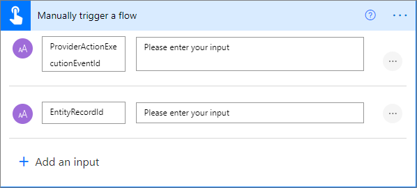](../media/manual-trigger-flow-ss.png#lightbox)

1. إنشاء إجراء تهيئة متغير:
    - في **الاسم**، أدخل **ExecutionResult‎**.
    - في **النوع**، حدد **منطقي**.
    - في **القيمة**، أدخل **صحيح‬**.  
1. إنشاء إجراء تهيئة متغير ثانٍ:
    - في **الاسم**، أدخل **ProcessedSaleOrderLines**.
    - في **النوع**، حدد **صفيف**.
1. إنشاء إجراء تهيئة متغير ثالث:
    - في **الاسم**، أدخل **ProcessedFulfillmentOrderLines**.
    - في **النوع**، حدد **صفيف**.

    > [!div class="mx-imgBorder"]
    > [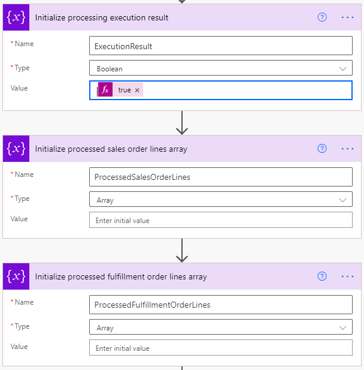](../media/variable-initialization-actions-ss.png#lightbox)

1. قم بإضافة نطاق **المحاولة‏‎**.
1. ضمن نطاق **المحاولة**، أضف إجراء **تنفيذ إجراء غير منضم** كما يلي:
    - **ProviderActionExecutionEventId**: ضمن **‏‫المحتوى الديناميكي‬**، حدد **ProviderActionExecutionEventId**.
    - **PowerAutomateRunId**: حدد ما يلي كتعبير: `workflow()['run']?['name']`.

    > [!div class="mx-imgBorder"]
    > [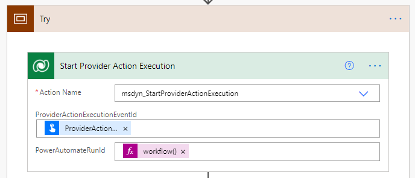](../media/try-scope-ss.png#lightbox)

1. أضف إجراء **‏‫الحصول على صف بالمعرف** ثم أدخل ما يلي:
    - في **اسم الجدول**، أدخل **أوامر التنفيذ**.
    - في **معرف الصف**، حدد **EntityRecordId** ضمن **المحتوى الديناميكي**.

    > [!div class="mx-imgBorder"]
    > [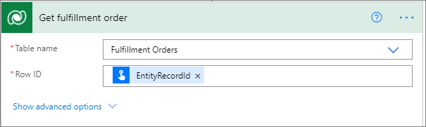](../media/get-fulfillment-order-ss.png#lightbox)

1. أضف إجراء **إرسال رسالة إلكترونية** من موصل Outlook.com، لأن هذا هو الاتصال الذي تم إعداده مسبقاً.
    - على السطر **إلى**، يتم استخدام *placeholder@placeholder.com* كعنصر نائب للنص. سيتم استبدال هذا بمعلمة الموفر في خطوات لاحقة.
    - في السطر **الموضوع**، يتم الحصول على *الاسم* من خطوة **الحصول على أمر التنفيذ** ضمن **المحتوى الديناميكي**.
    - في **النص الأساسي**، حدد ما يلي كتعبير: `outputs('Get_fulfillment_order')['body']`
    
    > [!div class="mx-imgBorder"]
    > [](../media/send-email-ss.png#lightbox)

1. أضف إجراء **صفوف القائمة** كما يلي:
    - في **اسم الجدول**، أدخل **منتجات أوامر التنفيذ**.
    - في **استعلام إحضار XML** أدخل ما يلي: 

    ```XML
    <fetch>  
      <entity name="msdyn_fulfillmentorderdetail">  
       <all-attributes />
         <filter>
         <condition attribute="msdyn_fulfillmentid" operator="eq" value="@{triggerBody()['text_1']}"/>
         </filter>
      </entity>  
    </fetch>
    ```

    > [!div class="mx-imgBorder"]
    > [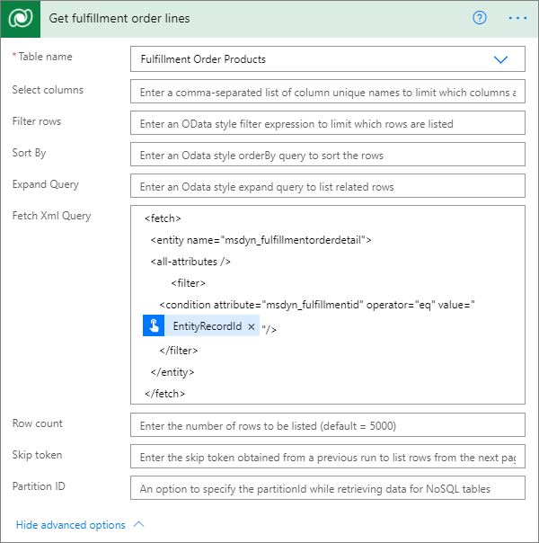](../media/get-fulfilment-lines-ss.png#lightbox)

1. أضف عنصر تحكم **تطبيق على كل‬‏‫** باستخدام إجراء **إرسال رسالة إلكترونية** كما يلي:   
    - يتم الحصول على **القيمة** من خطوة **الحصول على سطر أمر التنفيذ** ضمن **المحتوى الديناميكي**. 
    - يتم الحصول على **الاسم** من خطوة **الحصول على سطر أمر التنفيذ** ضمن **المحتوى الديناميكي**. 
    - تم تحديد **الصنف الحالي** ضمن **المحتوى الديناميكي**.

    > [!div class="mx-imgBorder"]
    > [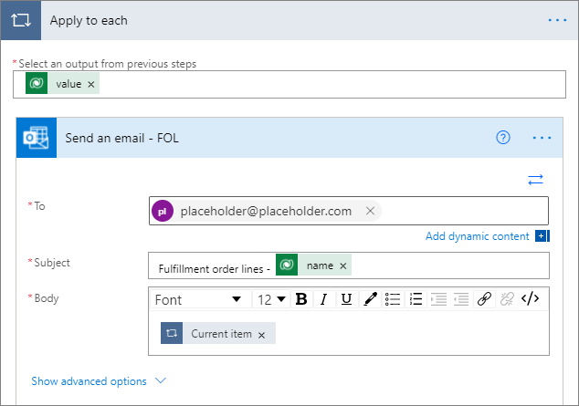](../media/apply-to-each-control-ss.png#lightbox)

1. ضمن التكرار الحلقي، أضف إجراء **إلحاق بمتغير الصفيف** كما يلي:
    - في **الاسم**، أدخل **ProcessedFulfillmentOrderLines**.
    - في **القيمة**، حدد **معرف سطر التنفيذ** ضمن **المحتوى الديناميكي**. 

    > [!div class="mx-imgBorder"]
    > [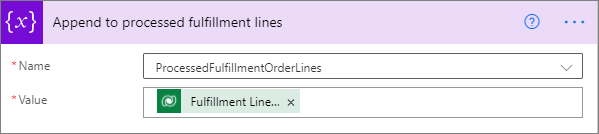](../media/append-processed-fulfillment-lines-ss.png#lightbox)

1. ضمن التكرار الحلقي، أضف إجراء **إلحاق بمتغير الصفيف** آخر كما يلي:
    - في **الاسم**، أدخل **ProcessedSalesOrderLines**.
    - في **القيمة**، حدد **معرف سطر المبيعات** ضمن **المحتوى الديناميكي**.

    > [!div class="mx-imgBorder"]
    > [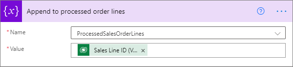](../media/append-processed-order-lines-ss.png#lightbox)

1. قم بطي نطاق **المحاولة** عن طريق تحديد شريط عنوانه. 
1. حدد **خطوة جديدة** وأضف نطاقاً آخر باسم "التقاط‏‎".
1. في النطاق **التقاط**، حدد علامة الحذف ("**...**")، ثم حدد **تكوين التشغيل بعد** وقم بالتكوين كما يلي:
    - حدد خانة الاختيار **فشل**.
    - حدد خانة الاختيار **انتهت المهلة**.

    > [!div class="mx-imgBorder"]
    > [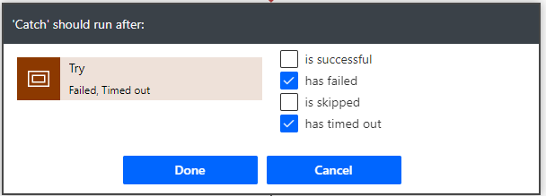](../media/catch-scope-ss.png#lightbox)

1. في النطاق **التقاط**، حدد **إضافة إجراء**، وأضف الإجراء **تعيين المتغير** وأعد تسميته إلى **تعيين نتيجة التنفيذ على فاشلة**.
1. كوّن الخصائص على النحو التالي:
    - في **الاسم**، أدخل **ExecutionResult‎**.
    - في **القيمة**، أدخل **خطأ**.

    > [!div class="mx-imgBorder"]
    > [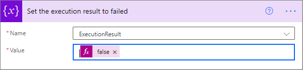](../media/set-execution-failed-ss.png#lightbox)

1. حدد **‎خطوة جديدة**، وأضف نطاقاً آخر باسم **أخيراً**.
1. في النطاق **أخيراً**، حدد علامة الحذف ("**...**")، ثم حدد **تكوين التشغيل بعد** وقم بالتكوين كما يلي:
    - حدد خانة الاختيار **ناجح**.
    - حدد خانة الاختيار **انتهت المهلة**.
    - حدد خانة الاختيار **تم تخطي**.
    - حدد خانة الاختيار **انتهت المهلة**.

    > [!div class="mx-imgBorder"]
    > [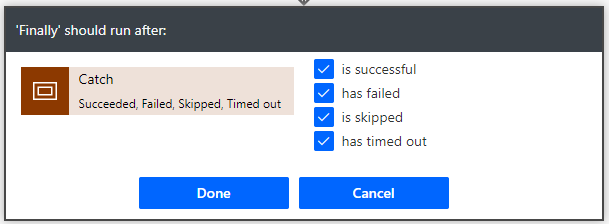](../media/finally-scope-ss.png#lightbox)

1. في النطاق **أخيراً**، أضف خطوة **شرط** وقارن متغير **ExecutionResult‎** مع صحيح كما يلي:
    - في الحقل الأول، حدد المتغير **ExecutionResult‎**.
    - في الحقل الثاني، حدد **يساوي**.
    - في الحقل الثالث، حدد **صحيح**.

    > [!div class="mx-imgBorder"]
    > [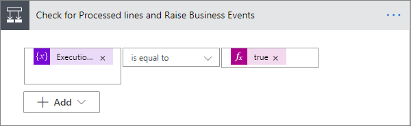](../media/check-processed-lines-raise-business-events-ss.png#lightbox)

1. في الفرع **‬‏‫إذا كانت الإجابة بنعم**، أضف إجراء **تشغيل تدفق فرعي** وأعد تسميته إلى **زيادة أحداث العمل لسطور أوامر التنفيذ التي تمت معالجتها**.
1. كوّن الخصائص على النحو التالي:
    - في **التدفق الفرعي**، أدخل **زيادة حدث العمل**.
    - في **BusinessEventDefinitionId**، أدخل **063d85c8-60a4-eb11-9443-000d3a313675**.
    - في **EntityRecordId**، حدد ما يلي كتعبيرات: `string(variables('ProcessedFulfillmentOrderLines'))`

    > [!div class="mx-imgBorder"]
    > [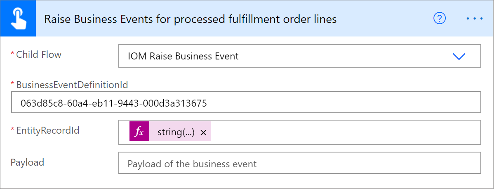](../media/raise-business-events-processed-fulfillment-order-lines-ss.png#lightbox)

1. في الفرع **إذا كانت الإجابة بنعم**، أضف إجراء **تشغيل تدفق فرعي** آخر وأعد تسميته إلى **زيادة الأحداث المجموعة لأمر المبيعات**.
1. كوّن الخصائص على النحو التالي:
   - في **LineBusinessEventDefinitionId**، أدخل **ccf64002-61a4-eb11-9443-000d3a313675**.
   - في **LineRecordId**، حدد ما يلي كتعبير: `string(variables('ProcessedSalesOrderLines'))`.
   - في **OrderBusinessEventDefinitionId**، أدخل **48688716-61a4-eb11-9443-000d3a313675**.

    > [!div class="mx-imgBorder"]
    > [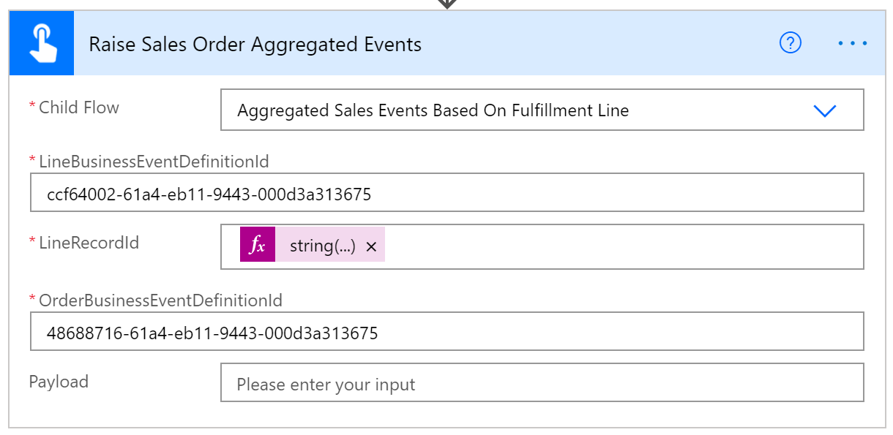](../media/run-child-flow-action-2-ss.png#lightbox)

1. قم بطي خطوة الشرط.  
1. أضف إجراء **تنفيذ إجراء غير منضم** كما يلي:
    - في **اسم الإجراء**، أدخل "msdyn_CompleteProviderActionExecution".
    - في **ExecutionResult**، حدد المتغير **ExecutionResult** ضمن **المحتوى الديناميكي**.
    - في **ProviderActionExecutionEventId**، حدد **ProviderActionExecutionEventId** ضمن **المحتوى الديناميكي**.

    > [!div class="mx-imgBorder"]
    > [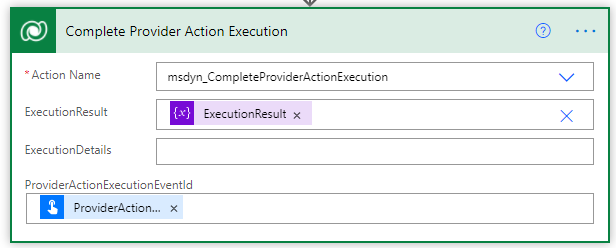](../media/perform-unbound-action-ss.png#lightbox)

1. حدد **حفظ**.

## <a name="add-a-provider-definition-logic-definition-to-the-outlook-provider-definition"></a>إضافة تعريف منطق تعريف الموفر إلى تعريف موفر Outlook

لإضافة تعريف منطق تعريف الموفر إلى تعريف موفر Outlook، اتبع الخطوات التالية.

1. انتقل إلى **الموفرين‏‎ \> كتالوج**.
1. حدد **LabFulfillmentProvider** الذي تم إنشاؤه مؤخراً.
1. حدد **تحرير‬** من شريط القوائم. 
1. حدد علامة التبويب **تعريفات المنطق**.
1. حدد **+ تعريف منطق تعريف موفر IOM الجديد**.
1. في **اسم العرض**، أدخل **تمرين عملي - إرسال إلى التنفيذ (Outlook)**.
1. في **الاسم المنطقي**، أدخل **msdyn_LabSentToFulfillmentOutlook**.
1. في **تعريف الموفر**، أدخل **LabFulfillmentProvider**.
1. في **نوع المنطق**، أدخل **إجراء الموفر**.
1. في **اسم سير العمل**، أدخل **تمرين عملي - إرسال إلى التنفيذ (Outlook)**.
1. في **دقائق المهلة**، أدخل **2**.
1. في **‫الحد الأقصى لعدد عمليات إعادة المحاولة‬**، أدخل **3**.
1. في **الوصف‏‎‬**، أدخل **تمرين عملي - إرسال إلى التنفيذ (Outlook)**.
1. بالنسبة إلى **نوع الإجراء**، أدخل **الإرسال إلى التنفيذ**.
1. حدد **حفظ**. سيؤدي هذا إلى إنشاء تمثيل JSON لتدفق السحابة لمعالج الرسائل وتعبئة حقل **بيانات العميل**.
1. استبدل البريد الإلكتروني للعنصر النائب بمعلمة الموفر، عن طريق نسخ كتلة النص في حقل **بيانات العميل** ولصقها في المفكرة. 
2. في كتلة النص، ابحث عن **placeholder@placeholder.com** واستبدله بـ **{{LabOutboundFulfillmentEmail}}**.
3. انسخ كتلة النص المعدلة مرة أخرى إلى حقل **بيانات العميل**.
4. حدد **حفظ وإغلاق**.
1. حدد **الاتصالات**. يجب أن ترى الآن كلاً من تعريفات مرجع الاتصال **Microsoft Dataverse** و **Outlook.com** المدرجة.

## <a name="add-a-provider-definition-logic-definition-to-the-outlook-labproviders-solution"></a>إضافة تعريف منطق تعريف الموفر إلى حل Outlook LabProviders

لإضافة تعريف منطق تعريف الموفر إلى حل Outlook LabProviders، اتبع الخطوات التالية.

1. انتقل إلى [مدخل منشئ Power App](https://make.powerapps.com) وانتقل إلى الحل الذي تم إنشاؤه حديثاً **LabProviders**.
1. حدد **إضافة موجود \> تعريف منطق تعريف موفر IOM**.
1. حدد **تمرين عملي - إرسال إلى التنفيذ (Outlook)** ثم حدد **إضافة‏‎‏‎** لإضافته إلى الحل. 

## <a name="add-provider-definition-connection-references-to-labproviders-solution"></a>إضافة مراجع اتصال تعريف الموفر إلى حل LabProviders

لإضافة مراجع اتصال تعريف الموفر إلى حل LabProviders، اتبع هذه الخطوات.

1. انتقل إلى [مدخل منشئ Power App](https://make.powerapps.com) وانتقل إلى الحل الذي تم إنشاؤه حديثاً **LabProviders**.
1. حدد **إضافة موجود \> مرجع اتصال تعريف موفر IOM**.
1. حدد مراجع اتصال تعريف الموفر لكل من **Microsoft Dataverse** و **Outlook.com**، ثم حدد **إضافة** لإضافتها إلى الحل. 

## <a name="create-a-provider-action-to-send-a-fulfillment-payload-to-requestbin"></a>إنشاء إجراء موفر لإرسال حمولة تنفيذ إلى RequestBin

لإنشاء إجراء موفر لإرسال حمولة تنفيذ إلى RequestBin، اتبع هذه الخطوات.

1. انتقل إلى [مدخل منشئ Power App](https://make.powerapps.com) وانتقل إلى **الحلول‏‎**.
1. افتح **الحل الافتراضي**.
1. حدد **جديد**.
1. حدد **تدفق السحابة**، ثم قم بتسميته **تمرين عملي - إرسال إلى التنفيذ (RequestBin)**.
1. حدد نوع المشغل كـ **‬‏‫تشغيل تدفق يدوياً‬‏‫** ثم أدخل ما يلي:
    - حدد **إضافة إدخال**، وحدد **النص**، ثم قم بإدخال **ProviderActionExecutionEventId** في الحقل الأول.
    - حدد **إضافة إدخال**، وحدد **النص**، ثم قم بإدخال **EntityRecordId** في الحقل الأول.

    > [!div class="mx-imgBorder"]
    > [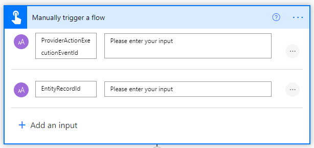](../media/manual-trigger-flow-properties-ss.png#lightbox)

1. إنشاء إجراء تهيئة متغير:
    - في **الاسم**، أدخل **ExecutionResult‎**.
    - في **النوع**، حدد **منطقي**.
    - في **القيمة**، أدخل **صحيح‬**.  
1. إنشاء إجراء تهيئة متغير ثانٍ:
    - في **الاسم**، أدخل **ProcessedSaleOrderLines**.
    - في **النوع**، حدد **صفيف**.
1. إنشاء إجراء تهيئة متغير ثالث:
    - في **الاسم**، أدخل **ProcessedFulfillmentOrderLines**.
    - في **النوع**، حدد **صفيف**.

     > [!div class="mx-imgBorder"]
     > [](../media/variable-initialization-actions-ss.png#lightbox)

1. قم بإضافة نطاق **المحاولة‏‎**.
1. ضمن نطاق **المحاولة**، أضف إجراء **تنفيذ إجراء غير منضم** كما يلي:
    - **ProviderActionExecutionEventId**: ضمن **‏‫المحتوى الديناميكي‬**، حدد **ProviderActionExecutionEventId**.
    - **PowerAutomateRunId**: حدد ما يلي كتعبير: `workflow()['run']?['name']`.

    > [!div class="mx-imgBorder"]
    > [](../media/try-scope-ss.png#lightbox)

1. أضف إجراء **‏‫الحصول على صف بالمعرف** وقم بتكوينه على النحو التالي:
    - في **اسم الجدول**، أدخل **أوامر التنفيذ**.
    - في **معرف الصف**، حدد **EntityRecordId** ضمن **المحتوى الديناميكي**.

    > [!div class="mx-imgBorder"]
    > [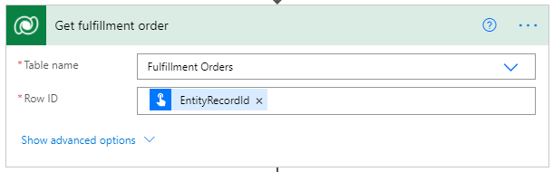](../media/get-row-id-action-ss.png#lightbox)

1. أضف إجراء **إنشاء أمر تنفيذ** من موصل RequestBin، على النحو التالي. 
    - في **النص الأساسي**، حدد **‎النص الأساسي** ضمن **المحتوى الديناميكي**.

    > [!div class="mx-imgBorder"]
    > [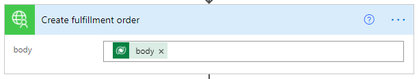](../media/create-fulfillment-order-ss.png#lightbox)

1. أضف إجراء **صفوف القائمة** كما يلي:
    - في **اسم الجدول**، أدخل **منتجات أوامر التنفيذ**.
    - في **استعلام إحضار XML** أدخل ما يلي: </br>

    ```XML
    <fetch>  
      <entity name="msdyn_fulfillmentorderdetail">  
       <all-attributes />
         <filter>
         <condition attribute="msdyn_fulfillmentid" operator="eq" value="@{triggerBody()['text_1']}"/>
         </filter>
      </entity>  
    </fetch>
    ```

    
    > [!div class="mx-imgBorder"]
    > [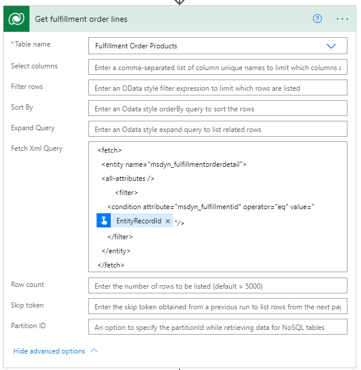](../media/list-rows-action-ss.png#lightbox)

1. أضف عنصر تحكم **تطبيق على كل** باستخدام إجراء **إنشاء سطور أوامر التنفيذ** من اتصال RequestBins كما يلي:
    - يتم الحصول على **القيمة** من خطوة **الحصول على سطر أمر التنفيذ** ضمن **المحتوى الديناميكي**. 
    - تم تحديد **الصنف الحالي** ضمن **المحتوى الديناميكي**.

     > [!div class="mx-imgBorder"]
     > [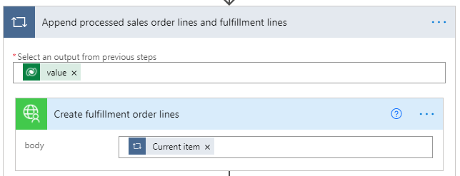](../media/apply-to-each-control-2-ss.png#lightbox)

1. ضمن التكرار الحلقي، أضف إجراء **إلحاق بمتغير الصفيف** كما يلي:
    - في **الاسم**، أدخل **ProcessedFulfillmentOrderLines**.
    - في **القيمة**، حدد **معرف سطر التنفيذ** ضمن **المحتوى الديناميكي**. 

    > [!div class="mx-imgBorder"]
    > > [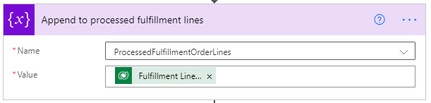](../media/append-to-array-1-ss.png#lightbox)

1. ضمن التكرار الحلقي، أضف إجراء **إلحاق بمتغير الصفيف** آخر كما يلي:
    - في **الاسم**، أدخل **ProcessedSalesOrderLines**.
    - في **القيمة**، حدد **معرف سطر المبيعات** ضمن **المحتوى الديناميكي**.

    > [!div class="mx-imgBorder"]
    > [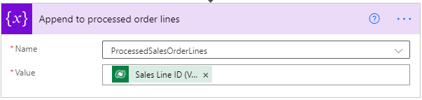](../media/append-to-array-2-ss.png#lightbox)

1. قم بطي نطاق **المحاولة** عن طريق تحديد شريط عنوانه. 
1. حدد **خطوة جديدة** وأضف نطاقاً مختلفاً تمت إعادة تسميته إلى **التقاط‏‎**.
1. في النطاق **التقاط**، حدد علامة الحذف ("**...**")، ثم حدد **تكوين التشغيل بعد** وقم بالتكوين كما يلي:
    - حدد خانة الاختيار **فشل**.
    - حدد خانة الاختيار **انتهت المهلة**.

     > [!div class="mx-imgBorder"]
     > [](../media/catch-scope-ss.png#lightbox)

1. في النطاق **التقاط‏‎**، حدد **إضافة إجراء**، وأضف الإجراء **تعيين المتغير** وأعد تسميته إلى "تعيين نتيجة التنفيذ على فاشلة".
1. كوّن الخصائص على النحو التالي:
    - في **الاسم**، أدخل **ExecutionResult‎**.
    - في **القيمة**، أدخل **خطأ**.

     > [!div class="mx-imgBorder"]
     > [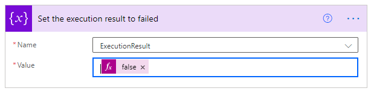](../media/set-variable-ss.png#lightbox)

1. حدد **‎خطوة جديدة**، وأضف نطاقاً مختلفاً تمت إعادة تسميته إلى "أخيراً".
1. في النطاق **أخيراً**، حدد علامة الحذف ("**...**")، ثم حدد **تكوين التشغيل بعد** وقم بالتكوين كما يلي:
    - حدد خانة الاختيار **ناجح**.
    - حدد خانة الاختيار **انتهت المهلة**.
    - حدد خانة الاختيار **تم تخطي**.
    - حدد خانة الاختيار **انتهت المهلة**.

     > [!div class="mx-imgBorder"]
     > [](../media/finally-scope-ss.png#lightbox)

1. في النطاق **أخيراً‏‎**، أضف خطوة "شرط‏‎" وقارن متغير **ExecutionResult** مع "صحيح" كما يلي:
    - في الحقل الأول، حدد المتغير **ExecutionResult‎**.
    - في الحقل الثاني، حدد **يساوي**.
    - في الحقل الثالث، حدد **صحيح**.

    > [!div class="mx-imgBorder"]
    > [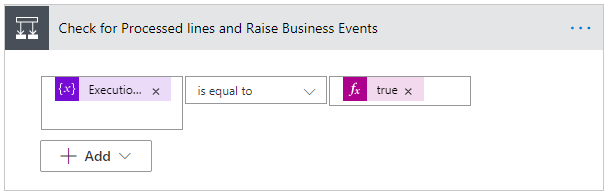](../media/condition-step-ss.png#lightbox)

1. في الفرع **إذا كانت الإجابة بنعم**، أضف إجراء **تشغيل تدفق فرعي** وأعد تسميته إلى **زيادة أحداث العمل لسطور أوامر التنفيذ التي تمت معالجتها**.
1. كوّن الخصائص على النحو التالي:
    - في **التدفق الفرعي**، أدخل **زيادة حدث العمل**.
    - في **BusinessEventDefinitionId**، أدخل **063d85c8-60a4-eb11-9443-000d3a313675**.
    - في **EntityRecordId**، حدد ما يلي كتعبيرات: `string(variables('ProcessedFulfillmentOrderLines'))`

1. في الفرع **إذا كانت الإجابة بنعم**، أضف إجراء **تشغيل تدفق فرعي** آخر وأعد تسميته إلى **زيادة الأحداث المجموعة لأمر المبيعات**.
1. كوّن الخصائص على النحو التالي:
   - في **LineBusinessEventDefinitionId**، أدخل **ccf64002-61a4-eb11-9443-000d3a313675**.
   - في **LineRecordId**، حدد ما يلي كتعبير: `string(variables('ProcessedSalesOrderLines'))`.
   - في **OrderBusinessEventDefinitionId**، أدخل **48688716-61a4-eb11-9443-000d3a313675**.

    
    > [!div class="mx-imgBorder"]
    > [](../media/run-child-flow-action-2-ss.png#lightbox)

1. قم بطي خطوة الشرط.  
1. أضف إجراء **تنفيذ إجراء غير منضم** كما يلي:
    - في **اسم الإجراء**، أدخل **msdyn_CompleteProviderActionExecution**.
    - في **ExecutionResult**، حدد المتغير **ExecutionResult** ضمن **المحتوى الديناميكي**.
    - في **ProviderActionExecutionEventId**، حدد **ProviderActionExecutionEventId** ضمن **المحتوى الديناميكي**.

    > [!div class="mx-imgBorder"]
    > [](../media/perform-unbound-action-ss.png#lightbox)

1. حدد **حفظ**.

## <a name="add-provider-definition-logic-definition-to-the-provider-definition-requestbin"></a>إضافة تعريف منطق تعريف الموفر إلى تعريف موفر (RequestBin)

لإضافة تعريف منطق تعريف الموفر إلى تعريف موفر RequestBin، اتبع الخطوات التالية.

1. انتقل إلى **الموفرين‏‎ \> كتالوج**.
1. حدد **LabFulfillmentProvider** الذي تم إنشاؤه مؤخراً.
1. حدد **تحرير‬** من شريط القوائم. 
1. حدد علامة التبويب **تعريفات المنطق**.
1. حدد **+ تعريف منطق تعريف موفر IOM الجديد**.
1. في **اسم العرض**، أدخل **تمرين عملي - إرسال إلى التنفيذ (RequestBin)**.
1. في **الاسم المنطقي**، أدخل **msdyn_LabSentToFulfillmentRequestBin**.
1. في **تعريف الموفر**، أدخل **LabFulfillmentProvider**.
1. في **نوع المنطق**، أدخل **إجراء الموفر**.
1. في **اسم سير العمل**، أدخل **تمرين عملي - إرسال إلى التنفيذ (RequestBin)**.
1. في **دقائق المهلة**، أدخل **2**.
1. في **‫الحد الأقصى لعدد عمليات إعادة المحاولة‬**، أدخل **3**.
1. في **الوصف‏‎‬**، أدخل **تمرين عملي - إرسال إلى التنفيذ (RequestBin)**.
1. بالنسبة إلى **نوع الإجراء**، أدخل **الإرسال إلى التنفيذ**.
1. حدد **حفظ**. سيؤدي هذا إلى إنشاء تمثيل JSON لتدفق السحابة لمعالج الرسائل وتعبئة حقل **بيانات العميل**.
1. حدد **حفظ وإغلاق**.
1. حدد **الاتصالات**. يجب أن ترى تعريفات مراجع اتصال **Microsoft Dataverse**، و **Outlook.com**، و **RequestBin** المدرجة.

## <a name="add-provider-definition-parameter-to-the-provider-definition"></a>إضافة معلمة تعريف الموفر إلى تعريف الموفر

لإضافة معلمة تعريف موفر إلى تعريف الموفر، اتبع هذه الخطوات.

1. حدد **المعلمات**. 
1. حدد **+ معلمة تعريف موفر IOM جديد**.
1. في **اسم العرض**، أدخل **LAbOutboundFulfillmentEmail**.
1. في **نوع البيانات**، قم بإدخال **النص**.
1. في **تعريف الموفر**، أدخل **LabFulfillmentProvider**.
1. في **المفتاح**، أدخل **LabOutboundFulfillmentEmail**.
1. في **الاسم المنطقي**، أدخل **msdyn_LabOutboundFulfillmentEmail**.
1. في **مطلوب‬**، أدخل **نعم**.
1. حدد **حفظ وإغلاق**.

## <a name="add-provider-definition-logic-definition-to-the-labproviders-solution-requestbin"></a>إضافة تعريف منطق تعريف الموفر إلى حل LabProviders (RequestBin)

لإضافة تعريف منطق تعريف الموفر إلى حل RequestBin LabProviders، اتبع الخطوات التالية.

1. انتقل إلى [مدخل منشئ Power App](https://make.powerapps.com) وانتقل إلى الحل الذي تم إنشاؤه حديثاً **LabProviders**.
1. حدد **إضافة موجود \> تعريف منطق تعريف موفر IOM**.
1. حدد **تمرين عملي - إرسال إلى التنفيذ (RequestBin)** ثم حدد **إضافة‏‎‏‎** لإضافته إلى الحل. 

## <a name="add-provider-definition-connection-reference-to-the-labproviders-solution"></a>إضافة مرجع اتصال تعريف الموفر إلى حل LabProviders

لإضافة مرجع اتصال تعريف الموفر إلى حل LabProviders، اتبع هذه الخطوات.

1. انتقل إلى [مدخل منشئ Power App](https://make.powerapps.com) وانتقل إلى الحل الذي تم إنشاؤه حديثاً **LabProviders**.
1. حدد **إضافة موجود \> مرجع اتصال تعريف موفر IOM**.
1. حدد **RequestBin‎**، ثم حدد **إضافة** لإضافته إلى الحل.

## <a name="add-provider-definition-parameter-to-the-labproviders-solution"></a>إضافة معلمة تعريف الموفر إلى حل LabProviders

لإضافة معلمة تعريف موفر إلى حل LabProviders، اتبع هذه الخطوات.

1. انتقل إلى [مدخل منشئ Power App](https://make.powerapps.com) وانتقل إلى الحل الذي تم إنشاؤه حديثاً **LabProviders**.
1. حدد **إضافة موجود \> معلمة تعريف موفر IOM**.
1. حدد **LabOutboundFulfillmentEmail**، ثم حدد **إضافة** لإضافته إلى الحل.
