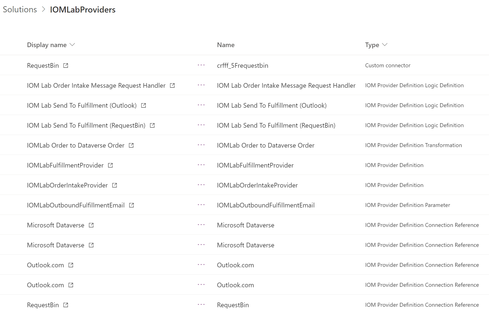

في هذه المرحلة من معمل البدء السريع ، يجب أن ترى الآن المكونات التالية في حل الموفر.

> [!div class="mx-imgBorder"]
> 

للحصول على إرشادات حول تصدير الحل الخاص بك، راجع [تصدير الحلول](/powerapps/maker/data-platform/export-solutions).

## التنظيف بعد التصدير

للتنظيف بعد التصدير، اتبع هذه الخطوات.

1. انتقل إلى [مدخل منشئ Power App](https://make.powerapps.com)، وانتقل إلى **الحلول \> الحلول الافتراضية**، ثم قم بالتصفية على **تدفق السحابة**.
1. أوقف تدفقات السحابة التالية التي تم إنشاؤها لتهيئة تعريف منطق تعريف الموفر. 
    - معالج طلبات الحصول على طلب رسالة من معمل IOM.
    - تمرين عملي IOM - إرسال إلى التنفيذ (Outlook).
    - تمرين عملي IOM - إرسال إلى التنفيذ (RequestBin).

> [!NOTE]
> يتم إنشاء تدفقات جديدة عند إنشاء مثيل للمزود. إذا لم يتم إيقاف تشغيل هذه التدفقات، فسيتم إرسال أكثر من الحمولة الصادرة المتوقعة.
