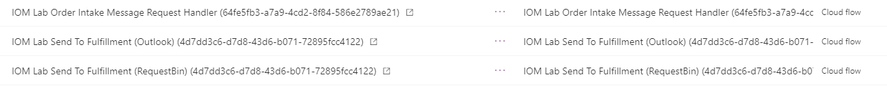

تصف هذه الوحدة الخطوات المطلوبة لإضافة مثيل موفر في Intelligent Order Management.

## إنشاء اتصالات التطبيق

في هذا القسم، ستقوم بإنشاء اتصالات تطبيقات Outlook وRequestBin.

> [!NOTE]
> إذا اتبعت خطوات إنشاء الموفر السابقة، فيمكنك تخطي هذا القسم لأنك قمت بالفعل بإنشاء اتصالات التطبيق هذه.

### إنشاء اتصال Outlook

لإنشاء اتصال Outlook، اتبع هذه الخطوات:

1. حدد **اتصال جديد**.
1. في مربع البحث في الزاوية العلوية اليسرى، أدخل **Outlook.com**.
1. حدد رمز علامة الجمع (**+**) لإنشاء الاتصال.
1. سجل دخولك باستخدام بيانات اعتماد Outlook (اسم المستخدم وكلمة المرور)، والتي لا تتعلق ببيانات اعتماد Intelligent Order Management.

### إنشاء اتصال RequestBin

لإنشاء اتصال RequestBin، اتبع هذه الخطوات:

1. حدد **اتصال جديد**.
1. في مربع البحث في الزاوية العلوية اليسرى، أدخل **requestbin**.
1. حدد رمز علامة الجمع (**+**) لإنشاء الاتصال.

## إضافة موفر لاستلام الأمر

لإضافة موفر لاستلام الأمر، اتبع هذه الخطوات:

1. انتقل إلى **الموفرون > كتالوج‏‎**، وحدد **إضافة موفر** على الإطار المتجانب **IOMLabOrderIntakeProvider**.
1. ضمن قسم **الاتصالات**، حدد **Microsoft Dataverse** للانتقال إلى صفحة **مرجع اتصال موفر IOM**. على غرار كيفية إعداد مرجع اتصال النظام الأساسي، ستقوم بإعداد مراجع الاتصال لاتصالات Power Automate المقابلة التي تم إنشاؤها في الخطوات السابقة.  
1. في صفحة **مراجع اتصال موفر IOM**، أكمل هذه الخطوات: 
    1. انسخ عنوان URL للاتصال من صفحة **تفاصيل اتصال Power Automate Dataverse** ثم الصقه في حقل **عنوان URL للاتصال**.
    1. حدد **حفظ**. 
    1. حدد **تنشيط**.
    1. حدد **حفظ وإغلاق**.
1. في صفحة **موفر IOM**، ضمن قسم **الاتصالات** حدد **Outlook.com**.
1. في صفحة **مرجع اتصال موفر IOM**، أكمل الخطوات التالية: 
    1. انسخ عنوان URL لاتصال Outlook.com من صفحة **تفاصيل اتصال Power Automate** ثم الصقه في حقل **عنوان URL للاتصال**.
    1. حدد **حفظ**. 
    1. حدد **تنشيط**.
    1. حدد **حفظ وإغلاق**.
1. في صفحة **موفر IOM**، حدد **تنشيط**. سيؤدي هذا الإجراء إلى نشر سير عمل Power Automate الذي يعالج البريد الإلكتروني الوارد مع مرفق الأمر.

## إضافة موفر للتنفيذ 

لإضافة موفر للتنفيذ، اتبع هذه الخطوات:

1. انتقل إلى **الموفرون > كتالوج‏‎**، وحدد **إضافة موفر** على الإطار المتجانب **IOMLabFulfillmentProvider**.
1. ضمن قسم **الاتصالات**، قم بإعداد جميع الاتصالات المدرجة. 
1. في علامة التبويب **المعلمات**، أدخل حساب البريد الإلكتروني الذي تريد إرسال حمولة أمر التنفيذ إليه. بإمكان هذا الإدخال أن يكون أي عنوان بريد إلكتروني صالح. 
1. في صفحة **IOMLabFulfillmentProvider**، أكمل الخطوات التالية: 
    1. حدد **حفظ**. 
    1. حدد **تنشيط**.
    1. حدد **حفظ وإغلاق**.

## عرض مكون Power Automate المنشور

لعرض مكون Power Automate المنشور، اتبع هذه الخطوات:

1. انتقل إلى [مدخل المنشئ في Power Apps](https://make.powerapps.com) وتأكد من أنك في بيئة Intelligent Order Management التجريبية الصحيحة. للتحقق من البيئة التي تتواجد فيها، حدد أيقونة **البيئة** في الزاوية العلوية اليسرى من مدخل المنشئ.
1. انتقل إلى **الحلول > الحل الافتراضي**. 
1. قم بتصفية مكون الحل لعرض **سير العمل السحابي** فقط. من المفترض أن تظهر الآن مهام سير عمل Power Automate التالية.

> [!div class="mx-imgBorder"]
> 
